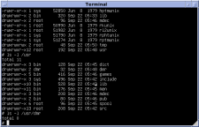

# The Open SIMH project

**Draft by TL 11-Oct-22 - not approved**

SIMH is a framework and family of computer simulators, initiated by Bob Supnik and continued with contributions (large and small) from many others, with the primary goal of enabling the preservation of knowledge contained in, and providing the ability to execute/experience, old/historic software via simulation of the hardware on which it ran. This goal has been successfully achieved and has for these years created a diverse community of users and developers.

For example Version 7 Unix, released in 1979, runs unchanged today on SimH.   Click the image to enlarge.

Note the "dmr" directory and home directory ("/usr/dmr") for Dennis Ritchie, one of the orignators of Unix.

## Project Resources
 * [About the project](about)
 * [About Contributions](contributions)
 * [Simulator Code repository](https://github.com/open-simh/simh)
 * [Simulation tools repository](https://github.com/open-simh/simtools)
 * [Project Contacts](contacts)

## External resources
 * [bitsavers.org](http://bitsavers.org/) - documentation & software archive
 * [Computer History Museum](https://computerhistory.org/)
 * [IEEE history of computing](https://www.computer.org/csdl/magazine/an)
 * [ACM computing history resources](https://history.acm.org/acm-history/computing-history-resources-and-guides/computing-history-resources-and-guides-2/)

<small>Credit: The image is creative commons-licensed from Wikipedia.</small>
