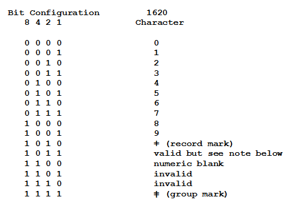
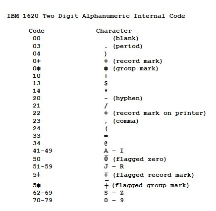
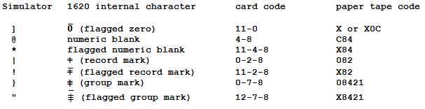

<!-- notpdf -->
# **IBM 1620 Simulator Usage**

**12-Oct-2018**

<!-- /notpdf -->
Copyright (c) 1993-2017, Robert M Supnik

[COPYRIGHT NOTICE and LICENSE](#copyright-notice-and-license) are at the end of this document.

# Contents

 - [Simulator Files](#simulator-files)
 - [IBM 1620 Features](#ibm-1620-features)
 - [CPU](#cpu)
   - [Memory](#memory)
   - [Registers](#registers)
 - [IO Operations](#io-operations)
   - [I/O Error Handling](#io-error-handling)
   - [Release Console Function](#release-console-function)
 - [Console Typewriter (TTY)](#console-typewriter-tty)
   - [Registers](#registers-1)
 - [1621 Paper Tape Reader (PTR)](#1621-paper-tape-reader-ptr)
   - [Registers](#registers-2)
   - [Error handling](#error-handling)
 - [1624 Paper Tape Punch (PTP)](#1624-paper-tape-punch-ptp)
   - [Registers](#registers-3)
   - [Error handling](#error-handling-1)
 - [1622 Card Reader/Punch (CDR, CDP)](#1622-card-readerpunch-cdr-cdp)
   - [Registers](#registers-4)
   - [Error handling](#error-handling-2)
 - [1443 Line Printer (LPT)](#1443-line-printer-lpt)
   - [Error handling](#error-handling-3)
 - [1311 Disk Pack (DP)](#1311-disk-pack-dp)
   - [Registers](#registers-5)
   - [Error handling](#error-handling-4)
 - [Symbolic Display and Input](#symbolic-display-and-input)
 - [Character Sets](#character-sets)
 - [Character I/O](#character-io)
   - [Simulated I/O files](#simulated-io-files)
 - [I/O Instructions](#io-instructions)
   - [RN â Read Numerically](#rn--read-numerically)
     - [RN to TTY](#rn-to-tty)
     - [RN to CDR](#rn-to-cdr)
     - [RN to PTR](#rn-to-ptr)
   - [WN â Write Numerically](#wn--write-numerically)
     - [WN to TTY](#wn-to-tty)
     - [WN to CDP](#wn-to-cdp)
     - [WN to PTP](#wn-to-ptp)
     - [WN to LPT](#wn-to-lpt)
   - [DN â Dump Numerically](#dn--dump-numerically)
     - [DN to TTY](#dn-to-tty)
     - [DN to CDP](#dn-to-cdp)
     - [DN to PTP](#dn-to-ptp)
     - [DN to LPT](#dn-to-lpt)
   - [RA â Read Alphanumerically](#ra--read-alphanumerically)
     - [RA to TTY](#ra-to-tty)
     - [RA to CDR](#ra-to-cdr)
     - [RA to PTR](#ra-to-ptr)
   - [WA â Write Alphanumerically](#wa--write-alphanumerically)
     - [WA to TTY](#wa-to-tty)
     - [WA to CDP](#wa-to-cdp)
     - [WA to PTP](#wa-to-ptp)
     - [WA to LPT](#wa-to-lpt)
   - [Read / Write Binary Paper Tape](#read--write-binary-paper-tape)
 - [COPYRIGHT NOTICE and LICENSE](#copyright-notice-and-license)

This memorandum documents the IBM 1620 simulator. This simulator is
based on Geoff Kuenning\'s 1620 simulator, which is used by permission.

# Simulator Files

- sim/
  - scp.h
  - sim\_console.h
  - sim\_defs.h
  - sim\_fio.h
  - sim\_rev.h
  - sim\_sock.h
  - sim\_timer.h
  - sim\_tmxr.h
  - scp.c
  - sim\_console.c
  - sim\_fio.c
  - sim\_sock.c
  - sim\_timer.c
  - sim\_tmxr.c
- sim/i1620/
  - i1620\_defs.h
  - i1620\_cpu.c
  - i1620\_fp.c
  - i1620\_tty.c
  - i1620\_pt.c
  - i1620\_cd.c
  - i1620\_lp.c
  - i1620\_dp.c
  - i1620\_sys.c

# IBM 1620 Features

The IBM 1620 simulator is configured as follows:

| device names | simulates                                                                                 |
| ------------ | ----------------------------------------------------------------------------------------- |
| CPU          | IBM 1620 Model 1 or Model 2 CPU with 20K to 60K memory                                    |
|              | Model 1 options: indirect addressing, automatic divide, edit instructions, floating point |
|              | Model 2 options: indexing, binary capability, floating point                              |
| TTY          | IBM console terminal                                                                      |
| PTR          | IBM 1621 paper tape reader                                                                |
| PTP          | IBM 1624 paper tape punch                                                                 |
| CDR,CDP      | IBM 1622 card reader/punch                                                                |
| LPT          | IBM 1443 line printer                                                                     |
| DP           | IBM 1311 disk pack with four drives                                                       |

The IBM 1620 simulator implements many unique stop conditions. On almost
any kind of error the simulator stops:

-   Unimplemented opcode
-   Reference to non-existent device
-   Invalid digit
-   Invalid alphameric character
-   Invalid P address digit
-   Invalid Q address digit
-   Indirect address limit exceeded
-   Invalid odd address
-   Invalid even address
-   Invalid function
-   Invalid indicator
-   Invalid return address register
-   Skip to unpunched carriage control tape channel
-   Card reader hopper empty
-   Overflow with arithmetic stop switch set
-   I/O error with I/O stop switch set
-   Invalid disk drive
-   Invalid disk sector address
-   Invalid disk sector count
-   Invalid disk buffer address
-   Disk address compare error
-   Disk cylinder overflow error
-   Disk write check error
-   Field exceeds memory
-   Record exceeds memory
-   Floating point mantissa exceeds maximum length
-   Floating point mantissas not the same length
-   Floating point exponent check with arithmetic stop switch set
-   Floating point exponent missing high flag

The LOAD command is used to load a line printer carriage-control tape.

The DUMP command is not implemented.

## CPU

The CPU options include the CPU model (Model 1 or Model 2), a number of special features, and the size of main memory.

    SET CPU IA                  enable indirect addressing
    SET CPU NOIA                disable indirect addressing
    SET CPU EDT                 enable extra editing instructions
    SET CPU NOEDT               disable extra editing instructions
    SET CPU DIV                 enable divide instructions
    SET CPU NODIV               disable divide instructions
    SET CPU IDX                 enable indexing
    SET CPU NOIDX               disable indexing
    SET CPU BIN                 enable binary instructions
    SET CPU NOBIN               disable binary instructions
    SET CPU FP                  enable floating point instructions
    SET CPU NOFP                disable floating point instructions
    SET CPU RMOK                enable record marks in add/sub/compare
    SET CPU NORMOK              disable record marks in add/sub/compare
    SET CPU MOD1                set Model 1
    SET CPU MOD2                set Model 2
    SET CPU 20K                 set memory size = 20K
    SET CPU 40K                 set memory size = 40K
    SET CPU 60K                 set memory size = 60K

Model 1 options include IA, EDT, DIV, FP, and RMOK; the first three are
on by default. Model 2 options include IDX, BIN, and FP; IA, EDT, and
DIV are standard on the Model 2.

The RMOK option enables a strange hack on the Model I, which caused
record marks in the Q field of add, subtract, and compare to be treated
as 0. This was done, apparently, to get the paper-tape verification
program MI-015 to run. It is not available on the Model 2.

If memory size is being reduced, and the memory being truncated contains
non-zero data, the simulator asks for confirmation. Data in the
truncated portion of memory is lost. Initially, the CPU is a Model 1,
memory size is 20K, and indirect addressing, editing instructions, and
divide are enabled.

### Memory

Memory is implemented as 5 bit BCD digits, as follows:

    4     3     2     1     0
    
    flag  8     4     2     1
          <----- digit ----->

In BCD, the decimal digits 0-9 are (hex) values 0x0, 0x1, 0x2, 0x3, 0x4,
0x5, 0x6, 0x7, 0x8, 0x9, respectively. 0xA is record mark, 0xC
non-punching blank, and 0xF group mark, respectively.

### Registers

CPU registers include the visible state of the processor. The 1620 has no interrupt system.

| name        | size | comments                                               |
| ----------- | ---- | ------------------------------------------------------ |
| PC          | 16   | instruction storage address register (IR1)             |
| IR2         | 16   | return register                                        |
| PR1         | 16   | processor register 1                                   |
| PAR         | 16   | P address register (OR2)                               |
| QAR         | 16   | Q address register (OR1)                               |
| SW1         | 1    | sense switch 1                                         |
| SW2         | 1    | sense switch 2                                         |
| SW3         | 1    | sense switch 3                                         |
| SW4         | 1    | sense switch 4                                         |
| HP          | 1    | high/positive indicator                                |
| EZ          | 1    | equal/zero indicator                                   |
| OVF         | 1    | arithmetic check (overflow) indicator                  |
| EXPCHK      | 1    | exponent check indicator                               |
| RDCHK       | 1    | read check indicator                                   |
| WRCHK       | 1    | write check indicator                                  |
| ARSTOP      | 1    | arithmetic check stop switch                           |
| IOSTOP      | 1    | I/O check stop switch                                  |
| IND\[0:99\] | 1    | indicator array                                        |
| IAE         | 1    | indirect address enabled (Model 2 only)                |
| IDXE        | 1    | indexing enabled (Model 2 only)                        |
| IDXB        | 1    | indexing band select (Model 2 only)                    |
| PCQ\[0:63\] | 16   | IR1 prior to last branch; most recent IR1 change first |
| WRU         | 8    | interrupt character                                    |

The CPU can maintain a history of the most recently executed
instructions. This is controlled by the SET CPU HISTORY and SHOW CPU
HISTORY commands:

    SET CPU HISTORY clear history buffer
    SET CPU HISTORY=0 disable history
    SET CPU HISTORY=n enable history, length = n

    SHOW CPU HISTORY print CPU history
    SHOW CPU HISTORY=n print first n entries of CPU history

The minimum length for the history is 64 entries; the maximum length is
65536 entries.

## IO Operations

The 1620 does not have asynchronous or overlapped IO. When an IO
instruction is issued, the machine suspends instruction execution until
IO is completed or stopped by the operator. From the program\'s point of
view, all IO is instantaneous.

However, from an operational point of view, the delays between digits or
characters may be significant. For example, the 1620 Model I typewriter
did not have a correction capability. The convention was that if the
operator typed an incorrect character, he would set a sense switch and
terminate the IO operation manually by pressing RELEASE and START. The
program would see that the sense switch was set and return to the
typewriter input instruction or routine.

Accordingly, the typewriter, paper-tape reader, and paper-tape punch
implement *deferred IO*. In this mode, the simulator implements delays
between digits or characters and continues IO execution through errors.
This allows the user to interrupt a type-in with \^E, or to change paper
tape input files after an end of file, and continue execution of the
current IO operation. Alternately, the user can terminate the IO
operation with the command SET CPU RELEASE.

All other IO devices execute IO instructions immediately.

### I/O Error Handling

The 1620 simulator stops on almost every IO error condition. When an
error occurs, the simulator can be in one of two states:

1.  The simulator is in the instruction execution phase. The PC of the
    instruction containing the error is reported.

2.  The simulator is in the IO execution phase. The PC has been
    advanced, the instruction is complete, but the IO operation is not
    complete. The PC of the next instruction is reported, along with an
    informational message, \"IO in progress.\"

In the first state, typing CONTINUE will repeat the current instruction,
presumably after correction of the error. In the second state, typing
CONTINUE will return to IO execution. This allows the user to correct
errors, change input files, set sense switches, or take other actions.

### Release Console Function

For all I/O stops, the simulator will return to the current instruction
or IO operation unless directed otherwise. The command SET CPU RELEASE
directs the CPU to advance to the next instruction or to cancel the
current IO operation.

## Console Typewriter (TTY)

The console typewriter (TTY) is a half-duplex console. Typewriter
options include the ability to set variable tab stops:

    SET TTY TABS=col;col;col... set tab stops at the specified columns
    SET TTY NOTABS              remove all tab stops
    SET TTY DEFAULTTABS         set tab stops every eight columns

    SHOW TTY TABS               display current tab stops

    SET TTY 1DIGIT              type flagged digits as letters
    SET TTY 2DIGIT              type flagged digits as \~digit

When 1DIGIT is set, flagged 1 to 9 are displayed as J-R, flagged 0 as
\], flagged record mark as !, flagged numeric blank as I, and flagged
group mark as \". In read numeric mode, these characters can be entered
to represent the corresponding flagged digits. On a numeric read,
flagged digits can also be entered as two characters; \~digit.

### Registers

The typewriter registers are:

| name   | size | comments                     |
| ------ | ---- | ---------------------------- |
| UNLOCK | 1    | keyboard unlocked flag       |
| FLAG   | 1    | set flag on next input digit |
| COL    | 7    | current column               |
| CPS    | 24   | character output rate        |
| ICPS   | 24   | character input rate         |

When the 1620 CPU requests input from the keyboard, a greater than sign
(\>) is printed. The CPU hangs waiting for input until the return/enter
key or the interrupt key is pressed. The typewriter has no errors.

## 1621 Paper Tape Reader (PTR)

The paper tape reader (PTR) reads data from a disk file. The POS
register specifies the number of the next data item to be read. Thus, by
changing POS, the user can backspace or advance the reader.

The 1620 did not provide any hardware means for booting from a paper
tape. Loading from a tape reader was accomplished by inserting an
instruction in location zero using the console INSERT key and the
console typewriter. The simulator, however, supports booting from the
paper tape reader with the BOOT command. BOOT PTR starts the most common
paper tape boot sequence at location 0, namely 360000000300 inserted at
location 0, which reads the first tape record to location 0 and
continues execution with the instruction just loaded into location 12.
Because there was no official standard boot sequence for paper tape,
this may not be correct for all programs.

### Registers

The paper tape reader implements these registers:

| name | size | comments                   |
| ---- | ---- | -------------------------- |
| BIN  | 1    | binary mode flag           |
| POS  | 32   | position in the input file |
| CPS  | 24   | character input rate       |

### Error handling

Error handling is as follows:

| error        | IOCHK | processed as                            |
| ------------ | ----- | --------------------------------------- |
| not attached | x     | set RDCHK indicator, report error, stop |
| end of file  | x     | set RDCHK indicator, report error, stop |
| OS I/O error | x     | set RDCHK indicator, report error, stop |
| parity error | 1     | set RDCHK indicator, report error, stop |
|              | 0     | set RDCHK indicator                     |

## 1624 Paper Tape Punch (PTP)

The paper tape punch (PTP) writes data to a disk file. The POS register
specifies the number of the next data item to be written. Thus, by
changing POS, the user can backspace or advance the punch.

### Registers

The paper tape punch implements these registers:

| name | size | comments                    |
| ---- | ---- | --------------------------- |
| BIN  | 1    | binary mode flag            |
| POS  | 32   | position in the output file |
| CPS  | 24   | character output rate       |

### Error handling

Error handling is as follows:

| error        | IOCHK | processed as                            |
| ------------ | ----- | --------------------------------------- |
| not attached | x     | report error, stop                      |
| end of file  | x     | report error, stop                      |
| OS I/O error | x     | set RDCHK indicator, report error, stop |
| parity error | 1     | set RDCHK indicator, report error, stop |
|              | 0     | set RDCHK indicator                     |

## 1622 Card Reader/Punch (CDR, CDP)

The IBM 1622 card/reader punch is simulated as two independent devices:
the card reader (CDR) and the card punch (CDP).

The card reader supports the BOOT command. BOOT CDR starts the standard
card boot sequence at location 0.

The card reader reads data from a disk file; the punch writes data to a
disk file. Cards are simulated as ASCII text lines with terminating
newlines. For each device, the POS register specifies the number of the
next data item to be read or written. Thus, by changing POS, the user
can backspace or advance these devices.

### Registers

The card reader registers are:

| name | size | comments                          |
| ---- | ---- | --------------------------------- |
| LAST | 1    | last card indicator               |
| POS  | 32   | position in the reader input file |

The card punch registers are:

| name | size | comments                          |
| ---- | ---- | --------------------------------- |
| POS  | 32   | position in the punch output file |

### Error handling

Card reader error handling is as follows:

| error        | IOCHK | processed as                            |
| ------------ | ----- | --------------------------------------- |
| not attached | x     | report error, stop                      |
| end of file  | x     | report error, stop                      |
| OS I/O error | x     | set RDCHK indicator, report error, stop |
| invalid char | 1     | set RDCHK indicator, report error, stop |
|              | 0     | set RDCHK indicator                     |

Card punch error handling is as follows:

| error        | IOCHK | processed as                            |
| ------------ | ----- | --------------------------------------- |
| not attached | x     | report error, stop                      |
| OS I/O error | x     | set WRCHK indicator, report error, stop |
| invalid char | 1     | set WRCHK indicator, report error, stop |
|              | 0     | set WRCHK indicator                     |

## 1443 Line Printer (LPT)

The IBM 1443 line printer (LPT) writes its data, converted to ASCII, to
a disk file. The line printer can be programmed with a carriage control
tape. The LOAD command loads a new carriage control tape:

    LOAD <file>                 load carriage control tape file

The format of a carriage control tape consists of multiple lines. Each
line contains an optional repeat count, enclosed in parentheses,
optionally followed by a series of column numbers separated by commas.
Column numbers must be between 1 and 12; a column number of zero denotes
top of form. The following are all legal carriage control
specifications:

    <blank line>         no punch
    (5)                  5 lines with no punches
    1,5,7,8 columns      1, 5, 7, 8 punched
    (10)2                10 lines with column 2 punched
    1,0                  column 1 punched; top of form

The default form is 66 lines long, with column 1 and the top of form
mark on line 1, and the rest blank.

The line printer recognizes one option for emulating top of form --
using multiple newline characters (the default) or a single form-feed
character:

    SET LPT FF      emulate top-of-form with one form-feed
    SET LPT NOFF    emulate top-of-form with multiple newlines

The line printer registers are:

| name          | size | comments                                 |
| ------------- | ---- | ---------------------------------------- |
| LBUF\[0:119\] | 7    | line buffer                              |
| BPTR          | 7    | buffer pointer                           |
| PCTL          | 8    | saved print control directive            |
| PRCHK         | 1    | print check indicator                    |
| PRCH9         | 1    | channel 9 indicator                      |
| PRCH12        | 1    | channel 12 indicator                     |
| PRBSY         | 1    | busy indicator                           |
| POS           | 32   | position in the output file              |
| CCT\[0:131\]  | 32   | carriage control tape array              |
| CCTP          | 8    | carriage control tape pointer            |
| CCTL          | 8    | carriage control tape length (read only) |

### Error handling

Error handling is as follows:

| error           | IOCHK | processed as                         |
| --------------- | ----- | ------------------------------------ |
| not attached    | x     | report error, stop                   |
| OS I/O error    | x     | set PRCHK, WRCHK, report error, stop |
| invalid char    | 1     | set PRCHK, WRCHK, report error, stop |
|                 | 0     | set PRCHK, WRCHK                     |
| invalid control | x     | set PRCHK, report error, stop        |

## 1311 Disk Pack (DP)

The disk pack controller supports 4 drives, numbered 0 through 3. Disk
pack options include the ability to enable address writing (formatting).

    SET DPn ADDROFF             set unit n address enable off
    SET DPn ADDRON              set unit n address enable on

Units can also be set ENABLED or DISABLED.

The 1620 had no hardware provision to boot from a disk, so the simulator
doesn\'t support the BOOT command.

Unlike most simulated disks, the 1311 includes explicit representation
for sector addresses. This is to support non-standard formats, such as
the inclusion of the drive number in the sector address. As a result,
1311 sectors are 105 digits long: 5 address digits and 100 data digits.
If the 1311 has not been formatted, the addresses are zeroes and are
synthesized, if needed, based on the sector number.

### Registers

The disk pack controller implements these registers:

| name       | size | comments                                 |
| ---------- | ---- | ---------------------------------------- |
| ADCHK      | 1    | address check (compare error) indicator  |
| WLRC       | 1    | wrong length record check indicator      |
| CYLO       | 1    | cylinder overflow check indicator        |
| ERR        | 1    | disk error indicator                     |
| DPSTOP     | 1    | disk check stop                          |
| CYL\[0:3\] | 8    | current cylinder, units 0..3 (read only) |

### Error handling

Error handling is as follows

| error        | DPCHK | processed as                          |
| ------------ | ----- | ------------------------------------- |
| not attached | x     | set ERR indicator, report error, stop |

1311 data files are buffered in memory; therefore, end of file and OS
I/O errors cannot occur.

# Symbolic Display and Input

The IBM 1620 simulator implements symbolic display and input. Display is
controlled by command line switches:

    -c     display as single character (alphameric for
           CPU and DP, ASCII for others)
    -s     display as alphameric string (CPU and DP only)
    -m     display instruction mnemonics (CPU and DP only)
    -d     display 50 characters per line, with flags
           denoted by "_" on the line above

Input parsing is controlled by the first character typed in or by
command line switches:

    ' or -c         character (alphameric for CPU and DP, ASCII for others)
    " or -s         alphameric string (CPU and DP only)
    alphabetic      instruction mnemonic (CPU and DP only)
    numeric         octal number

Instruction input is free format and consists of an opcode and up to
three operands:

    op {+/-}ppppp{(idx)},{+-}qqqqq{(idx)},flags

The p address and, if present, the q address, are always decimal. A plus
sign is ignored; a minus sign denotes indirect addressing (or a negative
immediate operand). If indexing is enabled, addresses may be indexed;
index registers are decimal numbers between 1 and 7. The flags field is
used to set extra flags on the instruction. It consists of digit
positions in ascending order, with no separators. For example,

    AM -12345(5),67890,110

translates into

    _ _ ___  _
    111234567890

The flag over digits 3 and 5 specify the P index register; the flag over
digit 6 specifies the P indirect address; the flag over digit 7 marks
the high order digit of the immediate Q operand; and the flags over
digits 1 and 10 are specified by the third (flags) field.

# Character Sets

Each storage location in the IBM 1620 held 6 bits: 5 data bits and 1
check bit. The check bit was not addressable by the program and was
maintained by the machine so that each location had an odd number of
bits. The check bit is not simulated since it could not be referenced by
any program instruction. On a real 1620, a parity error always indicated
a hardware error and stopped the machine when detected.

The 5 data bits in each location consisted of a flag bit and 4 data
bits. These are often shown as F 8 4 2 1 in IBM documentation. The flag
bit was used in several ways in the machine: to indicate the high order
digit of a field, to indicate a negative number, to indicate instruction
indirect addressing, and to specify index register modification of an
address.

The 8 4 2 1 data bits have 16 possible configurations. Thirteen of these
were valid characters in the internal character set; of the remaining
three, two were invalid and one could only be created in a special way.
See the note below.[^1]

The record mark and group mark characters were used in several ways: to
stop transmission of data on output instructions to some devices and in
some data movement instructions. The numeric blank character was used to
create a blank space on numeric output to some devices. Each of these 13
valid characters could have an associated flag bit. Therefore the 1620
internal character set consisted of exactly 26 characters. All data and
instructions in storage are represented using these characters.

## Character I/O

The IBM 1620 could read, process, and write alphameric data (letters,
digits, some special characters). These were stored internally as pairs
of digits. The machine supported a number of different input devices
(console typewriter, paper tape reader, card reader, disk drive) and a
number of output devices (console typewriter, paper tape punch, card
punch, line printer, disk drive). Except for the disk drives which
transferred data in 1620 internal code, all input devices responded to
two kinds of read operations: RN (read numerically) and RA (read
alphabetically). Output devices other than disk drives responded to
three kinds of write operations: WN (write numerically), WA (write
alphanumerically) and DN (dump numerically). The numeric input and
output operations transferred one 1620 character at a time; thus, on
output, each storage location produced one character on the console
typewriter, one punched card column, one punched character on paper
tape, one character on the line printer. Similarly, on numeric input,
each key typed on the console typewriter, each card column read, and
each paper tape character read was placed into one storage location. The
alphameric output operations transferred two 1620 storage locations to
produce one character typed on the console, one punched card column, one
punched character on paper tape, one character on the line printer. On
alphameric input, each key typed, each card column read, and each paper
tape character read was transferred into two adjacent storage locations.
On numeric input operations each digit stored set all bits including the
flag bit. Numeric output operations included the flag bit in determining
the character to type, punch or print. Alphameric input operations
stored data without altering any flag bits that might have been set in
the input area. Alphameric output operations ignored the flag bits. The
binary paper-tape read and write operations operated like alphameric
operations with respect to flags.

The IBM 1620 was designed in the late 1950's and sold and used during
the 1960's. This was a period in the history of computing that was
populated with many different kinds of equipment. There were unit record
devices made by IBM and other companies which mostly processed data on
punched cards. There were many different computers made by various
companies. There were numerous data recording devices that read
instruments and created punched paper tape or cards and there were
devices with keyboards that could be used to create paper tape or cards
for input to these various devices. There were many different printers
connected to these devices that could print data from paper tape,
punched cards and computers. It should come as no surprise that these
devices employed a number of different codes for punching holes in paper
tape and cards and different character sets for printers.

### Simulated I/O files

Some of the IBM 1620 input and output devices are simulated with text
files containing ASCII characters. Card decks and line printer output
are simulated as text files; input and output from the console is
simulated by typing in the simulator window. Paper tape input and output
are simulated as text files but are coded to indicate the hole patterns
that would have been in actual paper tape, not as equivalent ASCII
characters. Disk devices are written with internal representations of
1620 data. All of this means that it is possible to prepare simulator
card input files with just about any text editor; likewise, it is
possible to view line printer output and card output with most editors
and it is fairly easy to print that output on any printer. Also,
clearly, creating or reading simulator paper tape files with an editor
is not easy or practical; the same is true of disk files.

In order to create input card decks for the simulator it is necessary to
specify a correspondence between all 1620 characters and ASCII
characters. For the most part, this is easy since the 1620 character set
consists of letters, digits and some punctuation and special characters.
The same correspondence can be used for console input and output and
line printer output. There are a variety of difficulties with completely
defining such a correspondence. First, the 1620 character set includes
some characters whose graphics are not included in ASCII. For example,
the ASCII set does not include the 1620 record mark, group mark, numeric
blank, etc. This is handled by assigning them to other ASCII characters
not used in the 1620 set.

The second problem is that results of sending output to the console,
printer, tape punch, and card punch using a WN (write numerically)
instruction were not the same for all devices. For example, sending a
numeric blank to the console typed an @ character; sending it to a tape
punch punched an @; sending it to a card punch or printer produced a
blank space. All characters could be typed on the console but some
characters could not be printed on the line printer. All characters
could be read from cards or paper tape; all characters could be written
to cards or paper tape. There are additional difficulties depending on
whether an I/O operation is numeric or alphameric.

A third problem involves the coding of special characters. In the 1960's
when the 1620 was in use, there were a lot of different needs for
printing special characters. There were not enough different characters
that could be represented on cards to meet all the needs. This was
solved in various ways by different machines. Often the same card code
was printed as a different symbol depending on the application need. For
example, some printers would print +@=( as &'\#%. In some cases, the
character printed depended on what hardware accessory (usually called a
print belt, print chain or print bar) was installed in the printer.

The final problem is that machines in the 1620 days were often not
completely specified. That is, the documentation defined what would
happen if certain combinations of characters were sent to an output
device but did not specify what would happen if other unused
combinations of characters were used. For example, if a WA (write
alphabetically) instruction sent the two digits 41 to a card punch,
paper tape punch, the console or the printer, the letter A was printed
or the code for A was punched. There are 100 two digit combinations (00
-- 99) which could be used but the 1620 did not define all of these.
Some combinations actually caused letters, digits, or special characters
to punch/print and did not indicate an error. In some cases, this lack
of specification was deliberate to allow for possible future expansion.
In some cases, it was less expensive (i.e., used less hardware) to just
ignore the unused combinations and not worry about what the machine did
with them. What actually happened when these unspecified values were
sent to, for example, the printer depended on the particular 1620
machine and its printer. Results were different depending on the model
and engineering level of the machine.

The following table lists the two digit alphanumeric codes recognized by
the simulator. Actual results of alphameric input and output operations
vary slightly depending on the device. See the individual instructions
in sections below for details. Two digit codes not listed are invalid
and will produce an error if written to an output device. The codes
shown are the only ones that will be placed into storage on a read
operation. Not all of these codes were supported for all devices.

All of this makes for a series of dilemmas since the simulator must deal
with many different possibilities. To begin with, it is necessary to
specify ASCII characters to represent those 1620 characters that do not
have graphics that exist in ASCII. These 7 characters are flagged zero,
numeric blank, flagged numeric blank, record mark, flagged record mark,
group mark, and flagged group mark. The simulator defines the following
ASCII characters to be used when entering data in a text editor for card
input and for entering data in response to RN (read numerically) at the
console:

These same ASCII characters are used when data is written numerically to
the console.

Data written numerically to the simulator console must also deal with
flagged digits 1 -- 9. The actual 1620 console typewriter was able to
type an over-bar character without advancing the carriage and then print
another character under it. This feature was a function of the hardware
and not under program control. Thus, it could type the flagged versions
of the 10 digits, numeric blank, record mark and group mark. Similarly,
an operator responding to a numeric read to the console had the ability
to enter a flagged digit by first pressing a flag key (which typed the
over-bar without spacing the carriage) and then typing a digit, an @
(representing a numeric blank), record mark or group mark. Numeric
output to the simulator console is handled in one of two ways depending
on which option is chosen on the SET TTY command.

-   If the command SET TTY 1DIGIT has been issued, data written to the
    console in response to a WN (write numerically) or DN (dump
    numerically) instruction will show a flagged zero as \] and flagged
    digits 1 -- 9 as the letters J -- R. This choice was made since the
    punch card codes for the flagged digits is an 11 punch plus the
    digit which is the same code as the letters J -- R. Output card
    decks from the 1620 which contained numeric data were often printed
    on other machines which interpreted these as letters and programmers
    were accustomed to seeing this kind of output. Also, data written
    numerically to the 1620 line printer produced letters J -- R for the
    flagged digits 1 -- 9. This is the default setting.

-   If the command SET TTY 2DIGIT has been issued, data written to the
    console in response to a WN (write numerically) or DN (dump
    numerically) instruction will show a flagged digit by printing an
    accent (\`) character in front of it.

Finally, for convenience in entering data on the console and creating
files to be treated as input card decks, the simulator always treats
lower case ASCII letters as if they were upper case. All output is in
upper case; the IBM 1620 had no capability to process lower case
letters. The 1620 console typewriter did not have lower case letters.

## I/O Instructions

There are a number of different charts in the IBM 1620 manuals which
list the codes used for paper tape and cards together with how various
1620 characters were treated by different input and output devices and
by the five different I/O instructions: RN, RA, WN, WA, and DN. None of
these tables is complete in all details. There are some special cases
that are not shown. Details for each of these instructions are provided
below.

###  RN -- Read Numerically

#### RN to TTY

As described briefly above, an operator using a real 1620 console
typewriter could enter any of the 1620 numeric characters in response to
a RN instruction. Unflagged characters were just typed using the keys
for digits, @ for a numeric blank and special keys for record mark and
group mark. If the character was to be flagged, the special Flag key was
pressed first to print an over-bar followed by the key for the
character. Pressing the Flag key printed the over-bar but did not
advance the carriage so that the flagged character printed underneath it
on the page. Characters were transferred to storage until the operator
pressed the console Release and Start keys or until he pressed the
special RS key on the typewriter. Pressing the RS key on the typewriter
printed a ligature RS on the typewriter and performed the equivalent of
pressing the Release and Start console keys. This was the usual way to
finish entering data since it provided a record on the paper that it had
been done. Pressing the RS key did not cause the typewriter carriage to
return. The usual program procedure for requesting operator input from
the typewriter was to (1) execute a K (control) instruction to return
the carriage of the typewriter, (2) write a prompting message to let the
operator know what data was being requested, and (3) issue a read to the
typewriter to get the operator input. This left the typewriter carriage
positioned just after the last character typed. The simulator treats
pressing the Enter key as equivalent to the 1620 RS key. This causes a
carriage return which was not true on the 1620. This simply means that
the appearance of data on the screen will not exactly match what would
have appeared on the 1620 typed output.

The simulator provides two options for entering flagged data in response
to RN. The ASCII characters defined for flagged special characters can
be used: \] for flagged zero, ! for flagged record mark, \* for flagged
numeric blank, \" for flagged group mark and the letters J-R or j-r for
flagged 1-9. Alternatively, the ASCII characters for unflagged data can
be preceded by an accent (\`) or tilde (\~) and the next character typed
will be placed into storage with a flag.

The 1620-1 did not support backspace to correct a typing mistake. Each
character entered was placed directly into storage. The 1620-2 did
support a correction key which typed an overstrike character ­(--), and
backed up the address in the OR-2 register so the next character could
replace the one just placed in storage. If the correction key was
pressed multiple times, an overstrike character was typed each time and
the register decremented each time. If, for example, the operator typed
36 instead of the intended 26, use of the correction key would leave
36---26 on the console paper as a record of the operator action. The
simulator does not support this function.

#### RN to CDR

A numeric read to the card reader is one of the few cases which is
completely defined in the IBM 1620 documentation. An almost complete
table can be found on page 40 of IBM publication A26-5706-3, IBM 1620
Central Processing Unit, Model 1. Information is missing from this table
for two characters: the flagged record mark (card code 11-2-8) and the
flagged group mark (card code 12-7-8); however, they were read as
expected. A read numeric to the card reader transfers 80 digits into
storage.

#### RN to PTR

A numeric read to the paper tape reader, in contrast to the case for the
card reader, is not completely defined in IBM documentation. All 10
digits are read as themselves; the 9 letters J -- R are read as flagged
1 -- 9; a blank space is read as a 0; a single X punch is read as a
flagged 0. Flagged and unflagged record marks and group marks are read.
A numeric blank is read. There is no mention of reading a flagged
numeric blank (tape code the same as an asterisk: X84) but this did work
as expected.

IBM documentation described exactly what was placed into storage when a
card containing alphabetic and special characters was read numerically;
unfortunately, there seems not to be any official documentation for the
paper tape reader. Since cards read and punched numerically produce the
same codes for flagged digits as the letters J-R (for flagged 1-9) and
-- (hyphen) and those same characters are also printed for flagged
digits, the simulator treats reading of alphabetic and special
characters from paper tape exactly the same as if they were read from
cards. See the IBM document reference mentioned in the previous section
concerning the card reader.

There is a book, Basic Programming Concepts and the IBM 1620 Computer,
by Leeson and Dimitry, which has a table on page 77 of data read
numerically from paper tape. It does not include information for record
mark and group mark but does confirm the results for alphabetic and
special characters.

A read from paper tape transferred data until it encountered an EOL (end
of line) punch in the tape. When the EOL was encountered, a record mark
was placed into storage.

### WN -- Write Numerically

#### WN to TTY

A numeric write to the typewriter caused characters to be typed
beginning where the carriage was positioned and continued until a
character in storage was encountered that had both the 8 and 2 bits
(with or without a flag). This was usually a record mark but could also
be a group mark or one of the unusual characters mentioned above that
are the result of reading a dollar sign, period, comma or equal sign
from a card. The ending character was not typed. Flagged characters were
printed with the over-bar.

#### WN to CDP

A numeric write to the card punch always transferred 80 characters. All
standard 1620 characters are punched with their respective card codes
except the numeric blank and flagged numeric blank. These cause a blank
column (no punches). No IBM documentation describes what happens if one
of the 4 unusual characters mentioned above that are the result of
reading a dollar sign, period, comma or equal sign from a card. A
flagged zero was punched as 11-0.

#### WN to PTP

A numeric write to the tape punch transferred characters until a
character in storage was encountered that had both the 8 and 2 bits
(with or without a flag). This was usually a record mark but could also
be a group mark or one of the unusual characters mentioned above that
are the result of reading a dollar sign, period, comma or equal sign
from a card. The ending character was not punched; rather, an EOL
character was punched in the tape. A numeric blank was punched as a
numeric blank; a flagged zero produced an X punch.

#### WN to LPT

A numeric write to the printer caused data to be transferred to the
printer buffer until the buffer was full or until a character in storage
was encountered that had both the 8 and 2 bits (with or without a flag).
This was usually a record mark but could also be a group mark or one of
the unusual characters mentioned above that are the result of reading a
dollar sign, period, comma or equal sign from a card. The ending
character was not transferred to the buffer. Digits were printed as
digits; a flagged zero was printed as a hyphen; flagged 1 -- 9 were
printed as letter J -- R; numeric blanks (with or without a flag) were
printed as blanks. The length of the line printed depended on the
printer features: it was either 120 or 144 characters. The simulator
supports only a printer with 120 characters per line.

### DN -- Dump Numerically

#### DN to TTY

This instruction wrote all data characters from consecutive storage
locations beginning with the P address. The typewriter carriage
automatically returned at the end of the margin. Output continued until
either the operator pressed the console Release key or the highest
location of the storage module where the operation started was reached.
The highest address in a storage module is 19999, 39999, or 59999. All
characters including record marks and group marks were typed. No IBM
documentation described what happened if one of the four unusual
characters mentioned above that are the result of reading a dollar sign,
period, comma or equal sign from a card was encountered.

#### DN to CDP

This instruction punched the characters from all storage locations
beginning with the P address and continuing through the highest address
in the storage module where the operation started. If the last storage
location did not exactly fill a card, additional higher locations were
punched to fill out the card. In this case, if the starting address was
in the highest storage module, additional characters were taken by
wrapping around to and continuing from address 00000. Numeric blanks
were punched as blanks; flagged numeric blanks were punched as blanks;
flagged zeros produced only an 11 punch. . No IBM documentation
described what happened if one of the four unusual characters mentioned
above that are the result of reading a dollar sign, period, comma or
equal sign from a card was encountered.

#### DN to PTP

This instruction caused storage locations beginning at the P address and
continuing to the end of the addressed storage module. At the end of the
operation an EOL character was punched. Flagged zeros produced only an X
punch. No IBM documentation described what happened if one of the 4
unusual characters mentioned above that are the result of reading a
dollar sign, period, comma or equal sign from a card was encountered.

#### DN to LPT

This instruction caused only one line to be printed. The printer buffer
was filled (120 or 144 characters) beginning at the P address location
and continuing to higher locations. If the end of storage was
encountered before the buffer was full, the operation continued by
wrapping around to location 00000. Special translation took place for
special characters. Digits were printed as described above for WN.
Numeric blank was printed as @, flagged numeric blank as \*, record mark
as ǂ, flagged record mark as W, group mark as G, flagged group mark as
X. This translation made it possible to dump storage and tell exactly
what was in every location. . No IBM documentation described what
happened if one of the 4 unusual characters mentioned above that are the
result of reading a dollar sign, period, comma or equal sign from a card
was encountered.

### RA -- Read Alphanumerically

#### RA to TTY

This instruction caused one line to be read from the console typewriter.
All valid 1620 characters can be entered. Each character typed caused
two digits to be entered into storage. It is unclear (not documented
anywhere) if the actual 1620 supported input of flagged numeric blank,
flagged record mark, or flagged group mark. The instruction is complete
when the Enter key is pressed.

The 1620-1 did not support backspace to correct a typing mistake. Each
character entered was placed directly into a pair of storage locations.
The 1620-2 did support a correction key which typed an overstrike
character ­(--), and backed up the address in the OR-2 register by 2 so
the next character could replace the one just placed in storage. If the
correction key was pressed multiple times, an overstrike character was
typed each time and the register decremented each time. If, for example,
the operator typed EDN instead of the intended END, use of the
correction key would leave EDN-- --ND on the console paper as a record
of the operator action. The simulator does not support this function.

#### RA to CDR

This instruction reads one card and places 160 digits into storage. All
characters can be read. A card deck could be duplicated by issuing RA to
the reader and then issuing WA of the same data to the card punch.

#### RA to PTR

This instruction is similar to reading from a card reader except that a
variable number of characters were placed into storage. The operation
continued until an EOL punch was detected in the tape. When this
happened, the operation stopped and an alphameric record mark (the two
characters 0ǂ) were placed in storage.

### WA -- Write Alphanumerically

#### WA to TTY

This instruction decoded two characters at a time and wrote each
alphameric character on the typewriter. The operation continued until a
pair of digits was encountered that had the 8 and 2 bits on in the
second of the pair. This was usually 0ǂ but could have been anything
followed by a record mark, group mark or one of the unusual characters
mentioned above that resulted from reading a dollar sign, period, comma
or equal sign from a card. All alphameric codes except 22 and those that
contained a record mark or group mark could be written.

#### WA to CDP

This instruction decoded two characters at a time and transferred each
alphameric character to the card punch buffer. This operation continued
until 160 digits were processed and the corresponding 80 characters had
been transferred. All alphameric codes except 22 could be written.

#### WA to PTP

This instruction decoded two characters at a time and punched each
alphameric character to paper tape. The operation continued until a pair
of digits was encountered that had the 8 and 2 bits on in the second of
the pair. This was usually 0ǂ but could be anything followed by a record
mark, group mark or one of the unusual characters mentioned above that
resulted from reading a dollar sign, period, comma or equal sign from a
card. All alphameric codes except 22 and those that contained a record
mark or group mark could be written. The terminating character was not
written but an EOL was punched in the tape.

#### WA to LPT

This instruction decoded two characters at a time and transferred each
alphameric character to the line printer buffer. The operation continued
until a pair of digits was encountered that had the 8 and 2 bits one in
the second of the pair or until the print buffer was full. This was
usually 0ǂ but could be anything followed by a record mark, group mark
or one of the unusual characters mentioned above that resulted from
reading a dollar sign, period, comma or equal sign from a card. All
alphameric codes except those that contained a record mark or group mark
could be written. The printer was the only device that interpreted
alphameric code 22 and printed a record mark character (ǂ). This did not
stop the operation. After the ending character was detected, any
remaining buffer positions were filled with blanks. It was important to
always provide the ending 0ǂ to stop the operation because, for reasons
known only to IBM, the printer buffer was 197 characters long. Even
though the printer could only print 120 or 144 characters on a line
(depending on the printer feature installed), it still tried to decode
and transfer 197 characters. Omitting the ending character in storage
meant that the machine would process whatever followed the data to be
printed and likely detect an error because of an invalid code. This
obscure feature is implemented by the simulator.

### Read / Write Binary Paper Tape

The instructions RBPT (Read Binary Paper Tape) and WBPT (Write Binary
Paper Tape) operated in a manner similar to read and write
alphanumerically. That is, two storage locations are transferred for
each column on paper tape. On reading, each column of tape is stored
into two storage positions; on output each pair of storage locations is
punched as one column of tape. WBPT stops writing when it encounters a
0ǂ combination in storage and an EOL is punched in the tape. RBPT reads
data until it encounters an EOL on the tape. Presumably, this caused a
0ǂ to be placed into storage to indicate the end of the data read;
however, the IBM documentation does not actually state that this is the
case. The simulator does insert the record mark when EOL is encountered.

---

[^1]: *Note: Bit configurations 1101 and 1110 were invalid, could not be
    created by any valid operation, and were always treated as errors if
    encountered. As far as I know, these could only exist in storage as
    a result of a machine malfunction.*

    *The 1011 bit configuration could be created in the machine if a
    card or paper tape containing a period, a comma, an equal sign or a
    dollar sign was read with an RN (read numerically) instruction. The
    dollar sign would also set the flag bit. This bit configuration was
    treated the same as a record mark or group mark as far as stopping
    data transmission by a TR (transmit record), a WN (write
    numerically) or a WA (write alphamerically) instruction and tested
    as a record mark when referenced by the BNR (branch no record)
    instruction. This behavior was a strange design choice by IBM since
    it could just as well have stored a record mark. Operationally this
    character behaved the same as a record mark. The result of sending
    this character to an output device is not specified in any IBM
    documentation and is treated as an error by the simulator.*

    *On a 1620-1 there was no way to distinguish the 1011 character from
    a record mark except that it might produce an error on output to
    some device. Whether or not it did so is not known. On a 1620-2
    machine with binary capabilities, the BMK (Branch on Mask)
    instruction could test any bit and, therefore, distinguish this
    character from a record mark. It's unclear how this could be of any
    use to a program.*

    *As final note, on a 1620-1 there was no way to detect that a
    character was a numeric blank. A numeric blank could only be created
    in storage by reading it from a card, paper tape record or the
    console typewriter. On a 1620-2 machine with binary capabilities,
    the BMK instruction could determine that a character was a numeric
    blank. It's possible that this could have been of some use to a
    program but it seems unlikely that any program was ever written that
    made use of this.*

# COPYRIGHT NOTICE and LICENSE

The following copyright notice applies to the SIMH source, binary, and
documentation:

Original code published in 1993-2017, written by Robert M Supnik

Permission is hereby granted, free of charge, to any person obtaining
a copy of this software and associated documentation files (the
"Software"), to deal in the Software without restriction, including
without limitation the rights to use, copy, modify, merge, publish,
distribute, sublicense, and/or sell copies of the Software, and to
permit persons to whom the Software is furnished to do so, subject to
the following conditions:

The above copyright notice and this permission notice shall be
included in all copies or substantial portions of the Software.

THE SOFTWARE IS PROVIDED "AS IS", WITHOUT WARRANTY OF ANY KIND,
EXPRESS OR IMPLIED, INCLUDING BUT NOT LIMITED TO THE WARRANTIES OF
MERCHANTABILITY, FITNESS FOR A PARTICULAR PURPOSE AND NONINFRINGEMENT.
IN NO EVENT SHALL ROBERT M SUPNIK BE LIABLE FOR ANY CLAIM, DAMAGES OR
OTHER LIABILITY, WHETHER IN AN ACTION OF CONTRACT, TORT OR OTHERWISE,
ARISING FROM, OUT OF OR IN CONNECTION WITH THE SOFTWARE OR THE USE
OR OTHER DEALINGS IN THE SOFTWARE.

Except as contained in this notice, the names of the authors shall
not be used in advertising or otherwise to promote the sale, use or
other dealings in this Software without prior written authorization
from each author.
