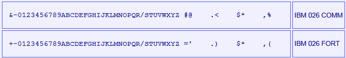
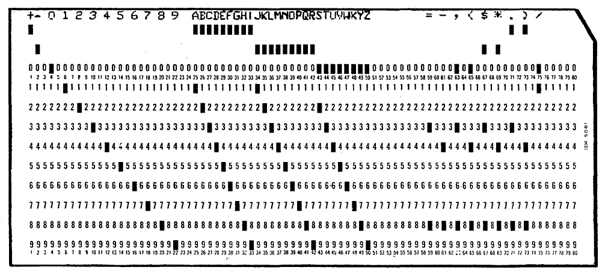
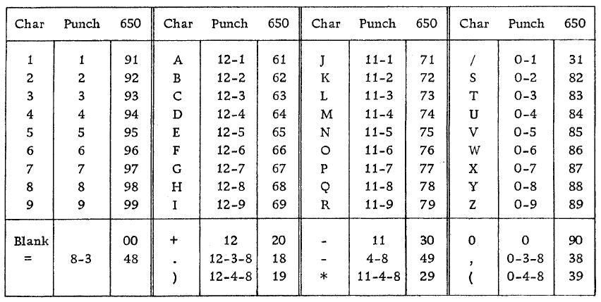

<!-- notpdf -->
# **IBM 650 Simulator User's Guide**

**14-May-2020**

<!-- /notpdf -->
Copyright © 1993-2012, Robert M Supnik\
Copyright © 2018, Roberto Sancho

[COPYRIGHT NOTICE and LICENSE](#copyright-notice-and-license) are at the end of this document.

# Contents

 - [Introduction](#introduction)
 - [The IBM 650 Magnetic Drum Data-Processing Machine](#the-ibm-650-magnetic-drum-data-processing-machine)
 - [Simulator Files](#simulator-files)
 - [Simulator Features](#simulator-features)
 - [Hardware-Equivalent Actions](#hardware-equivalent-actions)
 - [Simulator Specific Commands](#simulator-specific-commands)
   - [Symbolic Display and Entry](#symbolic-display-and-entry)
   - [RESET](#reset)
   - [RUN and GO](#run-and-go)
   - [STEP](#step)
   - [CARDDECK](#carddeck)
     - [CARDDECK SPLIT](#carddeck-split)
       - [<strong><em>&lt;count&gt;</em></strong>](#count)
       - [<strong><em>&lt; dev / file0 &gt;</em></strong>](#-dev--file0-)
     - [Examples:](#examples)
     - [CARDDECK JOIN](#carddeck-join)
       - [<strong><em>&lt;file1&gt;</em></strong>](#file1)
       - [<strong><em>&lt;file2&gt;</em></strong>](#file2)
       - [<strong><em>&lt;file N&gt;</em></strong>](#file-n)
       - [<strong>AS &lt;file&gt;</strong>](#as-file)
     - [Examples:](#examples-1)
     - [CARDDECK PRINT](#carddeck-print)
       - [<strong><em>&lt;file&gt;</em></strong>](#file)
     - [CARDDECK ECHOLAST](#carddeck-echolast)
       - [<strong><em>&lt;count&gt;</em></strong>](#count-1)
       - [<strong><em>&lt; dev &gt;</em></strong>](#-dev-)
     - [Examples:](#examples-2)
   - [Device Configuration](#device-configuration)
   - [Enabling and Disabling Devices](#enabling-and-disabling-devices)
 - [Tracing Simulator Operations](#tracing-simulator-operations)
 - [Processor Device Simulations](#processor-device-simulations)
 - [Central Processing Unit](#central-processing-unit)
   - [Speed](#speed)
   - [Mnemonics](#mnemonics)
   - [Storage unit](#storage-unit)
   - [Simulation Stops](#simulation-stops)
   - [Tracing](#tracing)
   - [Registers](#registers)
 - [IBM 533 Card Reader/Puncher (CDR)](#ibm-533-card-readerpuncher-cdr)
   - [Symbolic Information Load](#symbolic-information-load)
   - [Punched cards character set](#punched-cards-character-set)
 - [IBM 533 Card Punch (CDP)](#ibm-533-card-punch-cdp)
 - [IBM 727 Magnetic Tape (MT)](#ibm-727-magnetic-tape-mt)
 - [IBM 355 RAMAC Storage (DSK)](#ibm-355-ramac-storage-dsk)
 - [Panel Wiring](#panel-wiring)
 - [Printing](#printing)
 - [Software Support](#software-support)
 - [Interpretive Floating DecimalSystem](#interpretive-floating-decimalsystem)
   - [Description](#description)
   - [Hardware needed](#hardware-needed)
   - [Documentation](#documentation)
   - [CDR/CDP Wiring](#cdrcdp-wiring)
   - [Card deck](#card-deck)
   - [Source](#source)
   - [Comments](#comments)
 - [Regional Assembly Routine](#regional-assembly-routine)
   - [Description](#description-1)
   - [Hardware needed](#hardware-needed-1)
   - [Documentation](#documentation-1)
   - [CDR/CDP Wiring](#cdrcdp-wiring-1)
   - [Card deck](#card-deck-1)
   - [Source](#source-1)
   - [Comments](#comments-1)
 - [Floating Point Interpretive System](#floating-point-interpretive-system)
   - [Description](#description-2)
   - [Hardware needed](#hardware-needed-2)
   - [Documentation](#documentation-2)
   - [CDR/CDP Wiring](#cdrcdp-wiring-2)
   - [Card deck](#card-deck-2)
   - [Source](#source-2)
   - [Comments](#comments-2)
 - [Internal Translator, <strong>1956</strong>](#internal-translator-1956)
   - [Description](#description-3)
   - [Hardware needed](#hardware-needed-3)
   - [Documentation](#documentation-3)
   - [CDR/CDP Wiring](#cdrcdp-wiring-3)
   - [Card deck](#card-deck-3)
   - [Source](#source-3)
   - [Comments](#comments-3)
 - [SOAP II, <strong>1957</strong>](#soap-ii-1957)
   - [Description](#description-4)
   - [Hardware needed](#hardware-needed-4)
   - [Documentation](#documentation-4)
   - [CDR/CDP Wiring](#cdrcdp-wiring-4)
   - [Card deck](#card-deck-4)
   - [Source](#source-4)
   - [Comments](#comments-4)
 - [FOR TRANSIT, <strong>Aug/1957</strong>](#for-transit-aug1957)
   - [Description](#description-5)
   - [Hardware needed](#hardware-needed-5)
   - [Documentation](#documentation-5)
   - [CDR/CDP Wiring](#cdrcdp-wiring-5)
   - [Card deck](#card-deck-5)
   - [Source](#source-5)
   - [Comments](#comments-5)
 - [SOAP IIA-4000, <strong>1959</strong>](#soap-iia-4000-1959)
   - [Description](#description-6)
   - [Documentation](#documentation-6)
   - [CDR/CDP Wiring](#cdrcdp-wiring-6)
   - [Card deck](#card-deck-6)
   - [Source](#source-6)
   - [Comments](#comments-6)
 - [SuperSoap, <strong>1959</strong>](#supersoap-1959)
   - [Description](#description-7)
   - [Hardware needed](#hardware-needed-6)
   - [Documentation](#documentation-7)
   - [CDR/CDP Wiring](#cdrcdp-wiring-7)
   - [Card deck](#card-deck-7)
   - [Source](#source-7)
   - [Comments](#comments-7)
 - [Simulator Usage](#simulator-usage)
 - [Assemble a SOAP Program](#assemble-a-soap-program)
 - [Available Software](#available-software)
   - [Interpretive Floating Decimal System](#interpretive-floating-decimal-system)
   - [Regional Assembler](#regional-assembler)
   - [Floating Point Interpretive System](#floating-point-interpretive-system-1)
   - [SOAP Assembler](#soap-assembler)
   - [Internal Translator (IT Compiler)](#internal-translator-it-compiler)
   - [FORTRANSIT](#fortransit)
   - [SuperSoap](#supersoap)
 - [Running demo script](#running-demo-script)
 - [File extensions](#file-extensions)
 - [Version History](#version-history)
 - [COPYRIGHT NOTICE and LICENSE](#copyright-notice-and-license)
[
# Introduction

This manual documents the features and operation of the IBM 650
simulator. It is intended for use in conjunction with the *SIMH Users\'
Guide* manual, which describes how to compile and run the simulator, as
well as the general commands that may be entered at the Simulation
Control Program (SCP) prompt.

## The IBM 650 Magnetic Drum Data-Processing Machine

IBM sold the IBM 650 Magnetic Drum Data-Processing Machine from 1953
through 1962. The first unit was installed in December 1954.

IBM made several enhancements during the life of the computer (source:
Wikipedia)

-   1954: Initial model
    -   1K or 2K word drum memory (IBM 650)
    -   Connection of one device Card Read Punch (IBM 533 or 537)
    -   IBM 407 for off line printing of punched cards
-   1955: Storage Unit
    -   60 words of core memory
    -   3 index registers
    -   Floating Point
    -   Magnetic Tape support
    -   Connection of up to 3 devices: card read punch or modified IBM 407 for on-line printing
-   1956: RAMAC Disc support
    -   Enhancements in Storage Unit to support disc
    -   IBM 838 inquiry stations support
-   1959: Model 4
    -   4K word drum memory

All of these were vacuum tube machines. Each machine word is composed of
10 decimal digits plus sign. It is a decimal machine.

Reading or writing a word takes 96 microseconds (called the word time in
IBM Operation manual and described as having a duration of 0.096
milliseconds). This is the basic machine cycle. As main memory is
implemented by a drum, the CPU waits while drum is seeking to the word
to read or write. This can take from zero to 49 cycles. An average on
optimized code is about 5 cycles per instruction. The execution speed
for optimized code is range of 2K instructions per second.

## Simulator Files

The simulator sources are divided into a set of files for the Simulator
Control Program and its support libraries, and a set of files for the
IBM 650 CPU and device simulations; the latter reside in a subdirectory
of the directory that contains the SCP files. The former set is common
to all SIMH simulators, whereas the latter set is specific to the
virtual machine being simulated. The files that make up this simulator
are:

| **_Subdirectory_** | **_File_**    | **_Contains_**                                                               |
|--------------------|---------------|------------------------------------------------------------------------------|
| **i650**           | i650_defs.h   | System architectural declarations                                            |
|                    | i650_sys.c    | SCPinterface                                                                 |
|                    | i650_cpu.c    | Main CPU simulator                                                           |
|                    | i650_cdr.c    | IBM 533 (card reader part) simulator                                         |
|                    | i650_cdp.c    | IBM 533 (card punch part) and IBM 407 printing simulator                     |
|                    | i650_mt.c     | IBM 727 tape simulator                                                       |
|                    | i650_dsk.c    | IBM 355 RAMAC Disk Storage                                                   |
|                    | i650_doc.doc  | Documentation (this file)                                                    |
|                    | I650_test.ini | Executes all the sw rest-run scripts                                         |
| **I650 / sw**      |               | Contains the included software and test run script files (See usage section) |

PDF files of the original IBM 650 hardware and software manuals are
available in Bitsavers repository: <http://www.bitsavers.org/>

The computer programming and its operation are described in IBM 650
magnetic drum data-processing machine manual of operation, Form
22-6060-2 (1956)

# Simulator Features

The IBM 650 simulator contains the following device simulations:

| ***Device Name(s)*** | ***Simulates***                      |
|----------------------|--------------------------------------|
| **CPU**              | IBM 650 Drum Data Processing Machine IBM 652 Control Unit IBM 653 Storage Unit 1K word, 2K word or 4K drum          |
| **CDR1 to CDR3**     | IBM 533 Card Reader                  |
| **CDP1 to CDP3**     | IBM 533 Card Punch                   |
| **CDP0**             | IBM 407 Printing                     |
| **MT0 to MT5**       | IBM 727 Magnetic Tape                |
| **DSK0 to DSK3**     | IBM 355 RAMAC Disk Storage           |

The simulator has been tested with and supports the following software:

-   IBM SOAP II as stated on 24-4000-0 manual on Bitsavers
-   IBM SOAP IIA-4000
-   IBM Interpretive Floating Decimal Interpretive System
-   Bell Interpretive System
-   Lockheed Regional Assembler
-   Carnegie Internal translator
-   IBM Fortransit (version II (S))
-   Case Institute SuperSoap

The simulator also provides extensive facilities for tracing CPU and I/O
device operations.

## Hardware-Equivalent Actions

The current implementation does not provide simulations of the CPU or
peripheral device front panels. Instead, commands entered through the
simulation console are used to perform hardware actions. The simulation
commands that substitute for IBM 650 console actions are:

| **_Hardware Console Action_**        | **_Equivalent Simulation Command_** |
|--------------------------------------|-------------------------------------|
| Set PROGRAMMED switch to RUN \| STOP | DEPOSIT CSWPS 0 \| 1                |
| Set OVERFLOW switch to SENSE \| STOP | DEPOSIT CSWOS 0 \| 1                |
| Set HALF CYCLE switch to RUN \| HALF | DEPOSIT HALF 0 \| 1                 |
| Set ERROR switch                     | Not simulated                       |
| Set CONTROL to ADDRESS STOP          | BREAK \<address\>                   |
| Setting the Console Switches         | DEPOSIT CSW \<value\>               |
| Display Lower Accumulator            | EXAMINE ACCLO                       |
| Display Upper Accumulator            | EXAMINE ACCUP                       |
| Display Distributor                  | EXAMINE DIST                        |
| Display Program Register             | EXAMINE PR                          |
| Display Read-Out Storage             | EXAMINE \<address\>                 |
| Display Read-In Storage              | DEPOSIT \<address\> \<value\>       |
| Press TRANSFER Key                   | DEPOSIT AR \<address\>              |
| Press PROGRAM START Key              | GO                                  |
| Press PROGRAM STOP Key               | ^E on console                       |
| Press COMPUTER RESET Key             | RESET                               |

Mounting media on a peripheral device is simulated by the ***ATTACH***
command. For example, entering the ***ATTACH CDR1
\<card-deck-image-filename\>*** command is equivalent to loading the
card deck into the read hopper of the IBM 533. .

## Simulator Specific Commands

In general, all of the commands documented in the *SIMH Users\' Guide*
manual are available for use with the IBM 650 simulator. Commands whose
execution or parameters are implementation-defined are specified below.

### Symbolic Display and Entry

When examining or depositing into memory, command line switches
specifying the symbolic mode and format may be used to override the
default numeric mode, as follows:

|***Switch***  | ***Mode Interpretation***|
|--------------|---------------------------------|
|**--C**       | String of up to five character|
|**--M**       | A CPU instruction opcode|

If the ***--C*** switch is specified, the value is displayed as five
characters delimited by single quotes.

Depositing with ***--C*** accepts up to five displayable characters.
They can optionally be enclosed by quotes (single or double). If less
than five are supplied, the command pads on right side with spaces up to
five characters. If more than five are supplied, the sixth and following
characters are ignored. If a character not belonging to the IBM 650
character set is supplied, it is interpreted as space. If a character
not belonging to the IBM 650 character set is displayed, it is shown as
\~. Lowercase letters are converted to uppercase.

If the ***--M*** switch is specified, the value is displayed or accepted
as a CPU machine instruction opcode mnemonic, as described in the
Operation Manual. Note that the names of opcodes can range from two
letters such as RD up to five letters such as BRMIN. The names used are
*not* the SOAP assembler ones (all of them have three letters).

If neither switch is used, the normal 10-digit decimal form is assumed.
Digits can be separated by spaces for ease of reading. A sign can be
included before of just after the last digit (no space separator). If
number has less than 10 digits, it is assumed to have leading zeroes.
Values are displayed as 10 adjacent digits followed by a trailing sign.
A negative zero (minus zero) value is allowed.

Memory addresses are entered as 4 decimal digits without intervening
spaces.

Examples

~~~
examine 0100
100: 9011112222-

examine --c 0100
100: 9011112222- '0~~~~'

examine --m 0100
BRD10 1111 2222

deposit --c 0100 hola
examine --c 0100
100: 6876736100+ 'HOLA '

deposit --c 0100 ' HOLA'
examine --c 0100
100: 0068767361+ ' HOLA'
~~~

The ***DEPOSIT*** and ***EXAMINE*** SCP command accepts addresses in the
drum range, from 0 to 999, or to 1999 depending on the size of drum
memory. ***EXAMINE*** accept addresses of 8000 and beyond for the
console, distributor, and lower and upper accumulators; and (if Storage
Unit enabled) index registers and IAS storage contents.

### RESET

The ***RESET*** command is equivalent in hardware to pressing the
COMPUTER RESET console button.

The PROGRAM RESET and ACCUMULATOR RESET console buttons are not
simulated.

### RUN and GO

The ***RUN*** and ***GO*** commands do not accept any parameter
addresses. Execution will start at the address specified by the AR
register.

The IBM 650 does not have a Program Counter/Instruction Counter
register. Architecturally, it is not necessary, as each instruction word
contains the address of the next instruction to execute.

Register AR indicates the address of the instruction to be loaded in the
PR register, thus acting as the Program Counter on the first half of
instruction execution (I-Cycle). However, is overwritten by the address
of the data read or written during instruction execution (D-Cycle). If
an error occurs during a D-Cycle, e.g. the data address to be read from
the drum is invalid, the CPU stops without updating the AR register with
address of the next instruction. As the simulator reproduces this
behavior, AR cannot be used as a Program Counter. Also note that as AR
is overwritten during instruction execution, there is no trace at all of
where the current instruction in the PR register came from the drum.

SimH relies on a Program Counter for command display of user
information. For example, when the CPU stops, the simulator uses the
program counter to display the current instruction address and mnemonic
on the simulation console.

To permit this, a fictional IC register (Instruction Counter) has been
added to the simulation even though it has no equivalent on real
hardware. This register keeps track of the address of the current
instruction for display purposes.

As this IC register has no use in the simulated CPU, altering its value
has no effect. This is why it is necessary to deposit the address in the
AR register to set the address of the next instruction to execute.

The ***RUN*** command does an implied ***RESET***, so it is equivalent
in hardware to pressing the console panel RESET COMPUTER key, then the
TRANSFER key, and finally the PROGRAM START key. As reset clears all of
the registers, AR will be zero, so execution starts at drum address
zero.

The ***GO*** command is equivalent to pressing the TRANSFER key on the
console and is the way to start or resume execution after a programmed
halt. Execution starts at the instruction addressed by the AR register
value.

There is a special case when program halts on a STOP opcode instruction.

STOP instruction is the normal way to end a program or to stop execution
because there is an error to notify to the computer operator. Normally
the error code is the contents of DA part of STOP instruction, shown on
computer console as AR register value.

When cpu halted on STOP instruction, if the user enters a ***GO***
command on SCP console, then the program execution will resume using
STOP's instruction IA address, instead of current AR contents.

This allows using the ***GO*** command to resume the execution after a
programmed stop.

### STEP

The ***STEP*** command is used to execute program instructions on a one
by one basis.

By default, when the simulator steps, it executes a full instruction
cycle (an I-Cycle and a D-Cycle) and then stops.

On real hardware, stepping is done only by cycle halves. This is
simulated with:

    DEPOSIT HALF 1

In this case, ***STEP*** will only execute an I-Cycle or a D-Cycle
alternatively. Examining the HALF CPU register will show which cycle
will be done on next step: 1 for an I-Cycle, or 2 for a D-Cycle.

To return to normal full instruction cycle execution on stepping, set
the value to zero:

    DEPOSIT HALF 0

During stepping, the IC register will show the next instruction to be
executed. If the CPU stopped because of an error, IC points to the
current offending instruction, not to the next one.

If half cycle stepping is set, the same instruction will be displayed
twice (first on the I-Cycle step, and then on the D-Cycle step)

### CARDDECK

This command allows to manipulate card deck files.

The general syntax is:

    CARDDECK [-Q] <operation> <parameters ... >

Allowed operations are

-   SPLIT: to split source deck in two decks based on a criteria
-   JOIN: to join two or more decks in one destination deck
-   PRINT: to print the given deck

Default format for card files is AUTO, this allow mix source decks with
different formats. To set the format for carddeck operations use.

    SET CDR0 FORMAT=<format>

See section IBM 533 Card Reader/Puncher (CDR) for details on formats.

Switches:

    -Q              quiet operation. Suppress messages.

#### CARDDECK SPLIT

Split either the source deck file or the deck being punched in IBM 533
device in two separate destination decks.

    CARDDECK SPLIT <count> < dev | file0 > <file1> <file2>

##### ***\<count\>***

Split the source deck based on number of cards.

\<count\> is the number of cards in the first destination deck,
remaining cards goes to second destination deck.

If \<count\> is negative, it indicates the number of cards to be kept
in second destination deck, remaining cards goes to first destination
deck.

If \<count\> is **5CD**, the command assumes that the source deck
contains 5-word-per-load-card. The command will put
5-word-per-load-cards in second destination deck, and the rest of
cards in first destination deck.

If \<count\> is **PAT**, the command assumes that the source deck
contains SOAP availability cards (as result of a PAT pseudoop
execution during assembly). The command will put availability cards in
second destination deck, and the rest of cards in first destination
deck.

##### ***\< dev / file0 \>***

If this parameter is **CDP1**, **CDP2**
or **CDP3,** the source deck will be taken from attached file to the
device (a file must be attached, and it is automatically detached).

If not a device, this parameter indicates the filename for source
deck.

- ***\<file1\>*** First destination deck file
- ***\<file2\>*** Second destination deck file

Files are overwritten if already exists

Both \<file1\> or \<file2\> can have same name as source deck (either
the given \<file0\> or the attached file to cdp device)

If **5CD** or **PAT** is used, the selected cards will go to second
deck. If no card is found in source deck, the second deck will contain
no cards and in consequence, \<file2\> will have a size of zero bytes.
In this case, the command deletes \<file2\> to avoid generating an empty
file.

SimH reads the whole source deck file at once in an internal buffer
(room for 10K cards), then writes the destination files. Therefore,
there is no problem on using same file name as source and destination.

#### Examples:

    carddeck split -10 cdp1 deck1.dck deck2.dck

Put punched cards on deck1.dck, except the last 10 cards that goes to
desc2.dck

    carddeck split 20 deck1.dck nul deck1.dck

Removes firsts 20 cards from deck1.dck

    carddeck split pat deck1.dck deck1.dck nul

Discard availability cards from deck1.dck

    carddeck split 5cd deck1.dck deck1.dck condensed.dck

Generates a condensed deck file only if deck1.dck contains
5-word-per-card-load cards.

#### CARDDECK JOIN

Join several source deck files in one destination deck file.

    CARDDECK JOIN <file1> <file2> ... <file N> AS <file>

##### ***\<file1\>***

First source deck file

##### ***\<file2\>***

Second source deck file
.
##### ***\<file N\>***

Nth source deck file

##### **AS \<file\>**

Destination deck file

Destination file is overwritten if already exists

Any source file can have same name as destination deck.

SimH reads all the source deck files one by one in an internal buffer
(room for 10K cards), then writes the destination file. Therefore, there
is no problem on using same file name as source and destination,

#### Examples:

~~~
carddeck join deck1.dck deck2.dck as deck2.dck

Add deck1 at the beginning of deck2.

carddeck join deck1.dck as deck2.dck

Created deck2 as duplicate of deck1
~~~
If cdr0 format is AUTO (default), duplicating a deck (carddeck join
deck1.dck as deck2.dck) allow to convert source deck (in any format) to
TEXT

#### CARDDECK PRINT

Print deck on console and on simulated IBM 407 is any file is attached
to cpd0

    CARDDECK PRINT <file>

##### ***\<file\>***

Deck to print

#### CARDDECK ECHOLAST

Display on console (but do not print on simulated IBM 407) the lasts
cards that has being processed and are in the card reader take stacker
of IBM 533 Card Read-Punch

    CARDDECK ECHOLAST <count> <dev>

##### ***\<count\>***

The command will display \<count\> last cards arrived to take hopper

##### ***\< dev \>***

This parameter should be **CDR1**, **CDR2** or
**CDR3.** Is the device unit to use when looking for cards in take
hopper.

#### Examples:

    carddeck echolast 3 cdr1

Displays last 3 cards read by cdr1 unit.

### Device Configuration

Most devices support user configuration. The general forms of the
configuration commands are:

    SET {<switch> ...} <device> <option>{,<option> ...}
    SET {<switch> ...} <unit>   <option>{,<option> ...}

The options available and applicable switches are described in the
individual device descriptions below.

### Enabling and Disabling Devices

All devices other than the CPU, CDR and CDP may be disabled or enabled.
Disabling a device simulates removing the associated equipment from the
main CPU console. To disable or enable a device, use:

|***Command***                | ***Action***|
|-----------------------------|---------------------|
|**SET \<device\> DISABLED**  | Disable the device|
|**SET \<device\> ENABLED**   | Enable the device|

MTn (magnetic tape) and DSKn (disk units) are enabled by default

## Tracing Simulator Operations

The simulator provides options for extensive tracing of the internal
operations of selected devices. This is useful as an aid to hardware and
software debugging as well as to gain an understanding of the internal
operations of the simulated devices. Devices offer multiple trace
reporting levels, from command overviews to detailed operation. Tracing
for each device and its separate reporting levels may be enabled
independently.

To obtain a trace, two SCP commands must be given.

- First, a *debug log* must be established with the ***SET DEBUG
\<target\>*** command. This command is described in detail in the
"Controlling Debugging" section of the *SIMH Users\' Guide* manual.
The target can be a text file, so that the trace may be reviewed after
capture, or stdout to display the trace data on the console as it is
generated.

- Second, tracing must be enabled for the desired devices with ***SET
\<device\> DEBUG=\<option\>*** commands. The formats of the trace
outputs are specific to the devices being traced. All traces for a
device can be enabled at once with a ***SET \<device\> DEBUG***
command.

Tracing does impose some overhead on the simulator, with more detailed
tracing slowing the simulator more than higher-level tracing. No
overhead is incurred when tracing is suspended with the ***SET
NODEBUG*** command, even if individual device tracing options remain in
effect.

# Processor Device Simulations

## Central Processing Unit

The IBM 650 computer console contains the machine-instruction execution
unit and the main drum memory. The CPU is configured with commands of
the form:

    SET CPU <option>

Device options that may be specified are:

|***Option***          | ***Action***|
|----------------------|--------------------------------------------------|
|**1K**                | Set the drum memory size to 1000 words|
|**2K**                | Set the drum memory size to 2000 words|
|**4K**                | Set the drum memory size to 4000 words|
|**DEBUG=\<option\>**  | Enable tracing|
|**NODEBUG**           | Disable tracing (default)|
|**SOAPMNE**           | Use SOAP opcode mnemonics|
|**DEFAULTMNE**        | Use regular IBM opcode mnemonics (default)|
|**FAST**              | Execute all instructions in one cycle|
|**REALTIME**          | Simulate real number of cycles (default)|
|**STORAGEUNIT**       | Enable IBM 653 Storage Unit|
|**NOSTORAGEUNIT**     | Disable IBM 653 Storage Unit (default)|
|**CNTRLUNIT**         | Enable IBM 652 Control Unit|
|**NOCNTRLUNIT**       | Disable IBM 652 Control Unit (default)|
|**TLE**               | Enable Table LookUp on equal feature|
|**NOTLE**             | Disable Table LookUp on equal feature (default)|

There is no memory default value. Must be set each time the simulation
is started.

### Speed

Main computer memory is drum based. Drum rotates at 12500 rpm, this
defines the basic timing interval of the CPU: the word time which is 96
microseconds (stated as 0.096 milliseconds in manual)

Word time is also the basic timing unit on simulator. By issuing the SCP
command:

    SET THROTTLE 11K

... it is possible to simulate the speed of real hardware. Note that
throllelling needs some seconds to calibrate, during this time CPU will
execute at faster speed. As an alternative, to simulate real hardware
speed starting at the first simulated instruction, use the already
calibrated form of command:

    SET THROTTLE 55/5

This will pause host computer 5 msec each 55 simulated word times.

Note that on average, on optimized code an instruction needs 5 words
times to execute. This means that on real hardware, the average
execution speed is 2000 instructions per second on average.

The above commands sets how much word times per second will be executed
by simulator. Another element to consider is the number of word times an
instruction needs to execute.

IBM 650 simulator reproduces the number of word times each instruction
needs depending on instruction type, Data Address used, and angular
position of drum. AL (Add Lowe) instruction needs from 5 (best case) up
to 103 word times.

The user can disable the simulation of execution time, so all
instructions will need only one word time to execute.

    SET CPU FAST       each instruction needs only one word time to execute
    SET CPU REALTIM    simulate real number of word times needed

### Mnemonics

IBM defines the regular instruction opcode mnemonics in Operation
Manual. These mnemonics range from 2 letter (e.g. AL -- Add Lower) to 5
letter (BRNZU. Branch if Non-Zero Upper). Simulator will use this
mnemonics by default.

SOAP provides a new set of instruction opcode mnemonics, all of them
with 3 letters (AL becomes ALO, BRNZU becomes NZU)

With the generalization of SOAP usage, IBM changed the mnemonics in its
manuals revisions. For example, IBM 650 magnetic drum data-processing
machine manual of operation, Form 22-6060-2 (1956) and IBM 650 MDDPM
Additional Features, Form 22-6258-0 (1955) uses regular mnemonics, while
IBM 650 Data Processing System Bulletins, Forms 24-5000-0 up to
24-5004-0 (1958) uses SOAP mnemonics.

Simulator allows to choose the mnemonics to be used with the following
options

    SET CPU SOAPMNE       to use SOAP mnemonics
    SET CPU DEFAULTMNE    to use regular mnemonics (default)

Simulator will accept both mnemonic types on ***DEPOSIT*** SCP command
whatever this setting is. ***EXAMINE --M*** command will take the
setting in consideration when displaying the opcode mnemonic.

### Storage unit

In 1955 IBM releases the IBM 653 Storage Unit that provides IBM 650 with
additional features:

- Immediate Access Storage (IAS)
- Index registers
- Floating Point support
- Synchronizers 2 & 3

Storage unit can be enabled using the following options

    SET CPU STORAGEUNIT      enable IBM 653
    SET CPU NOSTORAGEUNIT    disable (default)

When Storage unit is enabled, the simulator

-   recognizes and executes the additional instruction opcodes for IAS,
    Index, etc.
-   displays the new opcodes with ***EXAMINE** **--M*** command
-   allows to enter the new opcodes with ***DEPOSIT --C*** command
-   allows the command ***EXANIME*** to display the contents of Index
    registers at address 8005, 8006 and 8006, and IAS storage at address
    9000-9059

### Simulation Stops

The IBM 650 simulator implements several unique stop conditions:

- Unknown Opcode
- IO Error (no card in hopper, read/punch failure, disk error)
- Programmed Stop
- Overflow
- Opcode Execution Error
- Address Error (Store attempt to address 800X, address out of drum
memory)

### Tracing

When a debug log has been established, tracing may be configured by
specifying one or more of the reporting level options:

|***Option***  | ***Reporting Level***|
|--------------|--------------------------------------------|
|**CMD**       | Opcode instructions executed|
|**DATA**      | Memory data accesses|
|**DETAIL**    | Register values or processing information|

### Registers

The CPU state contains the registers visible to the programmer (either
on code or thru the IBM 650 console):

|***Name***  | ***Size*** |  ***Description***|
|------------|------------|---------------------------------|
|**DIST**    | 10         |  Distributor|
|**ACCLO**   | 10         |  Lower Accumulator|
|**ACCUP**   | 10         |  Upper Accumulator|
|**PR**      | 10         |  Program Register|
|**AR**      | 4          |  Address Register|
|**OV**      | 1          |  Overflow|
|**CSW**     | 10         |  Console Switches|
|**CSWPS**   | 1          |  Console Switch Programed Stop|
|**CSWOS**   | 1          |  Console Switch Overflow Stop|

Size is given in digits, not in bits. If size is 1, only 0 and 1 values
are allowed.

If size is 10, sign is also included.

In addition, these register are implemented in simulator for convenience

| ***Name*** | ***Size*** | ***Description***                                    |
|------------|------------|------------------------------------------------------|
| **IC**     | 4          | Current Instruction address                          |
| **HALF**   | 1          | Deposit: enable (1) /disable (0) half cycle stepping. Examine: executing I-Cycle (1) or D-Cycle (2)        |
| **PROP**   | 2          | Last executed Instruction Operation Code             |

PROP pseudo register is very useful to allow SCP script to test for
example if cpu has stopped because last instruction was HLT.

## IBM 533 Card Reader/Puncher (CDR)

The card reader (CDR) reads simulated punched card decks into the
computer. Card decks are simulated as file with ASCII lines with
terminating newlines.

Card reader files can be either text (one character per column) or
column binary (two characters per column). The file type can be
specified with a SET command:

    SET CDR1 FORMAT=TEXT         sets ASCII text mode
    SET CDR1 FORMAT=BINARY       sets for binary card images.
    SET CDR1 FORMAT=BCD          sets for BCD records.
    SET CDR1 FORMAT=CBN          sets for column binary BCD records.
    SET CDR1 FORMAT=AUTO         automatically determines format.

The ATTACH command simulates putting a card deck in the reader hopper:

    ATTACH CDR1 <file>

### Symbolic Information Load

The simulator supports loading symbolic information. If the file is
attached with the --L switch, and it is a standard 1-word load card at
address 1951, then the symbolic information will be associated with the
machine address where the load card deposit the word.

    ATTACH CDR1 --L <file>

The symbolic information loaded remains associated with the machine
address until a ***SET CPU \<size\>*** command is issued. When this
happens, all symbolic information for all addresses is removed.

For example, given the card deck text file (deck.dck) in one-word load
format:

    6I1954195C 0015241000800?000000000D   startnop 0000 setx
    6I1954195C 0016240004800?600007001A   setx rauone   stx  set x
    6I1954195C 0017240011800?210027003?   stx  stup0001      to 1
    6I1954195C 0018240030800?190033000C        mpya          calculate
    6I1954195C 0019240003800?150006006A        alob          f
    6I1954195C 0020240061800?608002001I        rau 8002
                     ---     ----------   Load address, instr, symbolic

The deck is load and run:

    set cpu 2k                          set 2k memory drum, clears symb info
    set debug -n debug.txt              create new file debug.txt for ...
    set cpu debug=cmd;data;detail       ...CPU debug info
    att cdr1 --l deck.dck               attach program deck w/ symbolic info
    d csw 7019519999                    setup load card instruction ...
    d ar 8000

    go                                  ... load program into drum
    d ar 1000                           setup program start address
    go                                  run the program

The simulator generates the following debug information in the debug.txt
file as result of execution:

    DBG()> CPU CMD: Exec 1000: 00 NOOP 0000 0004   symb: start nop 0000 setx
    DBG()> CPU CMD: Exec 0004: 60 RAU 0007 0011    symb: setx rau one stx set x
    DBG()> CPU DATA: ... Read 0007: 0000000001+
    DBG()> CPU DETAIL: ... ACC: 0000000001 0000000000+, OV: 0
    DBG()> CPU CMD: Exec 0011: 21 STU 0027 0030    symb: stx stu p0001 to 1
    DBG()> CPU DATA: ... Write 0027: 0000000001+
    DBG()> CPU CMD: Exec 0030: 19 MULT 0033 0003   symb: mpy a calculate
    DBG()> CPU DATA: ... Read 0033: 0000000002+
    DBG()> CPU DETAIL: ... Mult ACC: 0000000001 0000000000+, OV: 0
    DBG()> CPU DETAIL: ... by DIST: 0000000002+
    DBG()> CPU DETAIL: ... ACC: 0000000000 0000000002+, OV: 0
    DBG()> CPU CMD: Exec 0003: 15 AL 0006 0061     symb: alo b f
    DBG()> CPU DATA: ... Read 0006: 0000000003+
    DBG()> CPU DETAIL: ... ACC: 0000000000 0000000005+, OV: 0
    DBG()> CPU CMD: Exec 0061: 60 RAU 8002 0019    symb: rau 8002

### Punched cards character set

The standard IBM 026 KeyPunch has two available character sets for
creating punched cards:

The IBM 650 simulator always uses the FORT character set.

Each card contains 80 columns; each column has 12 lines that can be
punched.

-   The upper line on the card: called High Punch, Hi Punch, 12, Y or Y(12)
-   The line bellow: called 11, X, X(11) or Minus Punch
-   The lines identified as 0 to 9

The following card image shows the punches corresponding to each
available character:

When simulating these cards as text files, each column can be mapped to
an ASCII character as follows:

    0 1 2 3 4 5 6 7 8 9       numeric digit 0 to 9
    ? A B C D E F G H I       0 to 9 with Y(12) High Punch set
    ! J K L M N O P Q R       0 to 9 with X(11) Minus Punch set
    a b c x y z               regular alphabetic characters
    ( ) \$ . , = + - / \*     allowed symbols

A load card is identified by a Y(12) punch set on any of the 80 columns.

Note that the character set is tied to IBM 026/IBM 407 and not to the
IBM 650 itself.

When preparing source program cards to be read by a program, some
characters are forbidden:

-   uppercase letters A to I
-   the question mark (?)
-   plus sign (+) on column 1

If these characters are used, they will be interpreted as numbers
with Y(12) set, the whole line (i.e. the punched card corresponding
to this line) will be interpreted as a load card, and the program
will crash when trying to execute it.

Note that the dot (.) and left parenthesis ()) characters, even if they
are coded with Y(12) punches, are not tested by the simulator when
checking if the current card is a load card.

IBM 650 stores alphabetic characters using two digits. The following
table describes the 650 code for each character, and it card punch
equivalent code

(table taken from <http://bitsavers.org/pdf/ibm/650/29-4047_FORTRAN.pdf>
page 36)

## IBM 533 Card Punch (CDP)

The card punch (CDP) punches card decks with data sent from computer.
Card decks are simulated as files.

Card punch files can be either text (one character per column) or column
binary (two characters per column). The file type can be specified with
a SET command:

    SET CDP1 FORMAT=TEXT       sets ASCII text mode
    SET CDP1 FORMAT=BINARY     sets for binary card images.
    SET CDP1 FORMAT=BCD        sets for BCD records.
    SET CDP1 FORMAT=CBN        sets for column binary BCD records.
    SET CDP1 FORMAT=AUTO       automatically determines format.

The ATTACH command simulates putting a blank card deck into the card
punch feed hopper:

    ATTACH CDP1 <file>

## IBM 727 Magnetic Tape (MT)

The Magnetic Tape (MT) reads and writes reels of magnetic medium. Tape
reels are simulated as files in standard SimH tape format.

To use tapes, both IBM 652 Control Unit and IBM 653 Storage Unit must be
enabled. If not, tape opcodes will be not available, and cpu will halt
on trying to execute them with undefined opcode error.

Six tapes are allowed, ranging from **MT0** to **MT5**. MT0 maps to 8010
address, MT5 to 8015 address.

The ATTACH command simulates mounting and loading a tape reel in tape
unit:

    ATTACH MTn <file>

Each individual tape drive support several options:

    SET MTn REWIND          Sets the mag tape to the load point.
    SET MTn LOCKED          Sets the mag tape to be read only.
    SET MTn WRITEENABLE     Sets the mag tape to be writeable.
    SET MTn LENGHT          Set tape medium length (50 to 10000 foot).
    SET MTn FORMAT=SIMH     Sets SIMH tape format
    SET MTn FORMAT=E11      Sets E11 format.
    SET MTn FORMAT=TPC      Sets TPC format.
    SET MTn FORMAT=P7B      Sets P7B format.

By default, tapes have a length of 2400 foots.

## IBM 355 RAMAC Storage (DSK) 

The RAMAC Disk Storage (DSK) reads and writes to one up to four hard
disk units. Hard disk units are simulated as files.

To use RAMAC, both IBM 652 Control Unit and IBM 653 Storage Unit must be
enabled. If not, disk opcodes will be not available, and cpu will halt
on trying to execute them with undefined opcode error.

Four disk units are allowed, ranging from **DSK0** to **DSK3**.

The ATTACH command simulates powering on disk unit:

    ATTACH DSKn <file>

## Panel Wiring

The IBM 650 has no I/O formatting facilities. It only can read and punch
cards using the IBM 533 device.

Formatting is done by wiring the IBM 533 control panel. This maps how
the words sent by the computer are to be punched. In addition, the
wiring maps how the punch marks read from cards are to be set up as word
values.

In each program's documentation it is usual to have a section describing
the needed IBM 533 control panel wiring, the column format for input
card, and maybe the panel wiring for the IBM 407 to printout the
results.

This wiring is outside the scope of the current simulation. In order to
use the IBM 533, several predefined wirings have been defined. These can
be selected using

      SET CDR1 WIRING=<option>
    or
      SET CDP1 WIRING=<option>

Where \<option\> can be one of the following:

| ***\<Option\>*** | ***Description*** |
|------------------|---------------------------------------------------------------------|
|**SOAP**          | Simulates SOAP II assembler wiring|
|**SOAPA**         | Simulates SOAP IIA multipass assembler wiring|
|**SUPERSOAP**     | Simulates SuperSoap assembler|
|**IS**            | Simulates Bell Floating Point Interpretive System wiring|
|**IT**            | Simulates IT Compiler wiring|
|**8WORD**         | Simulates an 8 word per card wiring, with no translation (default)|
|**RA**            | Simulates wiring for Lockheed Regional Assembler cars|
|**FDS**           | Simulates wiring for Interpretive Floating Decimal System|
|**FORTRANSIT**    | Simulates FORTRANSIT Compiler wiring|

The 8WORD wiring just punches/reads cards with the word value from the
first eight words of the I/O buffer. No character translation is done.

## Printing

The IBM 650 has no special I/O for printing. On real hw, printing is
done by the following procedure

1.  Collect punched cards from IBM 533
1.  Feed them into the card input hopper of an IBM 407
1.  Set up the IBM 407 control panel wiring to obtain the desired print formatting
1.  Print the cards from the input hopper

On real hardware this is a manual offline procedure, done outside of
computer's control.

To simulate printing, it is possible to attach a file to device CDP0
that will act as the printer part of the IBM 407. For example:

    attach cdp1 deck.dck
    set cdp1 wiring=soap
    set cdp1 echo
    set cdp1 print
    attach cdp0 printout.txt

The SCP command `attach cdp1 deck.dck` saves the cards punched by
simulated IBM 533 to the file `deck.dck`. Then the required wiring is
selected with `set cdp1 wiring=soap`. This defines the formatting to be
used for words sent by the computer to be punched or printed.

The SCP command set `cdp1 echo` instructs the simulator to echo the
printed format of each punched card to the console.

The SCP command `set cdp1 print` instructs the simulator to send the
printed format of each punched card to the file attached to device CDP0.

# Software Support

This IBM 650 release supports the following software:

## Interpretive Floating DecimalSystem

###  Description

Interpreter for floating point calculation, **Sep/1954**

### Hardware needed

 basic IBM 650, 2k drum, IBM 533 card read-punch

###  Documentation

`Appl Sci Tech Newletter 08 Sep54.pdf` (pages 18-37) 
Documentation URL:  [http://www.bitsavers.org/ pdf/ibm/periodicals/Applied\_Sci_Tech\_Newsletter/](http://www.bitsavers.org/pdf/ibm/periodicals/Applied_Sci_Tech_Newsletter/ )

### CDR/CDP Wiring

FDS

### Card deck

 fds.dck

### Source

(no source)

### Comments

This is an Interpreter for floating point calculation, developed by IBM.
Available on IBM 650 launch. Allows mixing interpretive instructions with
native 650 instructions. 

## Regional Assembly Routine

### Description

 Regional assembler, **Jun/1955**

### Hardware needed

 basic IBM 650, 2k drum, IBM 533 card read-punch

### Documentation

Appl Sci Tech Newletter 10 Oct55.pdf (pages 32-49) 
Documentation URL: [http://www.bitsavers.org/pdf/ibm/periodicals/Applied\_Sci_Tech\_Newsletter/](http://www.bitsavers.org/pdf/ibm/periodicals/Applied_Sci_Tech_Newsletter/)

### CDR/CDP Wiring

 RA

### Card deck

ra.dck (five-field per card)

### Source

 (no source)

### Comments

 This is regional Assembler developed at Missile Systems Division Lockheed Aircraft Corporation.

 It is a regional assembler (as IBM 701 Regional Assemble) symbolic: that is, no mnemonics allowed.

## Floating Point Interpretive System

### Description

Interpreter for floating point calculation (BELL interpreter), **Mar/1956**

### Hardware needed

basic IBM 650, 2k drum, IBM 533 card read-punch

### Documentation

`28-4024_FltDecIntrpSys.pdf`

Documentation URL: <http://www.bitsavers.org/pdf/ibm/650/>

### CDR/CDP Wiring

 IS

###  Card deck

 is.dck (1-word per card load cards)

### Source

`is_main_src.txt`

### Comments

This is also known as the BELL interpreter, and it
is a descendent of the IBM 701
SpeedCoding system. It predates
SOAP, so source is given as list
of words to be loaded in drum.

Optional decks are available:

- `is_trace_src.txt` to enable tracing
- `is_set_loopbox.txt to allow calculated indexing (needed by `is_example1_src.txt`)

## Internal Translator, **1956**

### Description

Algebraic Compiler (IT Compiler)

### Hardware needed

 basic IBM 650, 2k drum, IBM 533 card read-punch

### Documentation

`CarnegieInternalTranslator.pdf`

Documentation URL:  <http://www.bitsavers.org/pdf/ibm/650/>

### CDR/CDP Wiring

 IT

### Card deck

`it_compiler.dck` (1-word per card load cards)

### Source

`it_compiler_listing.txt`

### Comments

IT source listing requires SOAP I. As it is not
available, it has been slightly modified to be assembled with
SOAP II. Also, the SOAP patches stated in listing are to be
applied on SOAP I deck. They have been modified to be applied
to SOAP II instead.

## SOAP II, **1957**

### Description

Assembler

### Hardware needed

basic IBM 650, 2k drum, IBM 533 card read-punch

### Documentation

`24-4000-0_SOAPII.pdf`

Documentation URL: <http://www.bitsavers.org/pdf/ibm/650/>

### CDR/CDP Wiring

SOAP

###  Card deck

- `soapII.dck` (1-word per card load cards)
- `soapII_condensed_card.dck` (7 words per card load cards)

### Source

`soap_src.txt`

### Comments

Many versions were produced.

- SOAP (first version 1956)
- SOAP II (mid-1957)
- SOAP IIA (end-1957).

Versions also exists for specific hardware configurations:

- SOAP IIA 4000 (for 4k drum machines)
- Tape SOAP II (for tape machines)

## FOR TRANSIT, **Aug/1957**

### Description

 Fortran Compiler

### Hardware needed

IBM 650 with IBM 653 Storage Unit, 2k drum, IBM 533 card read-punch

### Documentation

`28-4028_FOR_TRANSIT.pdf` (the program listing is in `CarnegieInternalTranslator.pdf` file)

Documentation URL: <http://www.bitsavers.org/pdf/ibm/650/>

### CDR/CDP Wiring

 FORTRANSIT

### Card deck

- `fortransit_translator.dck`
- `fortransit_it_compiler.dck` (1-word per card load cards)

### Source

`fortransit_translator_compiler_listing.txt`

### Comments

There were 4 versions:

- Fortransit I
- Fortransit II
- Fortransit I (S)
- Fortransit  II (S)

"I" and "II" indicates the `it_compiler` to be used.

"I" is for basic IBM 650, and "II" is for IBM 650 + IBM  653..

"S" indicates the version of fortransit translator to be used.

"S" is to be used when IBM 533 included the special
character option.

The available is Fortransit II (S)

## SOAP IIA-4000, **1959**

### Description

Assembler

Hardware needed

basic IBM 650, 4k drum, IBM 533 card read-punch

### Documentation

`SOAPIIA-4000_listing.pdf` (24-5013-0\_SOAP2L.pdf contains
al complete description of assembler)

Documentation URL: <http://www.bitsavers.org/pdf/ibm/650/>

### CDR/CDP Wiring

 SOAPA

### Card deck

`soap4.dck`

### Source

`soa4p_src.txt`

### Comments

Supports tape library and multipass assembling

## SuperSoap, **1959**

### Description

Assembler

### Hardware needed

basic IBM 650, 2k drum, IBM 533 card read-punch, RAMAC disk unit, TLE feature enabled

### Documentation

`102784983-05-01-acc.pdf`

Documentation URL: <https://archive.computerhistory.org/resources/access/text/2018/07/>

### CDR/CDP Wiring

 SUPERSOAP

### Card deck

` ssoap_main.dck`

### Source

`ssoap_main_core_src.txt`

### Comments

This assembler resides in RAMAC. Supports tape/disk or card output.

# Simulator Usage

## Assemble a SOAP Program

|***Files***    | ***Description***              |  ***Hardware equivalent***|
|---------------|--------------------------------|-----------------------------|
|soapII.dck     | SOAP II assembler deck         |  Punched card deck|
|source.dck     | Source program to be assembled |  Punched card deck|
|deck\_out.dck  | Assembled program output       |  Blank cards deck|
|print.txt      | SOAP assembly listing printout |  Paper listing|

The following steps are described on page 15 of the SOAP II manual
(24-4000-0) in the \"Machine Operator\'s Guide\" section:

| ***SCP Commands***   | ***Comment***        | ***Real Hardware equivalent***  |
|----------------------|----------------------|---------------------------------|
| set cpu 2k           | Use a 2k machine     | SOAP II needs a 2k machine.     |
| set cdr1 wiring=soap | Set SOAP wiring      | In IBM 533                      |
| att cdr1 soapII.dck  | Attach soap          | Read-Punch unit: Place SOAP deck in read hopper    |
| set cdp1 wiring=soap |                      | Insert SOAP II                  |
| att cdp1 deck\_out.dck | Attach file for control panel assembled program output | Ready punch feed with blank cards |
| dep cswps 1          | These are the        | Set programmed                  |
|                      | defaults and can be  | switch to STOP                  |
| dep half 0           | omitted              | Set half cycle switch to RUN    |
|                      |                      |                                 |
| dep cswos 0          |                      | Set control switch to RUN Set display switch to DISTRIBUTOR Set overflow switch to SENSE Set error switch to STOP      |
| dep csw 7019519999   | Load a read card (RD) opcode at address 8000 (the storage entry switches address)  | SOAP is being loaded, set (70,1951, 9999) in storage entry switches Press computer-reset key |
| go                   | and execute it.      |  Press program-start key (Computer stops when finished loading SOAP deck into drum)            |
| att cdr1 source.dck  | Set up the simulated IBM 407 for printing the punched cards that will be generated. | Put source deck in read hopper |
| set cdp1 echo, print | Set up to print and display cards punched as they are generated. | |
| att cdp0 print.txt   | Output file          |                                 |
| dep csw 0000001000   | Start SOAP at address 1000  | Set (00, 0000, 1000) in storage entry switches.|
| dep ar 8000          |                      |                                 |
| go                   |                      | Press computer-reset key Press program-start key. |
| det cdp1             | The deck\_out.dck file has the assembled program punched cards.   | Get cards punched from the IBM 533 output stacker.   |
|                      |                      |                                 |
| det cdp0             | The Print.txt file has the assembly listing in a readable format   |  Move them to the IBM 407 input feed to print the assembly listing.|

## Available Software 

The available software files are in **i650/sw** directory. These files
have been typed from listings information from documents available on
BitSavers.

-  xxx\_run.ini script will allow to load and run source program given as parameter.

- build\_xxx.ini will allow to build the main program deck.

All ini files an in **i650/sw** directory. The language files in its own folder

### Interpretive Floating Decimal System 

|***Files***                       | ***Description***|
|----------------------------------|--------------------------------------------------------|
|run\_fds.ini                      | SimH script to load and run fds programs|
|fds/                              | Folder contents:|
|load\_ card.dck                   | Loader for FDS deck in five-word format (load card)|
|5440.2009\_INTERPRETIVE\_FDS.crd  | FDS main deck (five-word format), binary format|
|ra\_starter\_card.dck             | Regional assembler starter card (see doc) (load card)|
|example.txt                       | Sample program|

How to run:

    sim> do run_ra.ini print_drum_ctrl_cards.txt print_drum_src.txt 0900 deck_in.dck

### Regional Assembler 

|***Files***                          | ***Description***|
|-------------------------------------|--------------------------------------------------------|
|run\_ra.ini                          | SimH script to load and run source programs|
|regional/                            | Folder contents:|
|load\_id\_card.dck                   | Loader for any deck in five-field format (load card)|
|ra.dck                               | Regional assembler main deck (five-field format)|
|ra\_starter\_card.dck                | Regional assembler starter card (see doc) (load card)|
|punch\_drum\_a\_to\_b.dck            | Sample assembled prog (five-field format)|
|punch\_eighths\_drum.dck             | Sample assembled prog (five-field format)|
|print\_five\_field\_ctrl\_cards.txt  | Sample Reg.Ass. source program (control cards)|
|print\_five\_field\_src.txt          | Sample Reg.Ass. source program|

How to run:

    im> do run_ra.ini print_drum_ctrl_cards.txt print_drum_src.txt 0900 deck_in.dck

### Floating Point Interpretive System

|***Files***                 | ***Description***|
|----------------------------|--------------------------------------------------------------|
|build\_is\_from\_decks.ini  | SimH script to build IS main deck from source using SOAP II|
|run\_is.ini                 | SimH script to load and run source programs|
|bell/                       | Folder contents:|
|00\_readme.txt              | Restoration comments|
|is\_sys\_load\_src.txt      | Source for program build (system loader)|
|is.dck                      | Main program deck (1-word load format)|
|is\_main\_src.txt           | Main program source|
|is\_trace\_src.txt          | Main program source for trace|
|is\_set\_loopbox.txt        | Main program source extension|
|is\_example\_1\_src.txt     | Sample IS source. Prints prime numbers \< 50|

How to run:

    sim> do Build_is_from_decks.ini ntr lbox
    sim> do run_is.ini bell/is_example_1_src.txt

### SOAP Assembler

|***Files***                        | ***Description***|
|-----------------------------------|--------------------------------------------------------------------------|
|build\_soap\_from\_source.ini      | SimH script to build SOAP from source using condensed SOAP II card deck|
|run\_soap.ini                      | SimH script to assemble and run source programs using SOAP II|
|run\_soap4.ini                     | SimH script to assemble and run using SOAP IIA-4000|
|soap/                              | Folder contents:|
|00\_readme.txt                     | Restoration comments|
|soap\_listing.txt                  | Main program assembly listing (SOAP II)|
|soap\_src.txt                      | Main program source|
|soapII.dck                         | Main program deck (1-word load format)|
|soapII\_condensed\_card.dck        | Main program deck (7-word per card load format)|
|soap\_example\_1\_src.txt          | Sample 1 SOAP source (as in manual)|
|soap4\_listing.txt                 | Main program assembly listing (SOAP IIA-4000)|
|soap4\_src.txt                     | Main program source|
|soap4.dck                          | Main program deck (1-word load format)|
|soap4\_lib.txt                     | SOPA IIA-4000 Tape Librarian|
|soap4\_example\_lib\_routines.txt  | Sample routines for library tape|
|soap4\_example\_tap.txt            | Sample usage of library routines with TAP pseudo-op|

How to run:

    sim> do build_soap_from_source.ini
    sim> do run_soap.ini soap/soap_example_1_src.txt 1000

    ; build SOAP-4000 from source

    sim> do run_soap4.ini soap/soap4_src.txt

    ; create SOAP-4000 library tape

    sim>del soaplib.tap

    ; assemble librarian program (soap4_lib.txt) and run it (starts at addr 1000)
    ; as data gets the routines to be loaded in library tape (soap4_lib_routines.txt)
    ; must use SOAPA wiring on card read and punch

    sim> do run_soap4.ini soap/soap4_lib.txt 1000 soap/soap4_example_lib_routines.txt SOAPA SOAPA

    ; now test library tape usage
    sim> do run_soap4.ini soap/soap4_example_tap.txt 1000

### Internal Translator (IT Compiler)

|***Files***                       | ***Description***|
|----------------------------------|------------------------------------------------------|
|||
|run\_it.ini                       | SimH script to compile and run source programs|
|it/                               | Folder contents:|
|00\_readme.txt                    | Restoration comments|
|it\_compiler\_listing.txt         | Compiler assembly listing|
|it\_compiler.dck                  | Main program deck (1-word load format)|
|soap\_patch\_listing.txt          | Patches on SOAP listing (as on manual)|
|soapII\_patch.txt                 | Text file that describe patches on SOAP II|
|soapII\_patch.dck                 | Patches to SOAP II (1-word load format)|
|soapII.dck                        | SOAP II to be patched (1-word load format)|
|it\_reservation\_p1.dck           | Reservation for Runtime Package P1 source|
|it\_reservation\_p1.dck           | Reservation for Runtime Package P2 source|
|it\_reservation\_p2.dck           | Reservation for Runtime Package P3 source|
|it\_reservation\_p4.dck           | Reservation for Runtime Package P4 source|
|it\_reservation\_p1\_listing.txt  | Reservation for Runtime Package P1 assembly listing|
|it\_reservation\_p2\_listing.txt  | Reservation for Runtime Package P2 assembly listing|
|it\_reservation\_p3\_listing.txt  | Reservation for Runtime Package P3 assembly listing|
|it\_reservation\_p4\_listing.txt  | Reservation for Runtime Package P4 assembly listing|
|it\_package\_p1.dck               | Runtime Package P1 (1-word load format)|
|it\_package\_p2.dck               | Runtime Package P2 (1-word load format)|
|it\_package\_p3.dck               | Runtime Package P3 (1-word load format)|
|it\_package\_p4.dck               | Runtime Package P4 (1-word load format)|
|it\_package\_p1\_listing.txt      | Runtime Package P1 assembly listing|
|it\_package\_p2\_listing.txt      | Runtime Package P2 assembly listing|
|it\_package\_p3\_listing.txt      | Runtime Package P3 assembly listing|
|it\_package\_p4\_listing.txt      | Runtime Package P4 assembly listing|
|it\_subr\_cos\_listing.txt        | Cosine subroutine assembly listing|
|it\_subr\_sqrt\_listing.txt       | Square root subroutine assembly listing|
|it\_example\_1\_src.txt           | Sample 1 source (as in manual)|
|it\_example\_1\_data.txt          | Sample 1 input data|
|it\_example\_1\_out.txt           | Sample 1 output data|
|it\_example\_2\_src.txt           | Sample 2 IT source. Prints prime numbers \< 50|

How to run:

sim> do run_it.ini it/it_example_1_src.txt it/it_example_1_data.txt

sim> do run_it.ini it/it_example_2_src.txt nul deck_out.dck

### FORTRANSIT 

|***Files***                          | ***Description***|
|-------------------------------------|---------------------------------------------------------------------------|
|build\_fortransit\_pack.ini          | SimH script to build PACKAGE from source using regular SOAP II card deck|
|run\_fortransit.ini                  | SimH script to compile and run source programs|
|fortransit/                          | Folder contents:|
|00\_readme.txt                       | Restoration comments|
|fortransit\_translator\_listing.txt  | Fortransit Translator assembly listing|
|it\_compiler\_listing.txt            | Fortransit IT compiler assembly listing|
|fortransit\_addfn\_listing.txt       | Fortransit Add Function title card|
|pack\_listing.txt                    | Fortransit run time PACKAGE assembly listing|
|fortransit\_translator\_src.txt      | Translator source|
|fortransit\_addfn\_src.txt           | Add Function title card|
|pack\_entry\_src.txt                 | PACKAGE entry points source|
|pack\_res1.txt                       | Reservation for PACKAGE build source|
|pack\_res2.txt                       | Reservation for PACKAGE usage source|
|fortransit\_translator.dck           | Main program deck (1-word load format)|
|fortransit\_addfn.dck                | Main program deck (1-word load format)|
|it\_compiler.dck                     | Main program deck (1-word load format)|
|pack.dck                             | Runtime PACKAGE (1-word load format)|
|soapII.dck                           | Regular SOAP II assembler (1-word load format)|
|fortransit\_example\_1\_src.txt      | Sample Fortransit source. Prints prime numbers \< 50|
|fortransit\_example\_2\_src.txt      | Sample Fortransit source as in manual (rectangular|
|fortransit\_example\_2\_data.txt     | matrix multiplication) and input data|
|fortransit\_example\_3\_src.txt      | Sample Fortransit source as in manual|
|fortransit\_example\_4\_src.txt      | Sample Fortransit source. Package functions test|
|fortransit\_example\_5\_src.txt      | Sample Fortransit source. Card punch graphics|

How to run:

    sim\> do run\_fortransit.ini fortransit/fortransit\_example\_1\_src.txt
    sim\> do run\_fortransit.ini fortransit/fortransit\_example\_2\_src.txt fortransit/fortransit\_example\_2\_data.txt

### SuperSoap

| ***Files***                      | ***Description***                |
|----------------------------------|----------------------------------|
| build\_ssoap\_ramac\_from\_decks.ini | SimH script to build SuperSoap into RAMAC for later use  |
| run\_supersoap.ini               | SimH script to assemble and run supersoap main deck          |
| run\_supersoap\_ramac.ini        | /using already built supersoap into RAMAC                    |
| supersoap/                       | Folder contents:                 |
| 00\_readme.txt                   | Restoration comments             |
| ssoap.txt                        | SuperSoap assembled listing recovered from doc  |
| ssoap\_main\_core\_src.txt       | SuperSoap source code            |
| ssoap\_main.dck                  | SuperSoap assembled main deck (resides on drum) |
| ssoap\_core.dck                  | SuperSoap assembled core deck (resides on core) |
| ssoap\_loader\_src.txt           | SuperSoap loader source code     |
| build\_ssoap\_ramac\_src.txt     | Build loader+main+core into RAMAC|
| ssoap\_calling\_card.txt         | SuperSoap calling card listing from doc  |
| ssoap\_calling\_card.dck         | SuperSoap calling card deck      |
| ssoap\_example.txt               | SuperSoap example listing from doc       |
| ssoap\_example\_src.txt          | Example source code              |
| ssoap\_example\_src.txt          | Example source code              |

How to run:

    sim> do build_ssoap_ramac_from_decks.ini

This generates the ramac0.dsk disk image file that contains SuperSoap
loaded in it, ready to use with the following scripts:

    sim> do run_supersoap_ramac.ini supersoap/ssoap_example_src.txt
    sim> do run_supersoap_ramac.ini supersoap/ssoap_main_core_src.txt

## Running demo script

The file i650\_demo\_all.ini executes all the scripts in sequence.
Between each script, SimH asks

    Press Enter to continue . . .

All the console output is available in console.txt file.

This script can be used as an example of other scripts usage.

## File extensions 

The simulator does not enforce any extension for any file. Nevertheless,
some extension are used as a convention on the script files

| Extension       | Meaning |
|-----------------|---------|
| \*.dck          | Ascii text format card deck |
| \*.crd          | Binary format card deck |
| \*.tap          | Magnetic tape image file |
| \*.dsk          | RAMAC disk unit image file |
| \*.ini          | SimH i650 simulator script |
| \*.txt          | Text file |
| \*\_src.txt     | editable source code (text format) card deck |
| \*\_listing.txt | original listing as found in original doc |

# Version History

-   **Release 1: Mar/2018**

-   Hardware support:

    -   1k and 2k drum machine.

    -   IBM 533 card read-punch

    -   Drum timing simulation

-   Software included:

    -   SOAP II One pass assembler

    -   Floating Point Interpretive System

-   **Release 2: Apr/2018**

-   New Hardware support:

    -   Half cycle simulation

    -   Halt CPU simulation (\^E on SimH console)

-   New Software included:

    -   Carnegie Internal Translator (IT) algebraic compiler

-   New features:

    -   Support for displaying SOAP symbolic instructions in debug
        information

    -   CardDeck internal command to split/join/print decks of cards

-   Bugs corrected:

    -   Fixed card format handling. Release 1 can only read TEXT format
        punched cards. Release 2 can read any SimH supported formats
        BIN, TEXT, BCD, CBN, EBCDIC and OCTAL

    -   Removed superfluous line ends from debug strings. Release 1 adds
        a redundant \\r to debug output. Release 2 removes the extra
        unneeded \\r

    -   Better minus zero support

    -   Fixed unneeded prompt Really truncate memory \[N\] when setting
        memory size

-   **Release 3: May/2018**

-   New Hardware support:

    -   IBM 653 Storage Unit: provides machine opcodes for Floating
        Point, Immediate Access Storage (IAS), Three Index registers,
        Cards Punch-read synchronizers 2 and 3.

-   New Software included:

    -   FORTRANSIT: version II (S), plus run time PACKAGE with standard
        Fortran functions. Is a 704 Fortran I port.

    -   Reorganized sw directory, separating each language in its own
        folder. Each one includes a 00\_readme.txt file with restoration
        notes and comments.

-   New features:

    -   Support for SOAP opcode mnemonics in addition to regular IBM
        mnemonics

    -   FAST / REALTIME CPU options

    -   PROP pseudo register

    -   CARDDECK ECHOLAST command to display on console last n read
        cards that are in the simulated take stacker.

-   Bugs corrected:

    -   Fixed a bug in combined usage of --C and --M flags with examine:
        EXAMINE --C --M \<addr\> was showing always opcode NOP. Now
        shows the correct opcode

    -   Fixed a bug that prevented EXAMINE to work with addresses 8000
        and beyond. Now EXAMINE can display register contents at address
        8000 and beyond.

    -   Fixed a bug in DIV opcode: divide was ignoring higher digit of
        accumulator (assuming always as zero). Now DIV takes in
        considerations all digits.

    -   Fixed a bug in HLT opcode: on programmed stop, AR was displaying
        IA part of HLT opcode instead or DA part. Now HLP sets AR with
        DA contents when stopped, but allows SCP GO command to continue
        execution.

    -   Fixed a bug in SCT opcode: accumulator negative sign was reset
        if upper accumulator is not zero and lower accumulator is zero
        on instruction execution entry. Now SCT keeps unchanged
        accumulator sign.

    -   Fixed a bug in SRD opcode: a shift of 0 was performing no
        shifts. Now SRD performs 10 shifts when asked for zero as
        defined in manual.

-   **Release 4: May/2020**

-   New Hardware support:

    -   IBM 650 Model 4 with 4000 words drum memory.

    -   IBM 652 Control Unit: provides up to 6 tape units IBM 727

    -   Table LookUp on equal feature (provides TLE opcode)

    -   IBM 355 RAMAC Disk Storage

-   New Software included:

    -   SOAP IIA-4000 multipass assembler

    -   SOAP IIA-4000 Tape Librarian

    -   Regional Assembler

    -   SuperSoap

-   New features:

    -   CARDDECK SPLIT command now allows to split availability table
        deck and condensed 5-word-per-load-card deck.

-   Bugs corrected:

    -   Removed query "really truncate memory" when reducing drum size

    -   Fixed bug on reading cards in binary mode. Bits 16-13 where
        expected to be zero. Now are ignored and can have any value.

    -   Fixed bug in IAS to DRUM transfers (was not stopping on end of
        IAS)

    -   Fixed Overflow (OV) handling. All arithmetic opcodes were
        resetting OV flag. Now only BOV opcode resets OV flag.

    -   Opcodes for card read-punch on Synchronizer 2 and 3 were
        missing. They has been added (RD2 RC2,WR2, RD3, RC3, WR3)

    -   Fixed a bug in PCH opcode. When punching from IAS memory, Timing
        ring was set incorrectly. Now sets the correct value on
        instruction execution termination.

    -   Fixed a bug in BDn opcode. If value in distributor is negative
        machine halts. Now sign is ignored on digit comparing against 8
        or 9 value.

    -   Fixed bug in NZA/B/C opcodes. Was branching to DA address on
        index=0. Now branch to DA address when index\<\>0

    -   Fixed bug in LDI/LIB opcode. Was loading DIST with first word
        transferred. Now LDI/LIB does not modifies the distributor

    -   Fixed bug in STC opcode. Was not handling the case AccUp=zero in
        the same way as stated in manual.

    -   Fixed Index register arithmetic (opcodes RAA/B/C, RSA/B/C,
        AXA/B/C, SXA/B/C). Was not allowing negative values. Now it
        allows values from -9999 to +9999

    -   Fixed Index register arithmetic (opcodes RAA/B/C, RSA/B/C,
        AXA/B/C, SXA/B/C). Was not updating distributor when reading
        operand value. Now sets the distributor with operand value when
        performing arithmetic on address 8000-8003, 8005-8007,
        9000-9059. This behavior was not stated in docs, but expected by
        SuperSoap program.

# COPYRIGHT NOTICE and LICENSE

The following copyright notice applies to the SIMH source, binary, and
documentation:

Original code published in 1993-2012, written by Robert M Supnik

Permission is hereby granted, free of charge, to any person obtaining
a copy of this software and associated documentation files (the
"Software"), to deal in the Software without restriction, including
without limitation the rights to use, copy, modify, merge, publish,
distribute, sublicense, and/or sell copies of the Software, and to
permit persons to whom the Software is furnished to do so, subject to
the following conditions:

The above copyright notice and this permission notice shall be
included in all copies or substantial portions of the Software.

THE SOFTWARE IS PROVIDED "AS IS", WITHOUT WARRANTY OF ANY KIND,
EXPRESS OR IMPLIED, INCLUDING BUT NOT LIMITED TO THE WARRANTIES OF
MERCHANTABILITY, FITNESS FOR A PARTICULAR PURPOSE AND NONINFRINGEMENT.
IN NO EVENT SHALL ROBERT M SUPNIK BE LIABLE FOR ANY CLAIM, DAMAGES OR
OTHER LIABILITY, WHETHER IN AN ACTION OF CONTRACT, TORT OR OTHERWISE,
ARISING FROM, OUT OF OR IN CONNECTION WITH THE SOFTWARE OR THE USE
OR OTHER DEALINGS IN THE SOFTWARE.

Except as contained in this notice, the names of the authors shall
not be used in advertising or otherwise to promote the sale, use or
other dealings in this Software without prior written authorization
from each author.
