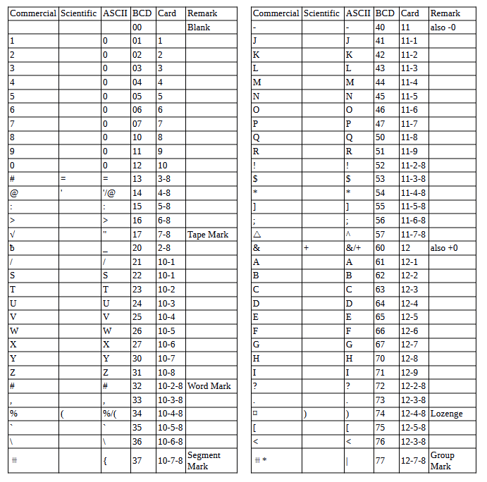

<!-- notpdf -->
# **IBM 7010 Simulator Usage**

**01-Jan-2007**

<!-- /notpdf -->
Copyright © 2007, Richard Cornwell\
Copyright © 1993-2007, Robert M Supnik

[COPYRIGHT NOTICE and LICENSE](#copyright-notice-and-license) are at the end of this document.

# Contents

 - [Introduction](#introduction)
 - [Simulator Files](#simulator-files)
 - [IBM 7010 Features](#ibm-7010-features)
 - [Stop conditions](#stop-conditions)
 - [CPU](#cpu)
   - [Registers](#registers)
 - [I/O Channels (CH1..CH4)](#io-channels-ch1ch4)
   - [Registers](#registers-1)
 - [Unit record devices.](#unit-record-devices)
   - [Inquiry Station (INQ)](#inquiry-station-inq)
   - [1402 Card Reader (CDR)](#1402-card-reader-cdr)
   - [1402 Card Punch (CDP)](#1402-card-punch-cdp)
   - [Stack Device (STKR)](#stack-device-stkr)
   - [1403 Line Printer (LP)](#1403-line-printer-lp)
 - [Magnetic Tape devices](#magnetic-tape-devices)
   - [729 Magnetic Tape (MTA-C)](#729-magnetic-tape-mta-c)
   - [ChronoClock](#chronoclock)
 - [7909 Devices](#7909-devices)
   - [1301/1302/2302/7320 Disk devices](#1301130223027320-disk-devices)
   - [7750 Communications Controller (COM and COML)](#7750-communications-controller-com-and-coml)
     - [Registers](#registers-2)
 - [Symbolic Display and Input](#symbolic-display-and-input)
 - [Character Codes](#character-codes)
 - [COPYRIGHT NOTICE and LICENSE](#copyright-notice-and-license)

# Introduction

The IBM 1410 and 7010 were designed as enhancements to the IBM 1401,
these were somewhat source compatible, but not binary compatible.

The 1410 was introduced on September, 12 1960 and the 7010 in 1962. The 1410
was withdrawn on March 30, 1970.

The 7010 featured 4 I/O channels where
the 1410 had 2. Also the 7010 could access 100,000 characters of memory
as opposed to the 80,000 for the 1410. The 7010 also featured optional
decimal floating point instructions.

Memory was divided into fields
separated by a special flag called a word mark. Instructions end at the
first character with the word mark set. They consist of a operation
code, followed by 1 or 2 5-digit addresses, and an optional instruction
modifier. 

If the 10's and 100's digit have zone bits set the address is
modified by the contents of the five characters at locations 25-100.

Each register is 5 characters long and word marks are ignored. The 1410
and 7010 could also be optionally equipped with priority mode to allow
for device complete interrupts.

The 7010 or 1410 CPU has no registers. All operations on done from
memory.

# Simulator Files

To compile the IBM 7010:

| ***Subdirectory*** | ***File***     | ***Contains***                           |
| ------------------ | -------------- | ---------------------------------------- |
| **I7000**          | i7000\_defs.h  | IBM 7000 simulators general definitions  |
|                    | i7010\_defs.h  | IBM 7010 simulator specific definitions  |
|                    | i7000\_chan.c  | Generic channel interface.               |
|                    | i7010\_cpu.c   | 7010 CPU, Channel, interface             |
|                    | I7010\_chan.c  | 7010 Channel.                            |
|                    | i7010\_sys.c   | 7010 System interface                    |
|                    | i7000\_cdr.c   | 1402 Card reader                         |
|                    | i7000\_cdp.c   | 1402 Card punch                          |
|                    | i7000\_com.c   | 7750 Communications Controller           |
|                    | i7000\_con.c   | Inquiry console.                         |
|                    | i7000\_dsk.c   | 1301/2302 disk and 7238 drum controller. |
|                    | i7000\_ht.c    | 7340 Hypertape controller.               |
|                    | i7000\_lpr.c   | 1403 Line printer                        |
|                    | i7000\_mt.c    | 729 Tape controller.                     |
|                    | i7000\_chron.c | Chrono Clock.                            |

# IBM 7010 Features

The IBM 7010 simulator is configured as follows:

| **Device Name(s)** | **Simulates**                             |
| ------------------ | ----------------------------------------- |
| **CPU**            | 7010 CPU with 10-60K of memory            |
| **CH1..4**         | 7010 Channels.                            |
| **MTA**            | 729 Magnetic Tape Controller (Channel 20) |
| **MTB**            | 729 Magnetic Tape Controller (Channel 21) |
| **MTC**            | 729 Magnetic Tape Controller (Channel 22) |
| **CHRON**          | Chrono Clock                              |
| **CDR**            | 1402 Card Reader                          |
| **CDP**            | 1402 Card Punch                           |
| **STKR**           | 1402 Card Punch Stacker                   |
| **LP**             | 1403 Line Printer                         |
| **DK**             | 1301/2302/7304 disk.                      |
| **COM**            | 7750 communications controller.           |
| **COML**           | 7750 Communications lines.                |

## Stop conditions

The 7010 simulator implements several unique stop conditions:

  - I/O Device not ready.
  - Unknown CPU instruction
  - I/O Check
  - Divide Error
  - No Word Mark
  - Invalid Addresses
  - Invalid Instruction Length
  - Program Check
  - Protection Check
  - invalid message to 7750
  - No buffer storage available for input character on 7750
  - no buffer storage available for output character on 7750

## CPU

The CPU options include setting memory size and CPU type.

    SET CPU 1401                Emulate a 1401       
    SET CPU 7010                Emulate a 7010       
    SET CPU 10K                 Sets memory to 10K   
    SET CPU 20K                 Sets memory to 20K   
    SET CPU 30K                 Sets memory to 30K   
    SET CPU 40K                 Sets memory to 40K   
    SET CPU 50K                 Sets memory to 50K   
    SET CPU 60K                 Sets memory to 60K   
    SET CPU 70K                 Sets memory to 70K   
    SET CPU 80K                 Sets memory to 80K   
    SET CPU 90K                 Sets memory to 90K   
    SET CPU 100K                Sets memory to 100K  
    SET CPU NOPRIORITY          No Priority Mode     
    SET CPU PRIORITY            Priority Mode        
    SET CPU NOFLOAT             No Floating Point    
    SET CPU FLOAT               Floating point       
    SET CPU NOPROT              No memory protection 
    SET CPU PROT                Memory Protection    

Memory size is 10KW on a standard CPU, extended option must be enabled
to use memory sizes over 10KW.

### Registers

CPU registers include the visible state of the processor as well as the
control registers for the interrupt system.

| ***Name*** | ***Size(digits)*** | ***Comments***               |
| ---------- | ------------------ | ---------------------------- |
| IAR        | 5                  | Instruction Address Register |
| AAR        | 5                  | A Address Register           |
| BAR        | 5                  | B Address Register           |
| CAR        | 5                  | C Address Register           |
| DAR        | 5                  | D Address Register           |
| E          | 5                  | Channel 0 Address Register   |
| F          | 5                  | Channel 1 Address Register   |
| G          | 5                  | Channel 2 Address Register   |
| H          | 5                  | Channel 3 Address Register   |
| ASTRISK    | 1                  | Asterix Mode                 |
| SW0..6     | 1                  | Sense Switch                 |
| SW         | 6                  | Sense Switches.              |

The CPU can maintain a history of the most recently executed
instructions.

This is controlled by the SET CPU HISTORY and SHOW CPU HISTORY commands:

    SET CPU HISTORY             clear history buffer
    SET CPU HISTORY=0           disable history
    SET CPU HISTORY=n           enable history, length = n
    SHOW CPU HISTORY            print CPU history
    SHOW CPU HISTORY=n          print first n entries of CPU history

The history trace shows the Instruction counter, the AAR and BAR before
and after the instruction executed. The result of the instruction is
displayed followed by the symbolic instruction.

## I/O Channels (CH1..CH4)

The 7010 supported 4 channels.

    SET CHAN UREC=dev           Sets device to cause interrupts on a channel.

### Registers

Channels have the following registers:

| ***Name*** | ***Size(digits)*** | ***Comments***       |
| ---------- | ------------------ | -------------------- |
| ADDR       | 5                  | Channel Data Address |
| CMD        | 1                  | Channel Command.     |
| FLAGS      | 32 (binary)        | Channel Flags        |

For meaning of bits in FLAGS see i7000\_defs.h.

## Unit record devices.

### Inquiry Station (INQ)

The inquiry station allows for communications with the operating system.

The station is half duplex and will either print or accept input.

Whenever the computer sends a message it is prefixed with a ‘R’
character.

When the station is ready to receive input it prompts with a
‘I’. Input is buffered until the return character is entered.

Backspace will remove the last character typed. 

An \<esc\> will send an
interrupt to the processor to request it read a record from the console.

An \<esc\> while in input mode will cancel input mode and clear any
typed message.

### 1402 Card Reader (CDR)

The card reader (CDR) reads data from a disk file. 

Cards are simulated
as ASCII lines with terminating newlines. 

Card reader files can either
be text (one character per column) or column binary (two characters per
column). The file type can be specified with a set command:

    SET CDRn FORMAT=TEXT        Sets ASCII text mode
    SET CDRn FORMAT=BINARY      Sets for binary card images
    SET CDRn FORMAT=BCD         Sets for BCD records.
    SET CDRn FORMAT=CBN         Sets for column binary BCD records.
    SET CDRn FORMAT=AUTO        Automatically determines format.

or in the ATTACH command:

    ATTACH CDRn <file>                Attaches a file
    ATTACH CDRn -f <format> <file>    Attaches a file with the given format.
    ATTACH CDRn -s <file>             Added file onto current cards to read.
    ATTACH CDRn -e <file>             After file is read in, the reader will receive an end of file flag.

The channel can be changed by the following command:

    SET CDRn CHAN=c             Set this device to channel c

The default assignments are:

    CDR0                        Channel 1
    CDR1                        Disabled

The card reader can be booted with:

    BOOT CDRn

The CDR Reads first card into address 1 and starts execution at location 1.

Error handling is as follows:

| error        | processed as          |
|--------------|-----------------------|
| not attached | report error and stop |
| end of file  | out of cards          |
| OS I/O error | report error and stop |

### 1402 Card Punch (CDP)

The card reader (CDP) writes data to a disk file. Cards are simulated as
ASCII lines with terminating newlines. Card punch files can either be
text (one character per column) or column binary (two characters per
column). The file type can be specified with a set command:

    SET CDPn FORMAT=TEXT        Sets ASCII text mode
    SET CDPn FORMAT=BINARY      Sets for binary card images.
    SET CDPn FORMAT=BCD         Sets for BCD records.
    SET CDPn FORMAT=CBN         Sets for column binary BCD records.
    SET CDPn FORMAT=AUTO        Automatically determines format.

or in the ATTACH command:

    ATTACH CDPn <file>                 Attaches a file
    ATTACH CDPn -f <format> <file>     Attaches a file with the given format.

The channel can be changed by the following command:

    SET CDPn CHAN=c             Set this device to channel c.

The default assignments are:

    CDP0                        Channel 1
    CDP1                        Disabled|

Error handling is as follows:

| error        | processed as          |
|--------------|-----------------------|
| not attached | report error and stop |
| OS I/O error | report error and stop |

### Stack Device (STKR)

The stacker device can be enabled, and files can be attached to
individual bins of the stacker.

The file format follows that of the CDP
device.

The individual unit reflects the stacker code sent by the
computer.

If no file is attached the output will go to the file attached
to the CDP device.

### 1403 Line Printer (LP)

The line printer (LP) writes data to a disk file as ASCII text with
terminating newlines. Currently set to handle standard signals to
control paper advance.

    SET LPn NO/ECHO             Sets echoing to console of line-printer output.
    SET LPn CHAN=n              Sets channel for this device
    SET LPn LINESPERPAGE=lpp    Sets number of lines per page on printer.

The default assignments are:

    LP0                         Channel 1
    LP1                         Disabled

The printer supports the following control codes to control spacing.

| Character (Octal) | Action                                        |
| ----------------- | --------------------------------------------- |
| 060               | Suppress spacing.                             |
| 020               | Single space after.                           |
| 040               | Single space before.                          |
| 063               | Skip to channel 3 (every 5th line) |
| 062               | Skip to channel 2 (every 8th line) |
| 061 & 069         | Skip to channel 1 (or 9), (top of form).      |

Error handling is as follows:

| error        | processed as          |
|--------------|-----------------------|
| not attached | report error and stop |
| OS I/O error | report error and stop |

## Magnetic Tape devices

### 729 Magnetic Tape (MTA-C)

These come in groups of 10 units each.

Each individual tape drive support several options: MTA used as an
example.

    SET MTAn REWIND             Sets the mag tape to the load point
    SET MTAn LOCKED             Sets the mag tape to be read only.
    SET MTAn WRITEENABLE        Sets the mag tape to be writable.
    SET MTAn LOW                Sets mag tape to low density.
    SET MTAn HIGH               Sets mag tape to high density.

Options: Density LOW/HIGH does not change format of how tapes are
written. And is only for informational purposes only.

Tape drives can be booted with:

    BOOT MTxn                   Read in record into location 0.

### ChronoClock

Disabled by default. This is a special 729 tape drive which returns the
current time. It supports the option of setting the channel and drive
that it will occupy. 

**Note:** You must disable the real 729 drive that is
is replacing.

The clock responds to Read and Backspace commands. A read
results in a 10 character buffer being generated that has the Month,
Day, Hour, Minutes, Seconds and Milliseconds.

This time is taken from the local computer time.

    SET CHRON CHAN=n            Set channel for chrono clock.
    SET CHRON UNIT=n            Sets the unit for the chrono clock.

Example: To set Chronoclock to unit A9 do the following:

    SET MTA9 DISABLE
    SET CHRON UNIT=9 CHAN=1

## 7909 Devices

These devices must be attached to a 7909 channel to work.

### 1301/1302/2302/7320 Disk devices

The 7631 file control supports up to ten devices, which can be 7320
drums, 1301 disks, 1302 disks, or 2302 disks. Unit types are specified
with the SET command.

    SET DKn TYPE=7320           Unit *n* is a drum
    SET DKn TYPE=7320-2         Unit *n* is a drum (two modules)
    SET DKn TYPE=1301           Unit *n* is a 1301 disk
    SET DKn TYPE=130l-2         Unit *n* is a 1301-2 disk (two modules).
    SET DKn TYPE=1302           Unit *n* is a 1302 disk
    SET DKn TYPE=1302-2         Unit *n* is a 1302-2 disk (two modules).
    SET DKn TYPE=2302           Unit *n* is a 2302 disk

Units can be SET ENABLED or DISABLED. In addition, units can be set to
enable or disable formatting:

    SET DKn FORMAT              Enable formatting
    SET DKn NOFORMAT            Disable formatting
    SET DKn HA2                 Enable writing of home address 2
    SET DKn NOHA2               Disable writing of home address 2
    SET DKn MODULE=n            Sets modules for unit, modules can only be even. 0 to 8.
    SET DKn CHAN=n              Sets channel for unit (A-H).
    SET DKn SELECT=n            Sets select on channel (0 or 1).
    SET DKn CTSS                Sets disk to use CTSS bootstrap
    SET DKn IBSYS               Sets disk to use IBSYS bootstrap.

Formatting is disabled by default.

All Disk units support bootstrapping with boot command. Bootstrap code
is build based on whether CPU is in CTSS mode or not.

    BOOT DKn                    Insert custom Loader into lower memory and start.

Error handling is as follows:

| error        | processed as          |
|--------------|-----------------------|
| not attached | report error and stop |
| OS I/O error | report error and stop |

### 7750 Communications Controller (COM and COML)

The 7750 is modeled as a terminal multiplexer with 33 lines. It consists
of two device: COM is the multiplexer controller, and COML is the
individual lines.

For the first 32 lines, the 7750 performs input and
output through Telnet sessions connected via a user-specified listening
port. 

The 33rd line is permanently attached to the simulator console
window.

The ATTACH command specifies the port to be used for Telnet sessions:

    ATTACH COM <port>           set up listening port

where port is a decimal number between 1 and 65535 that is not being
used other TCP/IP activities.

Each line (each unit of COML) can be set to one of twp modes: KSR-35 and
KSR-37. In KSR-35 mode, lower case input and output characters are
converted automatically to upper case, and parity is ignored. In KSR-37
mode, lower case characters are left alone, and even parity is generated
on input. KSR-37 is the default.

Once COM is attached and the simulator is running, the 7750 listens for
connections on the specified port. It assumes that any incoming
connection is a Telnet connections. The connections remain open until
disconnected either by the Telnet client, a SET COM DISCONNECT
command,or a DETACH COM command.

    SET COM DISCONNECT=n        Disconnect line n
    SET COM CHAN=n              Set channel for com controller.

The 7750 implements the following special SHOW commands

    SHOW COM CONNECTIONS        Displays current connections to the 7750
    SHOW COM STATISTICS         Displays statistics for active connections 

The 7750 implements the following special SET commands:

    SET COMLn LOG=filename      Log output of line n to filename 
    SET COMLn NOLOG             Disable logging and close log file
    SET COMLn KSR35             Set line *n* to ksr-35
    SET COMLn KSR37             Set line *n* to ksr-37
    SET COMLn 2741              Set line *n* to 2741

#### Registers

The controller (COM) implements these registers:

| *Name* | *Size* | *Comments*                    |
| ------ | ------ | ----------------------------- |
| ENABLE | 1      | Enable flag                   |
| STATE  | 6      | Controller state              |
| MSGNUM | 12     | Input message sequence number |

# Symbolic Display and Input

The IBM 7010 simulator implements symbolic display and input. These are
controlled by the following switches to the EXAMINE and DEPOSIT
commands:

    -m                          Display/Enter Symbolic Machine Code
    -c                          Display/Enter BCD Characters
    -n                          Display 1401 Symbolic Machine Code
    (none)                      Display/Enter Octal Characters

The symbolic input/display supports several formats for instruction
display:

  - \<opcode\>
  - \<opcode\> \<character\>
  - \<opcode\> \<character\>\<character\>\<character\>
  - \<opcode\> \<address\>
  - \<opcode\> \<address\>,\<address\>
  - \<opcode\> \<address\>,\<character\>
  - \<opcode\> \<address\>,\<address\>,\<character\>

An address is a decimal number optionally followed by a +Xnn specifying
an index register.

# Character Codes

This is the mapping between character codes used by the simulator:

# COPYRIGHT NOTICE and LICENSE

The following copyright notice applies to the SIMH source, binary, and
documentation:

Original code published in 1993-2007, written by Robert M Supnik

Permission is hereby granted, free of charge, to any person obtaining
a copy of this software and associated documentation files (the
"Software"), to deal in the Software without restriction, including
without limitation the rights to use, copy, modify, merge, publish,
distribute, sublicense, and/or sell copies of the Software, and to
permit persons to whom the Software is furnished to do so, subject to
the following conditions:

The above copyright notice and this permission notice shall be
included in all copies or substantial portions of the Software.

THE SOFTWARE IS PROVIDED "AS IS", WITHOUT WARRANTY OF ANY KIND,
EXPRESS OR IMPLIED, INCLUDING BUT NOT LIMITED TO THE WARRANTIES OF
MERCHANTABILITY, FITNESS FOR A PARTICULAR PURPOSE AND NONINFRINGEMENT.
IN NO EVENT SHALL ROBERT M SUPNIK BE LIABLE FOR ANY CLAIM, DAMAGES OR
OTHER LIABILITY, WHETHER IN AN ACTION OF CONTRACT, TORT OR OTHERWISE,
ARISING FROM, OUT OF OR IN CONNECTION WITH THE SOFTWARE OR THE USE
OR OTHER DEALINGS IN THE SOFTWARE.

Except as contained in this notice, the names of the authors shall
not be used in advertising or otherwise to promote the sale, use or
other dealings in this Software without prior written authorization
from each author.
