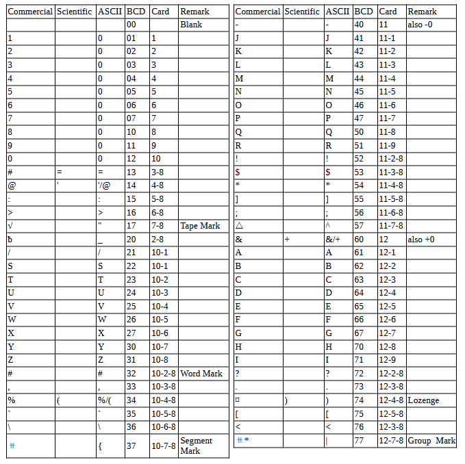

<!-- notpdf -->
# **IBM 701 Simulator Usage**

**01-Jan-2007**

<!-- /notpdf -->
Copyright © 2007, Richard Cornwell\
Copyright © 1993-2007, Robert M Supnik

[COPYRIGHT NOTICE and LICENSE](#copyright-notice-and-license) are at the end of this document.

# Contents

 - [Introduction](#introduction)
 - [Simulator Files](#simulator-files)
 - [IBM 701 Features](#ibm-701-features)
 - [Stop conditions](#stop-conditions)
 - [CPU](#cpu)
 - [I/O Channel (CH)](#io-channel-ch)
 - [Peripherals](#peripherals)
   - [Card Reader (CDR)](#card-reader-cdr)
   - [721 Card Punch (CDP)](#721-card-punch-cdp)
   - [716 Line Printer (LP)](#716-line-printer-lp)
   - [729 Magnetic Tape (MT)](#729-magnetic-tape-mt)
   - [733 Drum (DR)](#733-drum-dr)
 - [Symbolic Display and Input](#symbolic-display-and-input)
 - [Sim Load](#sim-load)
 - [Character Codes](#character-codes)
 - [COPYRIGHT NOTICE and LICENSE](#copyright-notice-and-license)

# Introduction

The IBM 701 also know as \"Defense Calculator\" was introduced by IBM on
April 7, 1953. This computer was start of IBM 700 and 7000 line. Memory
was 2048 36 bit words. Each instruction could be signed plus or minus,
plus would access memory as 18 bit words, minus as 36 bit words. There
was a expansion option to add another 2048 words of memory, but I can\'t
find documentation on how it worked. Memory cycle time was 12
microseconds. The 701 was withdrawn from the market October 1, 1954
replaced by 704 and 702. A total of 19 machines were installed.

# Simulator Files

To compile the IBM 701, you must define USE\_INT64 and I701 as part of
the compilation command line.

| ***Subdirectory***  | ***File***     |  ***Contains***                           |
|---------------------|----------------|-------------------------------------------|
| **I7000**           | i7000\_defs.h  | IBM 7000 simulators general definitions   |
|                     | i701\_defs.h   | IBM 701 simulator specific definitions    |
|                     | i7000\_chan.c  | Generic channel interface.                |
|                     | i701\_cpu.c    | 701 CPU, Channel, interface               |
|                     | i701\_chan.c   | 701 Channel.                              |
|                     | i701\_sys.c    | 701 System interface                      |
|                     | i7090\_cdr.c   | 711 Card reader                           |
|                     | i7090\_cdp.c   | 721 Card punch                            |
|                     | i7090\_lpr.c   | 716 Line printer                          |
|                     | i7090\_drum.c  | 733 Drum memory interface.                |
|                     | i7000\_mt.c    | 729 Tape controller                       |

# IBM 701 Features

The IBM 701 simulator is configured as follows:

| **Device Name(s)**  | **Simulates**                |
|---------------------|------------------------------|
| **CPU**             | 701 CPU with 2KW of memory   |
| **CH**              | 701 Channel Device           |
| **MT**              | 729 Magnetic Tape Controller |
| **CDR**             | 711 Card Reader              |
| **CDP**             | 721 Card Punch               |
| **LP**              | 716 Line Printer             |
| **DR0**             | 733 Drum                     |

The LOAD command will load a card binary image file into memory. An
octal dump file, or a pseudo assembly code.

## Stop conditions

The 701 simulator implements several unique stop conditions:

-   undefined CPU instruction
-   divide check on a divide and halt instruction
-   write select of a write protected device

## CPU

Memory size is 2KW on a standard CPU.

CPU registers include the visible state of the processor as well as the
control registers for the interrupt system.

| ***Name*** | ***Size*** | ***Comments***         |
|------------|------------|------------------------|
| IC         | 15         | Program Counter        |
| AC         | 38         | Accumulator            |
| MQ         | 36         | Multiplier-Quotient    |
| SW1..SW6   | 1          | Sense Switches 1..6    |
| SW         | 6          | Sense Switches         |
| SL1..4     | 1          | Sense Lights 1..4      |
| ACOVF      | 1          | AC Overflow Indicator  |
| DVC        | 1          | Divide Check Indicator |
| IOC        | 1          | I/O Check Indicator    |

The CPU can maintain a history of the most recently executed
instructions. This is controlled by the SET CPU HISTORY and SHOW CPU
HISTORY commands:

    SET CPU HISTORY             clear history buffer
    SET CPU HISTORY=0           disable history
    SET CPU HISTORY=n           enable history, length = n
    SHOW CPU HISTORY            print CPU history
    SHOW CPU HISTORY=n          print first n entries of CPU history

## I/O Channel (CH)

The channel device on the 701 is only used by simulator, and has no
controls or registers.

## Peripherals

### Card Reader (CDR)

The card reader (CDR) reads data from a disk file. Cards are simulated
as ASCII lines with terminating newlines. Card reader files can either
be text (one character per column) or column binary (two characters per
column). The file type can be specified with a set command:

    SET CDR FORMAT=TEXT            Sets ASCII text mode
    SET CDR FORMAT=BINARY          Sets for binary card images
    SET CDR FORMAT=BCD             Sets for BCD records
    SET CDR FORMAT=CBN             Sets for column binary BCD records
    SET CDR FORMAT=AUTO            Automatically determines format.

or in the ATTACH command:

    ATTACH CDR file                Attaches a file
    ATTACH CDR -f <format> <file>  Attaches a file with the given format.
    ATTACH CDR -s <file>           Added file onto current cards to read.
    ATTACH CDR -e <file>           After file is read in, the reader will receive an end of file flag.

The card reader can be booted with:

    BOOT CDR                    Loads first 3 words of card.|
    

Error handling is as follows:

| error        | processed as          |
|--------------|-----------------------|
| not attached | report error and stop |
| end of file  | out of cards          |
| OS I/O error | report error and stop |

### 721 Card Punch (CDP)

The card reader (CDP) writes data to a disk file. Cards are simulated as
ASCII lines with terminating newlines. Card punch files can either be
text (one character per column) or column binary (two characters per
column). The file type can be specified with a set command:

    SET CDP FORMAT=TEXT         Sets ASCII text mode
    SET CDP FORMAT=BINARY       Sets for binary card images.
    SET CDP FORMAT=BCD          Sets for BCD records.
    SET CDP FORMAT=CBN          Sets for column binary BCD records.
    SET CDP FORMAT=AUTO         Automatically determines format.

or in the ATTACH command:

    ATTACH CDP <file>              Attaches a file
    ATTACH CDP -f <format> <file>  Attaches a file with the given format.

Error handling is as follows:

| error        | processed as          |
|--------------|-----------------------|
| not attached | report error and stop |
| OS I/O error | report error and stop |

### 716 Line Printer (LP)

The line printer (LP) writes data to a disk file as ASCII text with
terminating newlines. Currently set to handle standard signals to
control paper advance.

    SET LP NO/ECHO              Sets echoing to console of line-printer output.
    SET LP LINESPERPAGE=n       Sets number of lines per page on printer.

The Printer supports the following SPRA *n* selection pulses for
controlling spacing (spacing occurs before the line is printed):

|  SPRA  | Action                                                   |
|--------| ---------------------------------------------------------|
| SPRA 1 | Slew to top of form.                                     |
| SPRA 2 | Single space.                                            |
| SPRA 3 | Double space. Before printing line.                      |
| SPRA 4 | Triple space. Before printing line.                      |
| SPRA 9 | Suppress linefeed after print. Prints characters 73-120  |
| SPT    | Will skip if any printer line has been pulsed.           |

Default with no SPRA is to single space before printing.

Error handling is as follows:

| error        | processed as          |
|--------------|-----------------------|
| not attached | report error and stop |
| OS I/O error | report error and stop |

### 729 Magnetic Tape (MT)

These come in groups of 10 units each. MT0 is unit 10.

Each individual tape drive support several options: MTA used as an
example.

    SET MT*n* REWIND            Sets the mag tape to the load point.
    SET MT*n* LOCKED            Sets the mag tape to be read only.
    SET MT*n* WRITEENABLE       Sets the mag tape to be writable.
    SET MT*n* LOW               Sets mag tape to low density.
    SET MT*n* HIGH              Sets mag tape to high density.

Options: Density LOW/HIGH does not change format of how tapes are
written. And is only for informational purposes only.

Tape drives can be booted with:

    BOOT MT*n*                  Read in first three words of record.

### 733 Drum (DR)

Up to 16 units can be attached to the CPU, all are on pseudo channel 0.
Each drum is 2048K words in size. They are all stored in one file.

    SET DR0 UNITS=n             Set number of units to of storage to attach.

Drum unit 0 can be booted with:

    BOOT DR0n                   Read in first three words of record.

# Symbolic Display and Input

The IBM 701 simulator implements symbolic display and input. These are
controlled by the following switches to the EXAMINE and DEPOSIT
commands:

    -m                          Display/Enter Symbolic Machine Code
    -c                          Display/Enter BCD Characters
    <none>                      Display/Enter Octal data

The symbolic input/display supports 1 format for instruction display:

 -   \<opcode\>,\<sign\>\<octal address\>,\<opcode\>,\<sign\>\<octal
    address\>

A negative address specifies the lower 18 bits of the given memory
location.

# Sim Load

The load command looks at the extension of the file to determine how to
load the file.

| Ext  | Load action and format                      |
|------| --------------------------------------------|
| .crd | Loads a card image file into memory. Standard 709 format + 1 card loader. |
| .oct | Loads an octal deck: address \<blank\> octal \<blank\> octal\... |
| .sym | Loads a 709 symbolic deck.                  |
|      | address instruction.. address BCD string address OCT octal octal    |

# Character Codes

This is the mapping between character codes used by the simulator:

# COPYRIGHT NOTICE and LICENSE

The following copyright notice applies to the SIMH source, binary, and
documentation:

Original code published in 1993-2007, written by Robert M Supnik

Permission is hereby granted, free of charge, to any person obtaining
a copy of this software and associated documentation files (the
"Software"), to deal in the Software without restriction, including
without limitation the rights to use, copy, modify, merge, publish,
distribute, sublicense, and/or sell copies of the Software, and to
permit persons to whom the Software is furnished to do so, subject to
the following conditions:

The above copyright notice and this permission notice shall be
included in all copies or substantial portions of the Software.

THE SOFTWARE IS PROVIDED "AS IS", WITHOUT WARRANTY OF ANY KIND,
EXPRESS OR IMPLIED, INCLUDING BUT NOT LIMITED TO THE WARRANTIES OF
MERCHANTABILITY, FITNESS FOR A PARTICULAR PURPOSE AND NONINFRINGEMENT.
IN NO EVENT SHALL ROBERT M SUPNIK BE LIABLE FOR ANY CLAIM, DAMAGES OR
OTHER LIABILITY, WHETHER IN AN ACTION OF CONTRACT, TORT OR OTHERWISE,
ARISING FROM, OUT OF OR IN CONNECTION WITH THE SOFTWARE OR THE USE
OR OTHER DEALINGS IN THE SOFTWARE.

Except as contained in this notice, the names of the authors shall
not be used in advertising or otherwise to promote the sale, use or
other dealings in this Software without prior written authorization
from each author.
