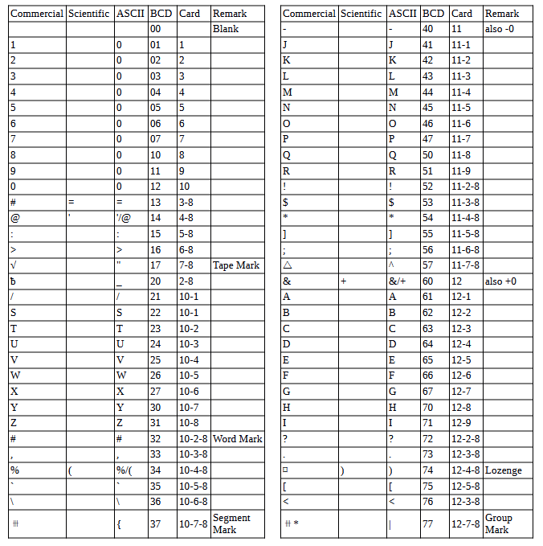

<!-- notpdf -->
# **IBM 7070 Simulator Usage**

**25-Jul-2018**

<!-- /notpdf -->
Copyright © 2007, Richard Cornwell\
Copyright © 1993-2007, Robert M Supnik

[COPYRIGHT NOTICE and LICENSE](#copyright-notice-and-license) are at the end of this document.

# Contents

 - [Introduction](#introduction)
 - [Simulator Files](#simulator-files)
 - [IBM 7070 Features](#ibm-7070-features)
 - [Stop conditions](#stop-conditions)
 - [CPU](#cpu)
 - [I/O Channels (CH0..CH8)](#io-channels-ch0ch8)
   - [Registers](#registers)
 - [Unit record devices.](#unit-record-devices)
   - [7500 Inquiry Station (INQ)](#7500-inquiry-station-inq)
   - [7500 Card Reader (CDR)](#7500-card-reader-cdr)
   - [7550 Card Punch (CDP)](#7550-card-punch-cdp)
   - [7400 Line Printer (LP)](#7400-line-printer-lp)
 - [Magnetic Tape devices](#magnetic-tape-devices)
   - [729 Magnetic Tape (MTA-C)](#729-magnetic-tape-mta-c)
   - [ChronoClock](#chronoclock)
 - [7907 Devices](#7907-devices)
   - [1301/1302/2302/7320 Disk devices](#1301130223027320-disk-devices)
   - [Hypertape 7340 Tape drive (HTA)](#hypertape-7340-tape-drive-hta)
   - [7750 Communications Controller (COM and COML)](#7750-communications-controller-com-and-coml)
 - [Symbolic Display and Input](#symbolic-display-and-input)
 - [Character Codes](#character-codes)
 - [COPYRIGHT NOTICE and LICENSE](#copyright-notice-and-license)

# Introduction

The IBM 7070 was introduced in June 1960, as a replacement to the IBM 650.
It had core memory up to 10,000 10 digit words.

The 7072 was
introduced November 1962 and the 7074 on November 1961. 

The 7074 is a faster version of the 7070 with the addition of memory
up to 40,000 10 digit words. 

The first 100 memory locations can be used as index registers. Most
memory reference instructions allow for a field of digits to be selected
to operate on and not modify the rest.

The 7070 is a decimal machine with each word consisting of 10 digits
plus a sign. The sign can be plus, minus or alpha. Alpha data is stored
5 characters to a word (2 digits per character).

# Simulator Files

To compile the IBM 7070, you must define USE\_INT64 as part of the
compilation command line.

| ***Subdirectory*** | ***File***     | ***Contains***                           |
| ------------------ | -------------- | ---------------------------------------- |
| **I7000**          | i7000\_defs.h  | IBM 7000 simulators general definitions  |
|                    | i7070\_defs.h  | IBM 7070 simulator specific definitions  |
|                    | i7000\_chan.c  | Generic channel interface.               |
|                    | i7070\_cpu.c   | 7070 CPU, Channel, interface             |
|                    | i7070\_chan.c  | 7070 Channel.                            |
|                    | i7070\_sys.c   | 7070 System interface                    |
|                    | i7000\_cdr.c   | 7500 Card reader                         |
|                    | i7000\_cdp.c   | 7550 Card punch                          |
|                    | i7000\_com.c   | 7750 Communications Controller           |
|                    | i7000\_con.c   | 7551 Inquiry console.                    |
|                    | i7000\_dsk.c   | 1301/2302 disk and 7238 drum controller. |
|                    | i7000\_ht.c    | 7340 Hypertape controller.               |
|                    | i7000\_lpr.c   | 7400 Line printer                        |
|                    | i7000\_mt.c    | 729 Tape controller.                     |
|                    | i7000\_chron.c | Chrono Clock.                            |

# IBM 7070 Features

The IBM 7070 simulator is configured as follows:

| **Device Name(s)** | **Simulates**                             |
| ------------------ | ----------------------------------------- |
| **CPU**            | 7070 CPU with 30KW of memory              |
| **CH0**            | Unit record devices                       |
| **CH1..4**         | 7504 Tape controller channels             |
| **CH5..7**         | 7907 Disk, Hypertape, controller channels |
| **MTA**            | 729 Magnetic Tape Controller              |
| **MTB**            | 729 Magnetic Tape Controller              |
| **MTC**            | 729 Magnetic Tape Controller              |
| **CHRON**          | Chrono Clock                              |
| **HTA**            | 7340 Hypertape, default not included.     |
| **HTB**            | 7340 Hypertape, default not included.     |
| **CDR**            | 7500 Card Reader                          |
| **CDP**            | 7550 Card Punch                           |
| **LP**             | 7400 Line Printer                         |
| **DK**             | 1301/2302/7304 disk.                      |
| **INQ**            | 7551 Inquiry console.                     |
| **COM**            | 7750 communications controller.           |
| **COML**           | 7750 Communications lines.                |

If desired individual devices can be removed from the system by editing
i7000\_defs.h and changing the number of “NUM\_DEVS\_xxx” entries. The
entry “NUM\_UNITS\_xx” determines the number of individual units for
each controller.

## Stop conditions

The 7090 simulator implements several unique stop conditions:

  - Undefined CPU instruction.
  - IO device not ready.
  - IO Check error.
  - Divide Error
  - Field Overflow (CPU enabled).
  - Sign Change (CPU enabled).
  - Alpha Index Word.
  - Invalid message to 7750.
  - No buffer storage available for input character on 7750.
  - N buffer storage available for output character on 7750.

## CPU

The CPU options include setting memory size and CPU type.

    SET CPU 7070                Sets CPU to emulate 7070.
    SET CPU 7074                Sets CPU to emulate 7074.
    SET CPU 5K                  Sets memory to 5K
    SET CPU 10K                 Sets memory to 10K
    SET CPU 15K                 Sets memory to 15K*
    SET CPU 20K                 Sets memory to 20K*
    SET CPU 25K                 Sets memory to 25K*
    SET CPU 30K                 Sets memory to 30K*
    SET CPU NOFLOAT             Disables floating point.
    SET CPU FLOAT               Enables floating point.
    SET CPU NOEXTEND            Disables extended memory support.
    SET CPU EXTEND              Enables extended memory support.
    SET CPU TIMER               Enables interval timer and interrupt.
    SET CPU NOTIMER             Disables interval timer.

\* Memory size is 10KW on a standard CPU, extended option must be
enabled to use memory sizes over 10KW.

CPU registers include the visible state of the processor as well as the
control registers for the interrupt system.

| ***Name*** | ***Size(digits)*** | ***Comments***      |
| ---------- | ------------------ | ------------------- |
| IC         | 5                  | Program Counter     |
| AC1        | 10s                | Accumulator 1       |
| AC2        | 10s                | Accumulator 2       |
| AC3        | 10s                | Accumulator 3       |
| IND        | 10                 | Error indicators    |
| SW1..SW4   | 1                  | Sense Switches 1..4 |
| SW         | 4                  | Sense Switches      |

The CPU can maintain a history of the most recently executed
instructions.

This is controlled by the SET CPU HISTORY and SHOW CPU HISTORY commands:

    SET CPU HISTORY             clear history buffer
    SET CPU HISTORY=0           disable history
    SET CPU HISTORY=n           enable history, length = n
    SHOW CPU HISTORY            print CPU history
    SHOW CPU HISTORY=n          print first n entries of CPU history

Instruction tracing shows the Instruction counter, the generated
effective address, the value of memory before and after execution of the
instruction and the decoded instruction in symbolic format.

## I/O Channels (CH0..CH8)

The 7070 supports up to 8 channels. Channel models include:

    7604                        standard multiplexer channel
    7907                        advanced capabilities channel

Channels are fixed on the 7070.

Channel 0 is a pseudo channel for unit record devices.

### Registers

Channels have the following registers:

| ***Name*** | ***Size(digits)*** | ***Comments***                |
| ---------- | ------------------ | ----------------------------- |
| ADDR       | 6                  | Channel data address          |
| CMD        | 2                  | Channel command (octal)       |
| LIMIT      | 6                  | Channel word count            |
| ASM        | 10s                | Channel assembly register     |
| LOCATION   | 6                  | Channel location counter      |
| FLAGS      | 32                 | Channel status flags (binary) |

For meaning of bits in FLAGS see i7000\_defs.h.

The command:

    SHOW CH                     Print summary of devices on channel

## Unit record devices.

### 7500 Inquiry Station (INQ)

The inquiry station allows for communications with the operating system.

The station is half duplex and will either print or accept input.

Whenever the computer sends a message it is prefixed with a ‘R’
character. 

When the station is ready to receive input it prompts with a
‘I’. Input is buffered until the return character is entered.

Backspace will remove the last character typed.

An \<esc\> will send an
interrupt to the processor to request it read a record from the console.

An \<esc\> while in input mode will cancel input mode and clear any
typed message.

### 7500 Card Reader (CDR)

The card reader (CDR) reads data from a disk file. Cards are simulated
as ASCII lines with terminating newlines. Card reader files can either
be text (one character per column) or column binary (two characters per
column). The file type can be specified with a set command:

    SET CDR FORMAT=TEXT         Sets ASCII text mode
    SET CDR FORMAT=BINARY       Sets for binary card images.
    SET CDR FORMAT=BCD          Sets for BCD records.
    SET CDR FORMAT=CBN          Sets for column binary BCD records.
    SET CDR FORMAT=AUTO         Automatically determines format.

or in the ATTACH command:

    ATTACH CDR <file>                   Attaches a file
    ATTACH CDR -f <format> <file>       Attaches a file with the given format.
    ATTACH CDR -s <file>                Added file onto current cards to read.
    ATTACH CDR -e <file>                At end-of-file, the reader will receive
                                        an end of file flag.

The card reader can be booted with:

    BOOT CDR                    Start card reader to read one card.

Boot is currently not working.

The 7500 Card reader supported two modes of operation, alpha mode
(default), and load mode in which the card had 5 words that were read
into storage. To enable this set LCOL non zero.

    SET CDR LCOL=n              Set load column detection.

If LCOL is set to a non-zero value, then on every card read is checked
to see if there is a 12 punch in the designated column. If so the card
is converted to decimal, every 10th column is used to
determine the sign. Zone 12 is +, Zone 11 is -, no zone is Alpha.

The Card reader could single ready on one of two attention lines. To set
which one receives the ready signal use the following commands:

    SET CDR NOATTEN             Don’t signal when reader done.
    SET CDR ATTENA              Signal on priority channel A.
    SET CDR ATTENB              Signal on priority channel B.

Error handling is as follows:

| error        | processed as          |
|--------------|-----------------------|
| not attached | report error and stop |
| end of file  | out of cards          |

### 7550 Card Punch (CDP)

The card reader (CDP) writes data to a disk file. Cards are simulated as
ASCII lines with terminating newlines. Card punch files can either be
text (one character per column) or column binary (two characters per
column). The file type can be specified with a set command:

    SET CDP FORMAT=TEXT         Sets ASCII text mode
    SET CDP FORMAT=BINARY       Sets for binary card images.
    SET CDP FORMAT=BCD          Sets for BCD records.
    SET CDP FORMAT=CBN          Sets for column binary BCD records.
    SET CDP FORMAT=AUTO         Automatically determines format.

or in the ATTACH command:

    ATTACH CDP <file>                   Attaches a file
    ATTACH CDP -f <format> <file>       Attaches a file with the given format.

The Card punch could single ready on one of two attention lines. To set
which one receives the ready signal use the following commands:

    SET CDP NOATTEN             Don’t signal when punch done.
    SET CDP ATTENA              Signal on priority channel A.
    SET CDP ATTENB              Signal on priority channel B.

Error handling is as follows:

| error        | processed as          |
|--------------|-----------------------|
| not attached | report error and stop |
| OS I/O error | report error and stop |

### 7400 Line Printer (LP)

The line printer (LP) writes data to a disk file as ASCII text with
terminating newlines. Currently set to handle standard signals to
control paper advance.

    SET LP NO/ECHO              Sets echoing to console of line-printer output.
    SET LP LINESPERPAGE=lpp     Sets number of lines per page on printer.

The Line printer could single ready on one of two attention lines. To
set which one receives the ready signal use the following commands:

    SET LP NOATTEN              Don’t signal when printing done.
    SET LP ATTENA               Signal on priority channel A.
    SET LP ATTENB               Signal on priority channel B.

Error handling is as follows:

| error        | processed as          |
|--------------|-----------------------|
| not attached | report error and stop |
| OS I/O error | report error and stop |

## Magnetic Tape devices

### 729 Magnetic Tape (MTA-C)

These come in groups of 10 units each.

Each individual tape drive support several options: MTA used as an
example.

    SET MTAn REWIND             Sets the mag tape to the load point.
    SET MTAn LOCKED             Sets the mag tape to be read only.
    SET MTAn WRITEENABLE        Sets the mag tape to be writable.
    SET MTAn LOW                Sets mag tape to low density.
    SET MTAn HIGH               Sets mag tape to high density.

Options: Density LOW/HIGH does not change format of how tapes are
written. And is only for informational purposes only.

Tape drives can be booted with:

    BOOT MTxn                   Read in record into location 0.

Channel 1 supports the read binary opcode to load binary tapes in octal
format.

### ChronoClock

Disabled by default. This is a special 729 tape drive which returns the
current time. It supports the option of setting the channel and drive
that it will occupy.

**Note:** You must disable the real 729 drive that is
is replacing.

The clock responds to Read and Backspace commands. A read
results in a 10 character buffer being generated that has the Month,
Day, Hour, Minutes, Seconds and Milliseconds.

This time is taken from the local computer time.

    SET CHRON CHAN=n            Set channel for chrono clock.
    SET CHRON UNIT=n            Sets the unit for the chrono clock.

Example: To set Chronoclock to unit A9 do the following:

    SET MTA9 DISABLE
    SET CHRON UNIT=9 CHAN=A

## 7907 Devices

These devices must be attached to a 7907 channel to work.

### 1301/1302/2302/7320 Disk devices

The 7631 file control supports up to ten devices, which can be 7320
drums, 1301 disks, 1302 disks, or 2302 disks. Unit types are specified
with the SET command.

    SET DKn TYPE=7320           Unit n is a drum
    SET DKn TYPE=7320-2         Unit n is a drum (two modules).
    SET DKn TYPE=1301           Unit n is a 1301 disk
    SET DKn TYPE=130l-2         Unit n is a 1301-2 disk (two modules).
    SET DKn TYPE=1302           Unit n is a 1302 disk
    SET DKn TYPE=1302-2         Unit n is a 1302-2 disk (two modules).
    SET DKn TYPE=2302           Unit n is a 2302 disk

Units can be SET ENABLED or DISABLED. In addition, units can be set to
enable or disable formatting:

    SET DKn FORMAT              Enable formatting
    SET DKn NOFORMAT            Disable formatting
    SET DKn HA2                 Enable writing of home address 2
    SET DKn NOHA2               Disable writing of home address 2
    SET DKn MODULE=n            Sets modules for unit, modules can only be even. 0 to 8.
    SET DKn CHAN=n              Sets channel for unit (A-H).
    SET DKn SELECT=n            Sets select on channel (0 or 1).

Formatting is disabled by default.

Error handling is as follows:

| error        | processed as          |
|--------------|-----------------------|
| not attached | report error and stop |
| OS I/O error | report error and stop |

### Hypertape 7340 Tape drive (HTA)

These come in groups of 10 units each. The controller defines which
channel the devices will be on. By default these devices are not
installed.

    SET HTA CHAN=n              Sets channel for unit (A-H).
    SET HTA SELECT=n            Sets select on channel (0 or 1).

Each individual tape drive support several options: HTA used as an
example.

    SET HTAn LOCKED       Sets the mag tape to be read only.
    SET HTAn WRITEENABLE  Sets the mag tape to be writable.

NOTE: Hypertape drives may not be working correctly since there is very
little documentation available on them.

### 7750 Communications Controller (COM and COML)

The 7750 is modeled as a terminal multiplexer with 33 lines. It consists
of two device: COM is the multiplexer controller, and COML is the
individual lines.

For the first 32 lines, the 7750 performs input and
output through Telnet sessions connected via a user-specified listening
port.

The 33rd line is permanently attached to the simulator console
window. The ATTACH command specifies the port to be used for Telnet
sessions:

    ATTACH COM <port>           set up listening port

where port is a decimal number between 1 and 65535 that is not being
used other TCP/IP activities.

Each line (each unit of COML) can be set to one of twp modes: KSR-35 and
KSR-37. In KSR-35 mode, lower case input and output characters are
converted automatically to upper case, and parity is ignored. In KSR-37
mode, lower case characters are left alone, and even parity is generated
on input. KSR-37 is the default.

Once COM is attached and the simulator is running, the 7750 listens for
connections on the specified port. It assumes that any incoming
connection is a Telnet connections. The connections remain open until
disconnected either by the Telnet client, a SET COM DISCONNECT
command,or a DETACH COM command.

    SET COM DISCONNECT=n        Disconnect line n
    SET COM CHAN=n              Set channel for com controller.

The 7750 implements the following special SHOW commands

    SHOW COM CONNECTIONS        Displays current connections to the 7750
    SHOW COM STATISTICS         Displays statistics for active connections

The 7750 implements the following special SET commands:

    SET COMLn LOG=filename      Log output of line n to filename
    SET COMLn NOLOG             Disable logging and close log file
    SET COMLn KSR35             Set line n to ksr-35
    SET COMLn KSR37             Set line n to ksr-37
    SET COMLn 2741              Set line n to 2741

The controller (COM) implements these registers:

| *Name* | *Size* | *Comments*                    |
| ------ | ------ | ----------------------------- |
| ENABLE | 1      | Enable flag                   |
| STATE  | 6      | Controller state              |
| MSGNUM | 12     | Input message sequence number |

# Symbolic Display and Input

The IBM 7070 simulator implements symbolic display and input. Display is
controlled by command line switches:

    -c                          Display/Enter as BCD character
    -m                          Display/Enter instruction mnemonics
    (none)                      Display/Enter as decimal numnber.

Instruction input uses standard 7070 assembler syntax.

  - \<opcode\> \<\*\>\<operand\>\<+X\#\>\<(n,m)\>
  - \<opcode\> \<operand\>\<+X\#\>,f2
  - \<opcode\> \<opcode2\>\<operand\>\<+X\#\>

# Character Codes

This is the mapping between character codes used by the simulator:

# COPYRIGHT NOTICE and LICENSE

The following copyright notice applies to the SIMH source, binary, and
documentation:

Original code published in 1993-2007, written by Robert M Supnik

Permission is hereby granted, free of charge, to any person obtaining
a copy of this software and associated documentation files (the
"Software"), to deal in the Software without restriction, including
without limitation the rights to use, copy, modify, merge, publish,
distribute, sublicense, and/or sell copies of the Software, and to
permit persons to whom the Software is furnished to do so, subject to
the following conditions:

The above copyright notice and this permission notice shall be
included in all copies or substantial portions of the Software.

THE SOFTWARE IS PROVIDED "AS IS", WITHOUT WARRANTY OF ANY KIND,
EXPRESS OR IMPLIED, INCLUDING BUT NOT LIMITED TO THE WARRANTIES OF
MERCHANTABILITY, FITNESS FOR A PARTICULAR PURPOSE AND NONINFRINGEMENT.
IN NO EVENT SHALL ROBERT M SUPNIK BE LIABLE FOR ANY CLAIM, DAMAGES OR
OTHER LIABILITY, WHETHER IN AN ACTION OF CONTRACT, TORT OR OTHERWISE,
ARISING FROM, OUT OF OR IN CONNECTION WITH THE SOFTWARE OR THE USE
OR OTHER DEALINGS IN THE SOFTWARE.

Except as contained in this notice, the names of the authors shall
not be used in advertising or otherwise to promote the sale, use or
other dealings in this Software without prior written authorization
from each author.
