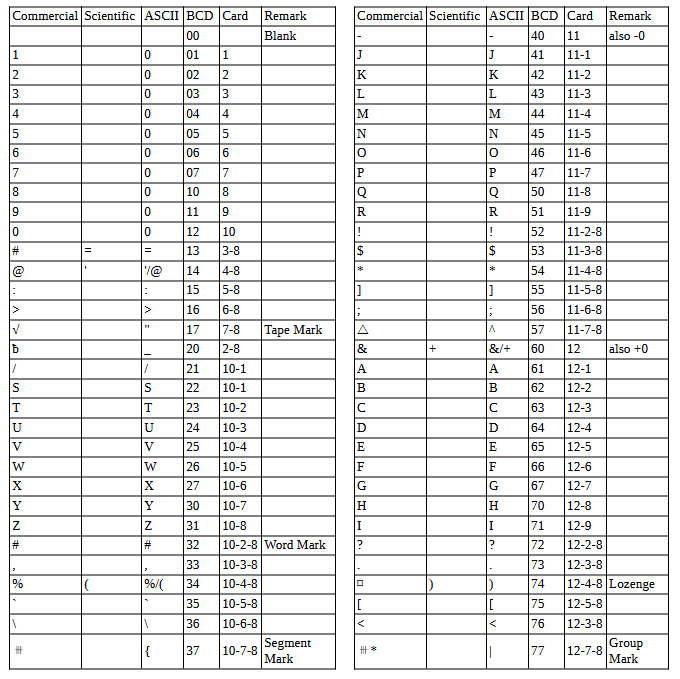

<!-- notpdf -->
# **IBM 7080 Simulator Usage**

**25-Jul-2018**

<!-- /notpdf -->
Copyright © 2007, Richard Cornwell\
Copyright © 1993-2007, Robert M Supnik

[COPYRIGHT NOTICE and LICENSE](#copyright-notice-and-license) are at the end of this document.

# Contents

 - [Introduction](#introduction)
 - [Simulator Files](#simulator-files)
 - [IBM 7080 Features](#ibm-7080-features)
 - [Stop conditions](#stop-conditions)
 - [3.1 CPU](#31-cpu)
   - [Registers](#registers)
 - [I/O Channels (CH0..CH6)](#io-channels-ch0ch6)
   - [Registers](#registers-1)
 - [Unit record devices.](#unit-record-devices)
   - [Inquiry Station (INQ)](#inquiry-station-inq)
   - [Card Reader (CDR)](#card-reader-cdr)
   - [721 Card Punch (CDP)](#721-card-punch-cdp)
   - [716 Line Printer (LP)](#716-line-printer-lp)
 - [Magnetic Tape devices](#magnetic-tape-devices)
   - [729 Magnetic Tape (MTA-D)](#729-magnetic-tape-mta-d)
   - [ChronoClock](#chronoclock)
 - [7908 Devices](#7908-devices)
   - [1301/1302/2302/7320 Disk devices](#1301130223027320-disk-devices)
   - [Hypertape 7340 Tape drive (HTA)](#hypertape-7340-tape-drive-hta)
   - [7750 Communications Controller (COM and COML)](#7750-communications-controller-com-and-coml)
     - [Registers](#registers-2)
 - [4 Symbolic Display and Input](#4-symbolic-display-and-input)
 - [5 Sim Load](#5-sim-load)
 - [Character Codes](#character-codes)
 - [COPYRIGHT NOTICE and LICENSE](#copyright-notice-and-license)
[
# Introduction

The IBM 7080 developed out of the IBM 702 which was a unique machine in
that it had character addressed memory, however instructions had to be
aligned on 5 character boundaries. Also it had to 256 character long
accumulators which could be treated as variable length registers.

IBM replaced this machine with the IBM 705, where the second accumulator was
replaced with 15 fixed offset registers, given 14 16 digit registers and
1 32 character register.

The 7080 enhanced this by adding in 3 more register sets that were used to
talk to I/O devices.

Instructions addressed the last location of an instruction or field and
proceeded to lower memory. All instructions were 5 characters long
consisting of a 4 character address and 1 character instruction. Data
length was either determined by the length of the referenced accumulator
or by a signed character indicating start of next data field.

# Simulator Files

| ***Subdirectory*** | ***File***     | ***Contains***                           |
| ------------------ | -------------- | ---------------------------------------- |
| **I7000**          | i7000\_defs.h  | IBM 7000 simulators general definitions  |
|                    | $0.00          | $0.00                                    |
|                    | i7000\_chan.c  | Generic channel interface.               |
|                    | i7080\_cpu.c   | 7080 CPU, Channel, interface             |
|                    | i7080\_chan.c  | 7080 Channel.                            |
|                    | i7080\_sys.c   | 7080 System interface                    |
|                    | i7000\_cdr.c   | 711 Card reader                          |
|                    | i7000\_cdp.c   | 721 Card punch                           |
|                    | i7000\_com.c   | 7750 Communications Controller           |
|                    | i7000\_con.c   | Inquiry console.                         |
|                    | i7080\_drum.c  | Drum interface.                          |
|                    | i7000\_dsk.c   | 1301/2302 disk and 7238 drum controller. |
|                    | i7000\_ht.c    | 7340 Hypertape controller.               |
|                    | i7000\_lpr.c   | 716 Line printer                         |
|                    | i7000\_mt.c    | 729 Tape controller.                     |
|                    | i7000\_chron.c | Chrono Clock.                            |

# IBM 7080 Features

The IBM 7080 simulator is configured as follows:

| **Device Name(s)** | **Simulates**                             |
| ------------------ | ----------------------------------------- |
| **CPU**            | 7080 CPU with 160K of memory              |
| **CH0**            | Unit record devices                       |
| **CH1..4**         | 754/7621 Tape controller channels         |
| **CH5..7**         | 7908 Disk, Hypertape, controller channels |
| **MTA**            | 729 Magnetic Tape Controller (Channel 20) |
| **MTB**            | 729 Magnetic Tape Controller (Channel 21) |
| **MTC**            | 729 Magnetic Tape Controller (Channel 22) |
| **MTD**            | 729 Magnetic Tape Controller (Channel 23) |
| **CHRON**          | Chrono Clock                              |
| **HTA**            | 7340 Hypertape, default not included.     |
| **HTB**            | 7340 Hypertape, default not included.     |
| **INQ**            | Inquiry Station                           |
| **CDR**            | 711 Card Reader                           |
| **CDP**            | 721 Card Punch                            |
| **LP**             | 716 Line Printer                          |
| **DR**             | Drum memory.                              |
| **DK**             | 1301/2302/7304 disk.                      |
| **COM**            | 7750 communications controller.           |
| **COML**           | 7750 Communications lines.                |

Channels B through D are mag tape channels 1,2,3,4.

Channels E & F are 7908 channels for disk, hypertape or 7750.

## Stop conditions

The 7080 simulator implements several unique stop conditions:

 - undefined CPU instruction
 - undefined channel instruction
 - XEC nesting exceeds limit
 - divide check on a divide and halt instruction
 - select of a non-existent channel
 - 7607 select of a 7909 channel
 - write select of a write protected device
 - invalid file control format
 - invalid message to 7750
 - no buffer storage available for input character on 7750
 - no buffer storage available for output character on 7750

The LOAD command will load a card binary image file into memory.

## 3.1 CPU

The CPU options include setting memory size and CPU type.

    SET CPU 702                 Sets CPU to emulate 702.
    SET CPU 705                 Sets CPU to emulate 705-I/II.
    SET CPU 7053                Sets CPU to emulate 705-III.
    SET CPU 7080                Sets CPU to emulate 7080.
    SET CPU 10K                 Sets memory to 10K
    SET CPU 20K                 Sets memory to 20K
    SET CPU 40K                 Sets memory to 40K
    SET CPU 80K                 Sets memory to 80K
    SET CPU 120K                Sets memory to 120K
    SET CPU 160K                Sets memory to 160K
    SET CPU NO/EMU40K           Sets emulated memory limit to 40k
    SET CPU EMU705              Sets CPU to emulate a 705-I/II.
    SET CPU EMU7053             Sets CPU to emulate a 705-III.
    SET CPU PROGRAM             Sets CPU to programmable stop mode.
    SET CPU NONSTOP             Sets CPU to Non-stop mode

The 702 can support only 10k of memory. All 705's modes can support up
to 40K of memory.

The 7080 can support up to 160k of memory.

When in 7080 mode the machine starts as either a 705-I/II or
a 705-III depending on mode of EMU705/EMU7053 switch. Also the
EMU40K fixes the maximum memory for the 7080 to 40K until it
enters 80 mode with EEM instruction.

CPU registers include the visible state of the processor as well as the
control registers for the interrupt system.

### Registers

| ***Name*** | ***Size(digits)*** | ***Comments***             |
| ---------- | ------------------ | -------------------------- |
| IC         | 5                  | Program Counter            |
| A          | 256                | Accumulator 1              |
| ASU1..15   | 256                | Accumulator 2              |
| SW         | 6                  | Switches                   |
| SW911..916 | 1                  | Sense Switches 911 to 916  |
| STOP       | 6                  | Stop conditions            |
| STOP0..5   | 1                  | Individual Stop conditions |

If CPU set to PROGRAM and the stop flag is set to 1, and a 90x trigger
is generated, the machine will stop. If flag is set to 0, no stop will
occur. If CPU set to NONSTOP all errors must be checked by program.

The CPU can maintain a history of the most recently executed
instructions.

This is controlled by the SET CPU HISTORY and SHOW CPU HISTORY commands:

    SET CPU HISTORY             clear history buffer
    SET CPU HISTORY=0           disable history
    SET CPU HISTORY=n           enable history, length = n
    SHOW CPU HISTORY            print CPU history
    SHOW CPU HISTORY=n          print first n entries of CPU history

Instruction history trace shows the Instruction counter, the symbolic
operator, and memory address and the contents of the selected register.

## I/O Channels (CH0..CH6)

The 7080 supports up to 11 channels.

    SET CHn UREC                Tapes are on unit record device.
    SET CHn 7261                Tapes are on Data Synchronizer.
    SET CHn 754                 Tapes are standard 705 drives.
    SET Chn HS                  Set channel to High Speed.

Channel 0 is for unit record devices.

Channels 1 through 4 are for tape drives. These support the option of

Channels 5-10 are for 7908 devices. For CPU channels are defined as:

| Channel | CPU address                   |
| ------- | ----------------------------- |
| 0       | 0-1999                        |
| 20      | 2000 or 0200                  |
| 21      | 2100 or 0210                  |
| 22      | 2200 or 0220                  |
| 23      | 2300 or 0230                  |
| 40      | 4000 7908 high speed channel. |
| 41      | 4100 7908 high speed channel. |
| 44      | 4400 7908 channel.            |
| 45      | 4500 7908 channel.            |
| 46      | 4600 7908 channel.            |
| 47      | 4700 7908 channel.            |

### Registers

Channels have the following registers:

| ***Name*** | ***Size(digits)*** | ***Comments***       |
| ---------- | ------------------ | -------------------- |
| ADDR       | 5                  | Channel Data Address |
| CMD        | 1                  | Channel Command.     |
| FLAGS      | 32 (binary)        | Channel Flags        |

For meaning of bits in FLAGS see i7000\_defs.h.

The command:

    SHOW CH                     Print summary of devices on channel

## Unit record devices.

### Inquiry Station (INQ)

The inquiry station allows for communications with the operating system.

The station is half duplex and will either print or accept input.

Whenever the computer sends a message it is prefixed with a ‘R’
character.

When the station is ready to receive input it prompts with a
‘I’. Input is buffered until the return character is entered.

Backspace will remove the last character typed.

An \<esc\> will send an interrupt to the processor to request
it read a record from the console.

An \<esc\> while in input mode will cancel input mode and clear any
typed message.

### Card Reader (CDR)

The card reader (CDR) reads data from a disk file.

Cards are simulated as ASCII lines with terminating newlines.

Card reader files can either be text (one character per column)
or column binary (two characters per column). The file type
can be specified with a set command:

    SET CDR FORMAT=TEXT         Sets ASCII text mode
    SET CDR FORMAT=BINARY       Sets for binary card images.
    SET CDR FORMAT=BCD          Sets for BCD records
    SET CDR FORMAT=CBN          Sets for column binary BCD records.
    SET CDR FORMAT=AUTO         Automatically determines format.

or in the ATTACH command:

    ATTACH CDR <file>               Attaches a file
    ATTACH CDR -f <format> <file>   Attaches a file with the given format.
    ATTACH CDR -s <file>            Added file onto current cards to read.
    ATTACH CDR -e <file>            After file is read in, the reader will
                                    receive an end of file flag.

The card reader can be booted with the:

    BOOT CDR

The CDR loads the first card into memory location 0 and transfers to location 4.

Error handling is as follows:

| error        | processed as          |
|--------------|-----------------------|
| not attached | report error and stop |
| end of file  | out of cards          |
| OS I/O error | report error and stop |

### 721 Card Punch (CDP)

The card reader (CDP) writes data to a disk file. Cards are simulated as
ASCII lines with terminating newlines. Card punch files can either be
text (one character per column) or column binary (two characters per
column). The file type can be specified with a set command:

    SET CDPn FORMAT=TEXT        Sets ASCII text mode
    SET CDPn FORMAT=BINARY      Sets for binary card images.
    SET CDPn FORMAT=BCD         Sets for BCD records.
    SET CDPn FORMAT=CBN         Sets for column binary BCD records.
    SET CDPn FORMAT=AUTO        Automatically determines format.

or in the ATTACH command:

    ATTACH CDPn <file>                 Attaches a file
    ATTACH CDPn -f <format> <file>     Attaches a file with the given format.

Error handling is as follows:

| error        | processed as          |
|--------------|-----------------------|
| not attached | report error and stop |
| OS I/O error | report error and stop |

### 716 Line Printer (LP)

The line printer (LP) writes data to a disk file as ASCII text with
terminating newlines. Currently set to handle standard signals to
control paper advance.

    SET LPn NO/ECHO             Sets echoing to console of line-printer output.
    SET LPn LINESPERPAGE=lpp    Sets number of lines per page on printer.
    SET LPn SINGLE              Set printer to single spacing.
    SET LPn DOUBLE              Set printer to double spacing.
    SET LPn PROGRAM             Set printer to single spacing.

If the printer is set to PROGRAM spacing the first character of the
print record controls spacing.

| Character (Octal) | Action                                        |
| ----------------- | --------------------------------------------- |
| 060               | Suppress spacing.                             |
| 020               | Single space after.                           |
| 012               | Single space before.                          |
| 003               | Skip to channel 3 (every 5th line) |
| 002               | Skip to channel 2 (every 8th line) |
| 001 & 009         | Skip to channel 1 (or 9), (top of form).      |

Error handling is as follows:

| error        | processed as          |
|--------------|-----------------------|
| not attached | report error and stop |
| OS I/O error | report error and stop |

## Magnetic Tape devices

### 729 Magnetic Tape (MTA-D)

These come in groups of 10 units each.

Each individual tape drive support several options: MTA used as an
example.

    SET MTAn REWIND             Sets the mag tape to the load point
    SET MTAn LOCKED             Sets the mag tape to be read only.
    SET MTAn WRITEENABLE        Sets the mag tape to be writable.
    SET MTAn LOW                Sets mag tape to low density.
    SET MTAn HIGH               Sets mag tape to high density.

Options: Density LOW/HIGH does not change format of how tapes are
written. And is only for informational purposes only.

Tape drives can be booted with:

    BOOT MTxn                   Read in record into location 0.

### ChronoClock

Disabled by default. This is a special 729 tape drive which returns the
current time. It supports the option of setting the channel and drive
that it will occupy. 

**Note:** You must disable the real 729 drive that is
is replacing.

The clock responds to Read and Backspace commands. A read
results in a 10 character buffer being generated that has the Month,
Day, Hour, Minutes, Seconds and Milliseconds.

This time is taken from the local computer time.

    SET CHRON CHAN=n            Set channel for chrono clock.
    SET CHRON UNIT=n            Sets the unit for the chrono clock.

Example: To set Chronoclock to unit A9 do the following:

    SET MTA9 DISABLE
    SET CHRON UNIT=9 CHAN=20

## 7908 Devices

These devices must be attached to a 7908 channel to work.

### 1301/1302/2302/7320 Disk devices

The 7631 file control supports up to ten devices, which can be 7320
drums, 1301 disks, 1302 disks, or 2302 disks. Unit types are specified
with the SET command.

    SET DKn TYPE=7320           Unit n is a drum
    SET DKn TYPE=7320-2         Unit n is a drum (two modules)
    SET DKn TYPE=1301           Unit n is a 1301 disk
    SET DKn TYPE=130l-2         Unit n is a 1301-2 disk (two modules).
    SET DKn TYPE=1302           Unit n is a 1302 disk 
    SET DKn TYPE=1302-2         Unit n is a 1302-2 disk (two modules).
    SET DKn TYPE=2302           Unit n is a 2302 disk

Units can be SET ENABLED or DISABLED. In addition, units can be set to
enable or disable formatting:

    SET DKn FORMAT              Enable formatting
    SET DKn NOFORMAT            Disable formatting
    SET DKn HA2                 Enable writing of home address 2
    SET DKn NOHA2               Disable writing of home address 2
    SET DKn MODULE=n            Sets modules for unit, modules can only be even. 0 to 8.
    SET DKn CHAN=n              Sets channel for unit (A-H)
    SET DKn SELECT=n            Sets select on channel (0 or 1).

Formatting is disabled by default.

Error handling is as follows:

| error        | processed as          |
|--------------|-----------------------|
| not attached | report error and stop |
| OS I/O error | report error and stop |

### Hypertape 7340 Tape drive (HTA)

These come in groups of 10 units each. The controller defines which
channel the devices will be on. By default these devices are not
installed.

    SET HTA CHAN=n              Sets channel for unit (A-H).
    SET HTA SELECT=n            Sets select on channel (0 or 1).

Each individual tape drive support several options: HTA used as an
example.

    SET HTAn LOCKED             Sets the mag tape to be read only.
    SET HTAn WRITEENABLE        Sets the mag tape to be writable.

**NOTE:** Hypertape drives may not be working correctly since there is very
little documentation available on them.

### 7750 Communications Controller (COM and COML)

The 7750 is modeled as a terminal multiplexer with 33 lines. It consists
of two device: COM is the multiplexer controller, and COML is the
individual lines.

For the first 32 lines, the 7750 performs input and output through
Telnet sessions connected via a user-specified listening
port.

The 33rd line is permanently attached to the simulator console
window.

The ATTACH command specifies the port to be used for Telnet
sessions:

    ATTACH COM <port>           set up listening port

where port is a decimal number between 1 and 65535 that is not being
used other TCP/IP activities.

Each line (each unit of COML) can be set to one of twp modes: KSR-35 and
KSR-37. In KSR-35 mode, lower case input and output characters are
converted automatically to upper case, and parity is ignored. In KSR-37
mode, lower case characters are left alone, and even parity is generated
on input. KSR-37 is the default.

Once COM is attached and the simulator is running, the 7750 listens for
connections on the specified port. It assumes that any incoming
connection is a Telnet connections. The connections remain open until
disconnected either by the Telnet client, a SET COM DISCONNECT
command,or a DETACH COM command.

    SET COM DISCONNECT=n        Disconnect line n
    SET COM CHAN=n              Set channel for com controller.

The 7750 implements the following special SHOW commands

    SHOW COM CONNECTIONS        Displays current connections to the 7750
    SHOW COM STATISTICS         Displays statistics for active connections 

The 7750 implements the following special SET commands:

    SET COMLn LOG=filename      Log output of line n to filename 
    SET COMLn NOLOG             Disable logging and close log file
    SET COMLn KSR35             Set line n to ksr-35
    SET COMLn KSR37             Set line n to ksr-37
    SET COMLn 2741              Set line n to 2741

#### Registers

The controller (COM) implements these registers:

| *Name* | *Size* | *Comments*                    |
| ------ | ------ | ----------------------------- |
| ENABLE | 1      | Enable flag                   |
| STATE  | 6      | Controller state              |
| MSGNUM | 12     | Input message sequence number |

# 4 Symbolic Display and Input

The IBM 7080 simulator implements symbolic display and input. Display is
controlled by command line switches:

    -c                          Display/Enter as BCD character
    -d/-s                       Display as character dump.
    -m                          Display/Enter instruction mnemonics.
    (none)                      Display/Enter as number.

Instruction input uses standard 7080 assembler syntax.

  - \<opcode\> \<address\>,\<ASU\>
  - \<opcode\> \<address\>

# 5 Sim Load

The load command looks at the extension of the file to determine how to
load the file. Based on extension the file is converted to characters
and loaded based on the 7080 load format.

# Character Codes

This is the mapping between character codes used by the simulator:

# COPYRIGHT NOTICE and LICENSE

The following copyright notice applies to the SIMH source, binary, and
documentation:

Original code published in 1993-2007, written by Robert M Supnik

Permission is hereby granted, free of charge, to any person obtaining
a copy of this software and associated documentation files (the
"Software"), to deal in the Software without restriction, including
without limitation the rights to use, copy, modify, merge, publish,
distribute, sublicense, and/or sell copies of the Software, and to
permit persons to whom the Software is furnished to do so, subject to
the following conditions:

The above copyright notice and this permission notice shall be
included in all copies or substantial portions of the Software.

THE SOFTWARE IS PROVIDED "AS IS", WITHOUT WARRANTY OF ANY KIND,
EXPRESS OR IMPLIED, INCLUDING BUT NOT LIMITED TO THE WARRANTIES OF
MERCHANTABILITY, FITNESS FOR A PARTICULAR PURPOSE AND NONINFRINGEMENT.
IN NO EVENT SHALL ROBERT M SUPNIK BE LIABLE FOR ANY CLAIM, DAMAGES OR
OTHER LIABILITY, WHETHER IN AN ACTION OF CONTRACT, TORT OR OTHERWISE,
ARISING FROM, OUT OF OR IN CONNECTION WITH THE SOFTWARE OR THE USE
OR OTHER DEALINGS IN THE SOFTWARE.

Except as contained in this notice, the names of the authors shall
not be used in advertising or otherwise to promote the sale, use or
other dealings in this Software without prior written authorization
from each author.
