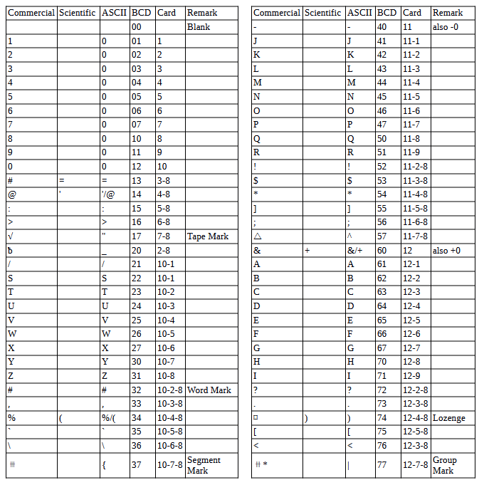

<!-- notpdf -->
# **IBM 7090 Simulator Usage**

**25-Jul-2018**

<!-- /notpdf -->
Copyright © 2007, Richard Cornwell\
Copyright © 1993-2007, Robert M Supnik

[COPYRIGHT NOTICE and LICENSE](#copyright-notice-and-license) are at the end of this document.

# Contents

 - [Introduction](#introduction)
 - [Simulator Files](#simulator-files)
 - [IBM 7090 Features](#ibm-7090-features)
 - [Stop conditions](#stop-conditions)
 - [CPU](#cpu)
   - [I/O Channels (CH0..CH8)](#io-channels-ch0ch8)
     - [Registers](#registers)
 - [Channel 7607 Devices and 704 devices.](#channel-7607-devices-and-704-devices)
   - [711 Card Reader (CDR)](#711-card-reader-cdr)
   - [721 Card Punch (CDP)](#721-card-punch-cdp)
   - [716 Line Printer (LP)](#716-line-printer-lp)
   - [729 Magnetic Tape (MTA-D)](#729-magnetic-tape-mta-d)
   - [ChronoClock](#chronoclock)
   - [733 Drum (DR)](#733-drum-dr)
 - [7909 Devices](#7909-devices)
   - [1301/1302/2302/7320 Disk devices](#1301130223027320-disk-devices)
   - [Hypertape 7340 Tape drive (HTA/B)](#hypertape-7340-tape-drive-htab)
   - [7750 Communications Controller (COM and COML)](#7750-communications-controller-com-and-coml)
     - [Registers](#registers-1)
 - [7289 High-Speed Drum (HD)](#7289-high-speed-drum-hd)
 - [Symbolic Display and Input](#symbolic-display-and-input)
 - [Sim Load](#sim-load)
 - [Character Codes](#character-codes)
 - [COPYRIGHT NOTICE and LICENSE](#copyright-notice-and-license)

# Introduction

The follow up to the IBM704. Utilizing ideas learned from the Stretch
IBM enhanced the 704 by adding multiple communications channels to speed
up processing I/O devices. This allowed the machine to continue
processing while the tapes or card readers transfered data.

Also this was one of the first machines to feature indirect addressing.
Also added was an indicator register to hold flags and other information.

The IBM 709 was announced January 2, 1957 withdrawn April 7, 1960.
Originally the IBM 709T later to be named the IBM 7090 by customers,
the machine was a faster version of the IBM 709 implemented in
transistors instead of tubes.

The IBM 7090 was announced December 30, 1958 withdrawn July 14, 1969.

The IBM 7090 also was built out of the same modules as the Stretch
and used the same memory modules. The final enhancement was the
IBM 7094, this added double percision arithmetic, faster processing,
and 4 more index registers. The machine looked like a 7090 until extra
indexing mode was entered, then instead of 3 registers begin or-ed
together, the 3 bits selected one of 7 index registers.

It was latter upgraded to the 7094/II which was still faster.

The IBM 7094 & IBM 7094/II were announced January 15, 1962 withdrawn
July 14, 1969.

IBM also developed two transistorized versions of the IBM 704, these
were slower then the IBM 7090, and did not feature an indicator register
or indirect addressing. But they came optionally with double precision
floating point, and special character operating instructions.

It was also possible to purchase a 7040 without index registers or
floating point. The machines were meant to be front ends to the
IBM 7094, and a direct couple devices was sold, along with the
ability to share 1301 drives between systems.

Unfortunately no software has been found for the IBM 7040/44.

The IBM 7094 was also one of the first machines to be modified to run
time sharing. The Compatible Time Sharing System (CTSS) was developed by
MIT to allow for the IBM 7094 to be shared by multiple people while
still being compatible with FMS.

# Simulator Files

To compile the IBM 7090, you must define USE\_INT64 as part of the
compilation command line.

| ***Subdirectory*** | ***File***     | ***Contains***                             |
| ------------------ | -------------- | ------------------------------------------ |
| **I7000**          | i7000\_defs.h  | IBM 7000 simulators general definitions    |
|                    | i7090\_defs.h  | IBM 7090 simulator specific definitions    |
|                    | i7000\_chan.c  | Generic channel interface.                 |
|                    | i7090\_cpu.c   | 7090 CPU, Channel, interface               |
|                    | i7090\_chan.c  | 7090 Channel.                              |
|                    | i7090\_sys.c   | 7090 System interface                      |
|                    | i7090\_cdr.c   | 711 Card reader                            |
|                    | i7090\_cdp.c   | 721 Card punch                             |
|                    | i7090\_lpr.c   | 716 Line printer                           |
|                    | i7090\_drum.c  | 733 Drum memory interface.                 |
|                    | i7000\_com.c   | 7750 Communications Controller\*           |
|                    | i7000\_dsk.c   | 1301/2302 disk and 7238 drum controller.\* |
|                    | i7000\_ht.c    | 7340 Hypertape controller.\*               |
|                    | i7090\_hdrum.c | CTSS High Speed Drum\*                     |
|                    | i7000\_mt.c    | 729 Tape controller.                       |
|                    | i7000\_chron.c | Chrono Clock.\*                            |

If so desired instead of defining I7090, I704 can be defined and the
files marked with ‘\*’ above can be removed. This produces a smaller
executable that will only emulate a IBM 704 computer.

## IBM 7090 Features

The IBM 7090 simulator is configured as follows:

| **Device Name(s)** | **Simulates**                         |
| ------------------ | ------------------------------------- |
| **CPU**            | 7090 CPU with 32Kw/64Kw of memory     |
| **CH0**            | 704 Unit record devices               |
| **CH1..8**         | 7607/7909/7289 Channels               |
| **MT**             | 729 Magnetic Tape Controller (On CH0) |
| **MTA**            | 729 Magnetic Tape Controller          |
| **MTB**            | 729 Magnetic Tape Controller          |
| **MTC**            | 729 Magnetic Tape Controller          |
| **MTD**            | 729 Magnetic Tape Controller          |
| **MTE**            | 729 Magnetic Tape Controller          |
| **CHRON**          | Chrono Clock                          |
| **HTA**            | 7340 Hypertape, default not included. |
| **HTB**            | 7340 Hypertape, default not included. |
| **CDR**            | 711 Card Reader                       |
| **CDP**            | 721 Card Punch                        |
| **LP**             | 716 Line Printer                      |
| **DR**             | Drum memory.                          |
| **HD**             | CTSS High Speed Drum.                 |
| **DK**             | 1301/2302/7304 disk.                  |
| **COM**            | 7750 communications controller.       |
| **COML**           | 7750 Communications lines.            |

Channels A through H, the corresponding magnetic tape controllers, and
the file control, drum control , and communications control are
initially set DISABLED.

The file control, drum control, and communications control
can be assigned to any channel in the range B through H.

## Stop conditions

The 7090 simulator implements several unique stop conditions:

  - Undefined CPU instruction
  - Undefined channel instruction
  - XEC nesting exceeds limit
  - Divide check on a divide and halt instruction
  - Select of a non-existent channel
  - 7607 select of a 7909 channel
  - Write select of a write protected device
  - Invalid file control format
  - Invalid message to 7750
  - No buffer storage available for input character on 7750
  - No buffer storage available for output character on 7750

The LOAD command will load a card binary image file into memory.

## CPU

The CPU options include setting memory size and cpu type. Also the
special features required for used by the CTSS project:

    SET CPU STANDARD            Standard CPU
    SET CPU CTSS                Adds extra core memory for CTSS
    SET CPU 704                 Sets CPU to emulate a 704
    SET CPU 709                 Sets CPU to emulate 709 instructions
    SET CPU 7090                Sets CPU to emulate 7090.
    SET CPU 7094                Sets CPU to emulate 7094.
    SET CPU 4K                  Sets memory to 4K
    SET CPU 8K                  Sets memory to 8K
    SET CPU 16K                 Sets memory to 16K
    SET CPU 32K                 Sets memory to 32K
    SET CPU TRUEIO              CPU executes I/O in CPU time.
    SET CPU FASTIO              CPU detects I/O waits and shortens them 
    SET CPU NOEFP               Disables extended precision floating point.
    SET CPU EFP                 Enables extended precision floating point.
    SET CPU NOFPSM              Disables floating point significance mode.
    SET CPU FPSM                Enables floating point significance mode.
    SET CPU TIMER               Enables interval timer and interrupt.
    SET CPU NOTIMER             Disables interval timer.

Memory size is 32KW on a standard CPU, 64KW on a CTSS CPU. Set notes
below on setting up for CTSS.

The 7090 supported many options which were called RPQ’s, these include
extended precision floating point instructions. These were similar to
the later 7094 double precision floating point instructions.
Significance mode allowed for better detection of bits during floating
point operations.

FASTIO mode detects when the CPU is in a loop waiting for a channel to
become available and then sets the simulation interval to run any
pending I/O. This results in faster simulations without the CPU being
aware of this. If the Timer is used, this might result in incorrect
timing intervals.

CPU registers include the visible state of the processor as well as the
control registers for the interrupt system.

| ***Name*** | ***Size*** | ***Comments***                      |
| ---------- | ---------- | ----------------------------------- |
| IC         | 15         | Program Counter                     |
| AC         | 38         | Accumulator                         |
| MQ         | 36         | Multiplier Quotient                 |
| ID         | 36         | Indicators register                 |
| KEYS       | 36         | Front panel keys                    |
| XR1..XR7   | 15         | Index registers                     |
| SW1..SW6   | 1          | Sense Switches 1..6                 |
| SW         | 6          | Sense Switches                      |
| SL1..4     | 4          | Sense Lights 1..4                   |
| ACOVF      | 1          | Accumulator Overflow Indicator      |
| MQOVF      | 1          | MQ Overflow Indicator.              |
| DVC        | 1          | Divide Check indicator              |
| IOC        | 1          | I/O Check indicator                 |
| TM         | 1          | Transfer Trap mode                  |
| CTM        | 1          | Copy Trap mode                      |
| STM        | 1          | Select Trap mode                    |
| FTM        | 1          | Floating Trap mode                  |
| NMODE      | 1          | Storage nullification mode          |
| MTM        | 1          | Multiple Tag mode                   |
| ENB        | 36         | Interrupt enable register           |
| INST\_BASE | 1          | (CTSS) B core instruction execution |
| DATA\_BASE | 1          | (CTSS) B core data access           |
| BASE       | 14         | (CTSS) relocation base block        |
| LIMIT      | 14         | (CTSS) address limit block          |

The CPU can maintain a history of the most recently executed
instructions.

This is controlled by the SET CPU HISTORY and SHOW CPU HISTORY commands:

    SET CPU HISTORY             clear history buffer
    SET CPU HISTORY=0           disable history
    SET CPU HISTORY=n           enable history, length = n
    SHOW CPU HISTORY            print CPU history
    SHOW CPU HISTORY=n          print first n entries of CPU history

Instruction history trace shows the Instruction counter for the
instruction, the AC and MQ before the execution, the computed Effective
Address, the word read from storage, and the three index registers XR1,
2 and 4.

### I/O Channels (CH0..CH8)

The 7090 supports up to 8 channels. Channel models include

    7607                        standard multiplexer channel
    7289                        high speed drum channel
    7909                        advanced capabilities channel

Channel A is required and is always a 7607.

Channels are represented by a number: A=1, B=2, C=3, D=4, E=5,
F=6, G=7, H=8.

Channel 0 is for 704 devices.

    SET CHn 7607                Sets channel to be a 7607 type.
    SET CHn 7909                Sets channel to be a 7909 type.
    SET CHn 7289                Sets channel to be a 7289 type. (For CTSS Drum).
    SET CHn FIXED               Fixes channel to specific type.
    SET CHn AUTO                Default, channel configures based on devices on it.

Generally there is no need to worry about channel configurations, in
auto mode they will configure to correct type to support devices
attached to them. Or you will get an error when you attempt to run the
simulation if there is a conflict.The default layout of devices will
work for IBSYS and CTSS.

A show channel command will list out the devices currently assigned to
this channel, or all channels if no specific channel is selected.

Channel 0 is a pseudo channel for 704 devices. Currently unit CR3, CP3,
LP3,

DR0, and MT are set to this device.

#### Registers

Channels have the following registers:

| ***Name*** | ***Type*** | ***Size*** | ***Comments***           |
| ---------- | ---------- | ---------- | ------------------------ |
| ADDR       | All        | 16         | Channel Data Address     |
| CMD        | All        | 6          | Channel Command.         |
| WC         | All        | 15         | Channel Word Count       |
| ASM        | All        | 36         | Assembly Register        |
| LOCATION   | All        | 16         | Channel Location Counter |
| STATUS     | All        | 16         | Channel Device Status    |
| SENSE      | 7909       | 16         | Channel Sense Data       |
| COUNTER    | 7909       | 6          | Channel Counter          |
| SMS        | 7909       | 7          | Channel SMS Register     |

For meaning of bits in STATUS and SENSE see i7000\_defs.h.

## Channel 7607 Devices and 704 devices.

These devices can only be attached to 7607 channels or to the Programed
I/O channel 0.

### 711 Card Reader (CDR)

The card reader (CDR) reads data from a disk file.

Cards are simulated as ASCII lines with terminating newlines.

Card reader files can either be text (one character per column) or
column binary (two characters per column). The file type can be
specified with a set command:

    SET CDRn FORMAT=TEXT        Sets ASCII text mode
    SET CDRn FORMAT=BINARY      Sets for binary card images.
    SET CDRn FORMAT=BCD         Sets for BCD records.
    SET CDRn FORMAT=CBN         Sets for column binary BCD records.
    SET CDRn FORMAT=AUTO        Automatically determines format.

or in the ATTACH command:

    ATTACH CDRn <file>                  Attaches a file
    ATTACH CDRn -f <format> <file>      Attaches a file with the given format
    ATTACH CDRn -s <file>               Added file onto current cards to read
    ATTACH CDRn -e <file>               After file is read in, the reader will
                                        receive and end of file flag

The card reader can be attached to either a 704 PIO channel or a 7607
channel. The channel can be changed by the following command:

    SET CDRn CHAN=c             Set this device to channel c.

The default assignments are:

    CDR0                        Channel A(1)
    CDR1                        Channel C(3)
    CDR2                        Disabled
    CDR3                        704 PIO.

If the simulator is compiled for only 704 then there is only one Card
Reader called CDR.

The card reader can be booted with the:

    BOOT CDRn                   Loads first 3 words of card.

Error handling is as follows:

| error        | processed as          |
|--------------|-----------------------|
| not attached | report error and stop |
| end of file  | out of cards          |
| OS I/O error | report error and stop |

### 721 Card Punch (CDP)

The card reader (CDP) writes data to a disk file. Cards are simulated as
ASCII lines with terminating newlines. Card punch files can either be
text (one character per column) or column binary (two characters per
column). The file type can be specified with a set command:

    SET CDPn FORMAT=TEXT        Sets ASCII text mode
    SET CDPn FORMAT=BINARY      Sets for binary card images.
    SET CDPn FORMAT=BCD         Sets for BCD records.
    SET CDPn FORMAT=CBN         Sets for column binary BCD records.
    SET CDPn FORMAT=AUTO        Automatically determines format.

or in the ATTACH command:

    ATTACH CDPn <file>                 Attaches a file
    ATTACH CDPn -f <format> <file>     Attaches a file with the given format.

The card punch can be attached to either a 704 PIO channel or a 7607
channel. The channel can be changed by the following command:

    SET CDPn CHAN=c             Set this device to channel c.

The default assignments are:

    CDP0                        Channel A(1)
    CDP1                        Channel C(3)
    CDP2                        Disabled
    CDP3                        704 PIO.

If the simulator is compiled for only 704 then there is only one Card
Punch called CDP.

Error handling is as follows:

| error        | processed as          |
|--------------|-----------------------|
| not attached | report error and stop |
| OS I/O error | report error and stop |

### 716 Line Printer (LP)

The line printer (LP) writes data to a disk file as ASCII text with
terminating newlines. Currently set to handle standard signals to
control paper advance.

    SET LPn NO/ECHO             Sets echoing to console of line-printer output
    SET LPn CHAN=n              sets channel for this device
    SET LPn LINESPERPAGE=lpp    Sets number of lines per page on printer.

The default assignments are:

    LP0                         Channel A(1)
    LP1                         Channel C(3)
    LP2                         Disabled
    LP3                         704 PIO.

The Printer supports the following SPRA *n* selection pulses for
controlling spacing (spacing occurs before the line is printed):

| SPRA   | Action                                                  |
| ------ | ------------------------------------------------------- |
| SPRA 1 | To top of form.                                         |
| SPRA 2 | Single space.                                           |
| SPRA 3 | Double space. Before printing line.                     |
| SPRA 4 | Triple space. Before printing line.                     |
| SPRA 9 | Suppress linefeed after print. Prints characters 73-120 |
| SPT    | Will skip if any printer line has been pulsed.          |

Default with no SPRA is to single space before printing.

Error handling is as follows:

| error        | processed as          |
|--------------|-----------------------|
| not attached | report error and stop |
| OS I/O error | report error and stop |

### 729 Magnetic Tape (MTA-D)

These come in groups of 10 units each. The controller defines which
channel the devices will be on. MT*x*0 is unit 10.

    SET MTx CHAN=n              Set mag tape to channel n.

Each individual tape drive support several options: MTA used as an
example.

    SET MTAn ONLINE             Sets the mag tape drive on-line.
    SET MTAn OFFLINE            Sets the mag tape drive off-line and not ready.
    SET MTAn REWIND             Sets the mag tape to the load point.
    SET MTAn LOCKED             Sets the mag tape to be read only.
    SET MTAn WRITEENABLE        Sets the mag tape to be writable.
    SET MTAn LOW                Sets mag tape to low density.
    SET MTAn HIGH               Sets mag tape to high density.

Options: Density LOW/HIGH does not change format of how tapes are
written. And is only for informational purposes only.

Online/Offline is part of a optional RPQ for the 7090 which adds the
DRS/TRS instructions.

| Instr.    | Function                                                                                                                                           |
| --------- | -------------------------------------------------------------------------------------------------------------------------------------------------- |
| DRS drive | Will set drive to off-line after current command is finished. Drive is not unloaded and can be re-enabled by setting it on-line.                   |
| TRS drive | Tests to see if the drive is on-line. If the drive is there and on-line it will skip the next instruction otherwise it takes the next instruction. |

These instructions were put in since accessing a unloaded tape drive
would hang the CPU.

Tape drives can be booted with:

    BOOT MTxn                   Read in first three words of record.

### ChronoClock

Disabled by default. This is a special 729 tape drive which returns the
current time. It supports the option of setting the channel and drive
that it will occupy. 

**Note:** You must disable the real 729 drive that is
is replacing.

The clock responds to Read and Backspace commands. A read
results in a 10 character buffer being generated that has the Month,
Day, Hour, Minutes, Seconds and Milliseconds.

This time is taken from the local computer time.

    SET CHRON CHAN=n            Set channel for chrono clock.
    SET CHRON UNIT=n            Sets the unit for the chrono clock.

Example: To set Chronoclock to unit A9 do the following:

    SET MTA9 DISABLE
    SET CHRON UNIT=9 CHAN=A

### 733 Drum (DR)

This is the drum for 704/709 and possible 7090. Up to 16 units can be
attached to the CPU, all are on pseudo channel 0. Each drum is 2048K
words in size. They are all stored in one file.

    SET DR0 UNITS=n             Set number of units to of storage to attach.

Drum unit 0 can be booted with:

    BOOT DR0                    Read in first three words of record.

Drum unit can be assigned to a 7607 channel, but this is unsupported by
the operating systems. Drum channel is changed with:

    SET DR0 CHAN=n              Set Drum to channel n.

## 7909 Devices

These devices must be attached to a 7909 channel to work.

### 1301/1302/2302/7320 Disk devices

The 7631 file control supports up to ten devices, which can be 7320
drums, 1301 disks, 1302 disks, or 2302 disks. Unit types are specified
with the SET command.

    SET DKn TYPE=7320           Unit n is a drum
    SET DKn TYPE=7320-2         Unit n is a drum (two modules).
    SET DKn TYPE=1301           Unit n is a 1301 disk
    SET DKn TYPE=130l-2         Unit n is a 1301-2 disk (two modules).
    SET DKn TYPE=1302           Unit n is a 1302 disk
    SET DKn TYPE=1302-2         Unit n is a 1302-2 disk (two modules).
    SET DKn TYPE=2302           Unit n is a 2302 disk

Units can be SET ENABLED or DISABLED. In addition, units can be set to
enable or disable formatting:

    SET DKn FORMAT              Enable formatting
    SET DKn NOFORMAT            Disable formatting
    SET DKn HA2                 Enable writing of home address 2 
    SET DKn NOHA2               Disable writing of home address 2
    SET DKn MODULE=n            Sets modules for unit, modules can only be even. 0 to 8.
    SET DKn CHAN=n              Sets channel for unit (A-H)
    SET DKn SELECT=n            Sets select on channel (0 or 1).
    SET DKn CTSS                Sets disk to use CTSS bootstrap.
    SET DKn IBSYS               Sets disk to use IBSYS bootstrap.

Formatting is disabled by default.

All Disk units support bootstrapping with boot command. Bootstrap code
is build based on whether CPU is in CTSS mode or not.

    BOOT DKn                    Insert custom Loader into lower memory and start.

Error handling is as follows:

| error        | processed as          |
|--------------|-----------------------|
| not attached | report error and stop |
| OS I/O error | report error and stop |

### Hypertape 7340 Tape drive (HTA/B)

These come in groups of 10 units each. The controller defines which
channel the devices will be on.

    SET HTA CHAN=n              Sets channel for unit (A-H).
    SET HTA SELECT=n            Sets select on channel (0 or 1).

Each individual tape drive support several options: HTA used as an
example.

    SET HTAn LOCKED      Sets the mag tape to be read only.
    SET HTAn WRITEENABLE Sets the mag tape to be writable.

NOTE: Hypertape drives may not be working correctly since there is very
little documentation available on them.

Hypertape drives support bootstrapping with boot command.

    BOOT HTAn                   Insert custom Loader into lower memory and start.

### 7750 Communications Controller (COM and COML)

The 7750 is modeled as a terminal multiplexer with 33 lines. It consists
of two device: COM is the multiplexer controller, and COML is the
individual lines.

For the first 32 lines, the 7750 performs input and
output through Telnet sessions connected via a user-specified listening
port.

The 33rd line is permanently attached to the simulator console
window.

The ATTACH command specifies the port to be used for Telnet sessions:

    ATTACH COM <port>           set up listening port

where port is a decimal number between 1 and 65535 that is not being
used other TCP/IP activities.

Each line (each unit of COML) can be set to one of twp modes: KSR-35 and
KSR-37. In KSR-35 mode, lower case input and output characters are
converted automatically to upper case, and parity is ignored. In KSR-37
mode, lower case characters are left alone, and even parity is generated
on input. KSR-37 is the default.

Once COM is attached and the simulator is running, the 7750 listens for
connections on the specified port. It assumes that any incoming
connection is a Telnet connections. The connections remain open until
disconnected either by the Telnet client, a SET COM DISCONNECT
command,or a DETACH COM command.

    SET COM DISCONNECT=n        Disconnect line n
    SET COM CHAN=n              Set channel for com controller.

The 7750 implements the following special SHOW commands

    SHOW COM CONNECTIONS        Displays current connections to the 7750
    SHOW COM STATISTICS         Displays statistics for active connections 

The 7750 implements the following special SET commands:

    SET COMLn LOG=filename      Log output of line n to filename 
    SET COMLn NOLOG             Disable logging and close log file
    SET COMLn KSR35             Set line *n* to ksr-35
    SET COMLn KSR37             Set line *n* to ksr-37
    SET COMLn 2741              Set line *n* to 2741

#### Registers

The controller (COM) implements these registers:

| *Name* | *Size* | *Comments*                    |
| ------ | ------ | ----------------------------- |
| ENABLE | 1      | Enable flag                   |
| STATE  | 6      | Controller state              |
| MSGNUM | 12     | Input message sequence number |

## 7289 High-Speed Drum (HD)

The 7289 (also known as the 7320A) high-speed drum was a late addition
to CTSS. Very little is known about the device, other than what is used
in the CTSS sources.

The drum can be changed to different channels with the:

    SET HD0 CHAN=n              Set Drum to channel n.The channel must be
                                configured as a 7289 type channel. Otherwise
                                the drum will not work.
    SET HD0 UNITS=n             Sets the number of 256K drums on the unit.                                                                       |

Error handling is as follows:

| error        | processed as          |
|--------------|-----------------------|
| not attached | report error and stop |

Drum data files are buffered in memory; therefore, end of file and OS
I/O errors cannot occur.

# Symbolic Display and Input

The IBM 7090 simulator implements symbolic display and input. Display is
controlled by command line switches:

    -c                          Display/Enter as BCD character
    -m                          Display/Enter instruction mnemonics
    -l                          Display as lisp pointer.
    (none)                      Display/Enter as octal number.

Instruction input uses standard 7090 assembler syntax. There are two
basic instruction classes: memory reference and index reference.

Memory reference instructions have the format

    memref{*} address{,tag}

Index reference instructions have the format

    idxref{*} address,{tag},decrement

Specific instructions may disallow indirect addressing or limit the size
of the tag, address, or decrement fields.

Channel (I/O) instructions have the same basic two formats.

# Sim Load

The load command looks at the extension of the file to determine how to
load the file.

| Ext. | Format/Action |
|------|---------------|
| .crd | Loads a card image file into memory. standard 709 format + 1 card loader. |
| .oct | Loads an octal deck: address &lt;blank&gt; octal &lt;blank&gt; octal... |
| .sym | Loads a 709 symbolic deck. address instruction.. address BCD string address OCT octal octal |

# Character Codes

This is the mapping between character codes used by the simulator:

# COPYRIGHT NOTICE and LICENSE

The following copyright notice applies to the SIMH source, binary, and
documentation:

Original code published in 1993-2007, written by Robert M Supnik

Permission is hereby granted, free of charge, to any person obtaining
a copy of this software and associated documentation files (the
"Software"), to deal in the Software without restriction, including
without limitation the rights to use, copy, modify, merge, publish,
distribute, sublicense, and/or sell copies of the Software, and to
permit persons to whom the Software is furnished to do so, subject to
the following conditions:

The above copyright notice and this permission notice shall be
included in all copies or substantial portions of the Software.

THE SOFTWARE IS PROVIDED "AS IS", WITHOUT WARRANTY OF ANY KIND,
EXPRESS OR IMPLIED, INCLUDING BUT NOT LIMITED TO THE WARRANTIES OF
MERCHANTABILITY, FITNESS FOR A PARTICULAR PURPOSE AND NONINFRINGEMENT.
IN NO EVENT SHALL ROBERT M SUPNIK BE LIABLE FOR ANY CLAIM, DAMAGES OR
OTHER LIABILITY, WHETHER IN AN ACTION OF CONTRACT, TORT OR OTHERWISE,
ARISING FROM, OUT OF OR IN CONNECTION WITH THE SOFTWARE OR THE USE
OR OTHER DEALINGS IN THE SOFTWARE.

Except as contained in this notice, the names of the authors shall
not be used in advertising or otherwise to promote the sale, use or
other dealings in this Software without prior written authorization
from each author.
