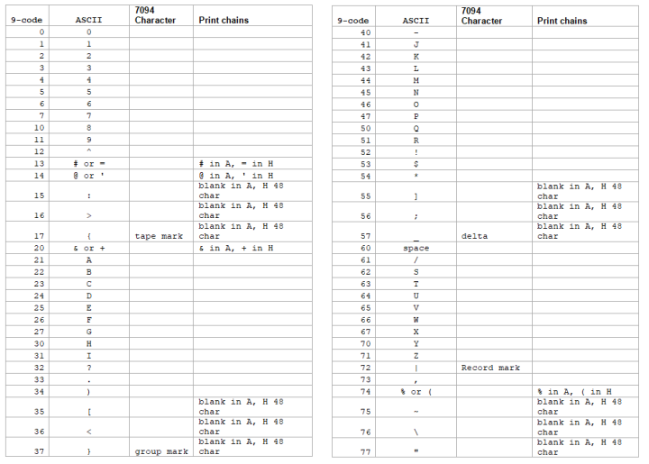

<!-- notpdf -->
# **IBM 7090/7094 Simulator Usage**

**01-Dec-2008**

<!-- /notpdf -->
Copyright © 1993-2008, Robert M Supnik

[COPYRIGHT NOTICE and LICENSE](#copyright-notice-and-license) are at the end of this document.

# Contents

 - [Simulator Files](#simulator-files)
 - [IBM 7090/7094 Features](#ibm-70907094-features)
 - [Stop conditions](#stop-conditions)
 - [CPU](#cpu)
   - [Registers](#registers)
 - [Interval Timer (CLK)](#interval-timer-clk)
   - [Registers](#registers-1)
 - [I/O Channels (CHANA..CHANH)](#io-channels-chanachanh)
   - [Registers](#registers-2)
 - [Channel A Devices](#channel-a-devices)
   - [711 Card Reader (CDR)](#711-card-reader-cdr)
     - [Registers](#registers-3)
     - [Error handling](#error-handling)
   - [721 Card Punch (CDP)](#721-card-punch-cdp)
     - [Registers](#registers-4)
     - [Error handling](#error-handling-1)
   - [716 Line Printer (LPT)](#716-line-printer-lpt)
     - [Registers](#registers-5)
     - [Error handling](#error-handling-2)
 - [729 Magnetic Tape (MTAâ¦MTH)](#729-magnetic-tape-mtamth)
   - [Registers](#registers-6)
   - [Error handling](#error-handling-3)
 - [7631 File Control (DSK)](#7631-file-control-dsk)
   - [Registers](#registers-7)
   - [Error handling](#error-handling-4)
 - [7289 High-Speed Drum (DRM)](#7289-high-speed-drum-drm)
   - [Registers](#registers-8)
   - [Error handling](#error-handling-5)
 - [7750 Communications Controller (COM and COML)](#7750-communications-controller-com-and-coml)
   - [Registers](#registers-9)
 - [Symbolic Display and Input](#symbolic-display-and-input)
 - [Character Sets](#character-sets)
 - [COPYRIGHT NOTICE and LICENSE](#copyright-notice-and-license)

This memorandum documents the IBM 7094 simulator.

# Simulator Files

To compile the IBM 7094, you must define `USE_INT64` as part of the
compilation command line.

| **_Subdirectory_** | **_File_**    |
| ------------------ | ------------- |
|                    | scp.h         |
|                    | sim_console.h |
|                    | sim_defs.h    |
|                    | sim_fio.h     |
|                    | sim_rev.h     |
|                    | sim_sock.h    |
|                    | sim_tape.h    |
|                    | sim_timer.h   |
|                    | sim_tmxr.h    |
|                    | scp.c         |
|                    | sim_console.c |
|                    | sim_fio.c     |
|                    | sim_sock.c    |
|                    | sim_tape.c    |
|                    | sim_timer.c   |
|                    | sim_tmxr.c    |
| i7094/             | i7094_defs.h  |
|                    | i7094_dat.h   |
|                    | i7094_cd.c    |
|                    | i7094_clk.c   |
|                    | i7094_com.c   |
|                    | i7094_cpu.c   |
|                    | i7094_cpu1.c  |
|                    | i7094_drm.c   |
|                    | i7094_dsk.c   |
|                    | i7094_io.c    |
|                    | i7094_lp.c    |
|                    | i7094_mt.c    |
|                    | i7094_sys.c   |

# IBM 7090/7094 Features

The IBM 7090/7094 simulator is configured as follows:

| device name(s) | simulates                                                                                |
| -------------- | ---------------------------------------------------------------------------------------- |
| CPU            | 7090, 7094, or 7094 with CTSS RPQ's CPU with 32KW, 32KW, or 64KW of memory, respectively |
| CLK            | interval timer (RPQ F89349) and Chronolog clock                                          |
| CHANA          | 7607 channel (required)                                                                  |
| CHANB          | ..CHANH additional 7607, 7289, or 7909 channels                                          |
| MTA            | magnetic tape controller, channel A (required)                                           |
| MTB            | ..MTH additional magnetic tape controllers, channels B to H                              |
| CDR            | 711 card reader                                                                          |
| CDP            | 721 card punch                                                                           |
| LPT            | 716 line printer                                                                         |
| DSK            | 7631 file control with up to 10 modules (disks or drums)                                 |
| DRM            | 7289 fast drum control                                                                   |
| COM            | 7750 communications control                                                              |
| COML           | 7750 communications lines                                                                |

Channels B through H, the corresponding magnetic tape controllers, and
the file control, drum control, and communications control are initially
set DISABLED. The file control, drum control, and communications control
can be assigned to any channel in the range B through H.

## Stop conditions

The 7090/7094 simulator implements several unique stop condition:

  - Undefined CPU instruction
  - Undefined channel instruction
  - XEC nesting exceeds limit
  - Divide check on a divide and halt instruction
  - Select of a non-existent channel
  - 7607 select of a 7909 channel
  - Write select of a write protected device
  - Invalid file control format
  - Invalid message to 7750
  - No buffer storage available for input character on 7750
  - No buffer storage available for output character on 7750

The LOAD command is not implemented.

## CPU

The CPU options allow the user to specify a 7090, a 7094, or a 7094 with
CTSS RPQ's.

    SET CPU 7090                7090
    SET CPU 7094                Standard 7094
    SET CPU CTSS                7094 with CTSS RPQ's.

Memory size is 32KW on a 7090 or 7094 CPU, 64KW on a CTSS CPU.

CTSS mode enables access to the Chronolog clock as magtape unit A7.

### Registers

CPU registers include the visible state of the processor as well as the
control registers for the interrupt system.

| name        | size | comments                                                        |
| ----------- | ---- | --------------------------------------------------------------- |
| PC          | 15   | program counter                                                 |
| AC          | 38   | accumulator                                                     |
| MQ          | 36   | multiplier-quotient                                             |
| SI          | 36   | storage indicators                                              |
| KEYS        | 36   | front panel keys                                                |
| XR1..XR7    | 15   | index registers 1 to 7 \[7090 uses only XR1, XR2, XR4\]      |
| SS1..SS6    | 1    | sense switches 1 to 6                                           |
| SL1..4      | 1    | sense lights 1 to 4                                             |
| OVF         | 1    | AC overflow indicator                                           |
| MQO         | 1    | MQ overflow indicator                                           |
| DVC         | 1    | divide check indicator                                          |
| IOC         | 1    | I/O check indicator                                             |
| TTRAP       | 1    | transfer trap enable                                            |
| CTRAP       | 1    | copy trap enable                                                |
| STRAP       | 1    | select trap enable                                              |
| FTRAP       | 1    | floating point trap enable                                      |
| STORN       | 1    | storage nullification mode enable                               |
| MULTI       | 1    | multiple-tag mode enable \[always 1 on 7090\]                   |
| CHREQ       | 8    | channel request flags                                           |
| CHTR_PEND   | 1    | channel trap pending                                            |
| CHTR_INHT   | 1    | channel trap inhibit                                            |
| CHTR_INHI   | 1    | channel trap instruction inhibit                                |
| CHTR_ENAB   | 30   | channel trap enable flags                                       |
| USERM       | 1    | user mode flag \[CTSS only\]                                    |
| IMEM        | 1    | instruction B-core flag \[CTSS only\]                           |
| DMEM        | 1    | data B-core flag \[CTSS only\]                                  |
| RELOC       | 8    | relocation base block \[CTSS only\]                             |
| START       | 8    | address start block \[CTSS only\]                               |
| LIMIT       | 8    | address limit block \[CTSS only\]                               |
| OLDPC       | 15   | PC at start of instruction                                      |
| PCQ\[0:63\] | 15   | PC prior to last jump or interrupt; most recent PC change first |
| HTPEND      | 1    | halt and transfer pending                                       |
| HTADDR      | 15   | halt and transfer address                                       |
| XECMAX      | 8    | XEC chain limit                                                 |
| WRU         | 8    | interrupt character                                             |
| STOP_ILL    | 1    | stop on undefined instruction                                   |

The CPU can maintain a history of the most recently executed
instructions. This is controlled by the SET CPU HISTORY and SHOW CPU
HISTORY commands:

    SET CPU HISTORY             clear history buffer
    SET CPU HISTORY=0           disable history
    SET CPU HISTORY=n           enable history, length = n
    SHOW CPU HISTORY            print CPU history
    SHOW CPU HISTORY=n          print first n entries of CPU history

If switch -C is set, channel commands are also included in the CPU
history. The maximum length for the history is 262144 entries.

## Interval Timer (CLK)

The timer (CLK) implements a 60Hz interval timer. It is disabled by
default.

The timer has the following registers:

### Registers

| name | size | comments                 |
| ---- | ---- | ------------------------ |
| TRAP | 1    | interval timer trap flag |
| TIME | 24   | tick delay               |

## I/O Channels (CHANA..CHANH)

The 709X supports up to 8 channels. Channel models include

    7607                        standard multiplexer channel
    7289                        high speed drum channel
    7909                        advanced capabilities channel

Channel A is required and is always a 7607. Channels B through H are
disabled by default. Channels B through H can be enabled. When a channel
is enabled, the attached device must also be specified:

    SET CHANx ENABLED{=[729|TAPE|7289|DRUM|7631|FILE|7750|COMM]}

If no device type is specified, TAPE is assumed.

Setting a channel to 729 (synonym TAPE) defines the channel as a 7607
and enables the corresponding magnetic tape controller.

Setting a channel to 7289 (synonym DRUM) defines the channel as a
7289 and enables the high-speed drum control.

Setting a channel to 7631 defines the channel as a 7909 and enables
the file control.

Setting a channel to 7750 (synonym COMM) defines the channel as a
7909 and enables the communications control. Only one high-speed
drum control, one file control, and one communications control are
supported per system.

As an example, the following commands set up the 1971 CTSS
configuration:

    SET CPU CTSS
    SET CLK ENABLED
    SET CHANB ENABLED=TAPE
    SET CHANC ENABLED=DISK
    SET CHANE ENABLED=COMM
    SET CHANG ENABLED=DRUM

### Registers

Channels have the following registers:

| name  | type      | size | comments                     |
| ----- | --------- | ---- | ---------------------------- |
| STATE | all       | 8    | channel state                |
| DSC   | 7607,7289 | 4    | data select                  |
| DSU   | 7607,7289 | 9    | data select unit             |
| NDSC  | 7607,7289 | 4    | non-data select              |
| NDSU  | 7607,7289 | 9    | non-data select unit         |
| FLAGS | all       | 30   | channel flags                |
| IDF   | all       | 2    | input data flags             |
| OP    | all       | 5    | channel opcode               |
| CLC   | all       | 16   | channel location counter     |
| WC    | all       | 15   | channel word counter         |
| CA    | all       | 16   | channel current address      |
| AR    | all       | 36   | channel assembly register    |
| CND   | 7909      | 6    | channel interrupt conditions |
| LCC   | 7909      | 6    | channel control counter      |
| SMS   | 7909      | 7    | channel options mask         |

## Channel A Devices

### 711 Card Reader (CDR)

The card reader (CDR) reads data from a disk file.

Cards are simulated as ASCII lines with terminating newlines.

The POS register specifies the number of the next data item
to be read. Thus, by changing POS, the user can backspace
or advance the reader.

Card reader files can either be text (one character per column) or
column binary (two characters per column). The file type can be
specified with a set command:

    SET CDR TEXT                set text mode
    SET CDR BINARY              set column binary mode

or in the ATTACH command:

    ATT -T CDR <file>           set text mode
    ATT    CDR <file>.TXT       set text mode
    ATT -C CDR <file>           set column binary mode
    ATT    CDR <file>.CBN       set column binary mode

The card reader supports the BOOT command. `BOOT CDR` starts the standard
card reader bootstrap at location 0.

#### Registers

The card reader implements these registers:

| name        | size | comments                   |
| ----------- | ---- | -------------------------- |
| STATE       | 2    | reader state               |
| BPTR        | 5    | binary buffer pointer      |
| BUF\[0:23\] | 36   | binary buffer              |
| POS         | 32   | position in the input file |
| TSTART      | 24   | card start delay           |
| TSTOP       | 24   | card stop delay            |
| TLEFT       | 24   | delay between row halves   |
| TRIGHT      | 24   | delay between rows         |

#### Error handling

Error handling is as follows:

| error        | processed as          |
|--------------|-----------------------|
| not attached | report error and stop |
| end of file  | out of cards          |
| OS I/O error | report error and stop |

### 721 Card Punch (CDP)

The card reader (CDP) writes data to a disk file. Cards are simulated as
ASCII lines with terminating newlines. The POS register specifies the
number of the next data item to be written. Thus, by changing POS, the
user can backspace or advance the punch.

Card punch files can either be text (one character per column) or column
binary (two characters per column). The file type can be specified with
a set command:

    SET CDP TEXT set text mode
    SET CDP BINARY set column binary mode

or in the ATTACH command:

    ATT -T CDP <file>           set text mode
    ATT    CDP <file>.TXT       set text mode
    ATT -C CDP <file>           set column binary mode
    ATT    CDP <file>.CBN       set column binary mode

The card punch supports both the business (1403 print chain A) and
Fortran (1403 print chain H) character sets:

    SET CDP BUSINESS            business character set
    SET CDP FORTRAN             Fortran character set

The Fortran character set is the default.

#### Registers

The card punch implements these registers:

| name        | size | comments                    |
| ----------- | ---- | --------------------------- |
| STATE       | 2    | reader state                |
| CHOB        | 36   | channel output buffer       |
| CHOBV       | 1    | output buffer valid flag    |
| BPTR        | 5    | binary buffer pointer       |
| BUF\[0:23\] | 36   | binary buffer               |
| POS         | 32   | position in the output file |
| TSTART      | 24   | card start delay            |
| TSTOP       | 24   | card stop delay             |
| TLEFT       | 24   | delay between row halves    |
| TRIGHT      | 24   | delay between rows          |

#### Error handling

Error handling is as follows:

| error        | processed as          |
|--------------|-----------------------|
| not attached | report error and stop |
| OS I/O error | report error and stop |

### 716 Line Printer (LPT)

The line printer (LPT) writes data to a disk file as ASCII text with
terminating newlines.

The POS register specifies the number of the next
data item to be written. Thus, by changing POS, the user can backspace
or advance the printer.

The line printer implements both 48- and 64-character print chains:

    SET LPT 64                  64-character print chain
    SET LPT 48                  48-character print chain

The line printer also implements both the business (1403 print chain A)
and Fortran (1403 H chain) character sets:

    SET LPT BUSINESS            business print character set
    SET LPT FORTRAN             Fortran character set

The default is 64 characters, Fortran set.

Finally, because the line printer was used for status output messages,
its output can be redirected to the controlling terminal window if no
file is attached:

    SET LPT DEFAULT             default output to console window
    SET LPT NODEFAULT           no default output, error if not attached

#### Registers

The line printer implements these registers:

| name         | size | comments                    |
| ------------ | ---- | --------------------------- |
| STATE        | 2    | printer state               |
| CMD          | 2    | printer command             |
| CHOB         | 36   | channel output buffer       |
| CHOBV        | 1    | output buffer valid flag    |
| BPTR         | 5    | binary buffer pointer       |
| BUF\[0:23\]  | 36   | binary buffer               |
| EBUF\[0:22\] | 36   | echo buffer                 |
| POS          | 32   | position in the output file |
| TSTART       | 24   | line start delay            |
| TSTOP        | 24   | line print delay            |
| TLEFT        | 24   | delay between row halves    |
| TRIGHT       | 24   | delay between rows          |

#### Error handling

Error handling is as follows:

| error        | processed as          |
|--------------|-----------------------|
| not attached | report error and stop |
| OS I/O error | report error and stop |

## 729 Magnetic Tape (MTA…MTH)

Every 7607 channel can support up to ten seven-track magnetic tape units
(MTx1…MTx10). 

Magnetic tape options include the ability to make units
write enabled or write locked.

    SET MTn LOCKED              set unit n write locked
    SET MTn WRITEENABLED        set unit n write enabled

Magnetic tape units can be set to a specific reel capacity in MB, or to
unlimited capacity:

    SET MTn CAPAC=m             set unit n capacity to m MB (0 = unlimited)
    SHOW MTn CAPAC              show unit n capacity in MB

Units can also be set ENABLED or DISABLED.

The magnetic tape simulator supports the BOOT command. `BOOT MTxn` starts
the standard magnetic tape load program at location 0.

### Registers

The magnetic tape controllers implement the following registers:

| name        | size | comments                           |
| ----------- | ---- | ---------------------------------- |
| UNIT        | 5    | unit select code                   |
| CHOB        | 36   | channel output buffer              |
| CHOBV       | 1    | output buffer valid flag           |
| BPTR        | 16   | buffer pointer                     |
| BLNT        | 16   | buffer length                      |
| BUF         | 7    | character buffer (with parity)     |
| TWEF        | 24   | wait time for end of file          |
| TSHORT      | 24   | wait time for "immediate" commands |
| TSTART      | 24   | wait time for unit start           |
| TSTOP       | 24   | wait time for unit stop            |
| TWORD       | 24   | wait time between word transfers   |
| UST\[1:10\] | 5    | unit state, drives 1 to 10         |
| POS\[1:10\] | 32   | position, drives 1 to 10           |
 
### Error handling

Error handling is as follows:

| error        | processed as          |
|--------------|-----------------------|
| not attached | report error and stop |
| end of file  | set error indicator   |
| OS I/O error | print error message set error indicator report error and stop |

## 7631 File Control (DSK)

The 7631 file control supports up to ten devices, which can be 7320
drums, 1301 disks, 1302 disks, or 2302 disks. Unit types are specified
with the SET command. The type can be set only if the unit (and the next
unit in sequence) is unattached, and the unit number is even:

    SET DSKn 7320               unit n is a drum (unit n+1 is disabled)
    SET DSKn 1301               unit n is a 1301 disk (unit n+1 is the same)
    SET DSKn 1302               unit n is a 1302 disk (unit n+1 is the same)
    SET DSKn 2302               unit n is a 2302 disk (unit n+1 is the same)

Units can be SET ENABLED or DISABLED. In addition, units can be set to
enable or disable formatting:

    SET DSKn FORMAT             enable formatting
    SET DSKn NOFORMAT           disable formatting

Formatting is disabled by default. The current format can be shown with
the command:

    SHOW DSKn FORMAT            display format information

### Registers

The 7631 implements the following registers:

| name          | size | comments                                                                           |
| ------------- | ---- | ---------------------------------------------------------------------------------- |
| STATE         | 6    | file control state                                                                 |
| ACCESS        | 1    | currently selected access                                                          |
| MODULE        | 4    | currently selected module (0-9)                                                    |
| RECORD        | 36   | record address (6 BCD characters)                                                  |
| MODE          | 4    | disk I/O mode                                                                      |
| SENSE         | 60   | sense data (10 BCD characters)                                                     |
| BCDCMD        | 60   | most recent command (10 BCD characters)                                            |
| CHOB          | 36   | channel output buffer                                                              |
| CHOBV         | 1    | output buffer valid flag                                                           |
| STOP          | 1    | channel stop flag                                                                  |
| FCNTR         | 13   | format track character counter                                                     |
| BUF\[0:999\]  | 36   | track buffer                                                                       |
| RBASE         | 10   | offset to record base                                                              |
| RPTR          | 10   | offset to current word                                                             |
| RLIM          | 10   | offset to record end                                                               |
| STIME         | 24   | seek delay                                                                         |
| RTIME         | 24   | rotational delay                                                                   |
| WTIME         | 24   | inter-word delay                                                                   |
| GTIME         | 24   | end-of-sector (gap) delay                                                          |
| CTIME         | 24   | command processing delay                                                           |
| TRACK\[0:19\] | 10   | current track number \[0:9\] module n, access 0 \[10:19\] module n, access 1 |

### Error handling

Error handling is as follows:

| error        | processed as          |
|--------------|-----------------------|
| not attached | report error and stop |
| OS I/O error | report error and stop |

## 7289 High-Speed Drum (DRM)

The 7289 (also known as the 7320A) high-speed drum was a late addition
to CTSS. Very little is known about the device, other than what is used
in the CTSS sources.

### Registers

The drum implements these registers:

| name  | size | comments                 |
| ----- | ---- | ------------------------ |
| STATE | 2    | drum state               |
| DA    | 18   | drum address register    |
| OP    | 1    | read/write flag          |
| CHOB  | 36   | channel output buffer    |
| CHOBV | 1    | output buffer valid flag |
| TIME  | 24   | inter-word delay         |

### Error handling

Error handling is as follows:

| error        | processed as          |
|--------------|-----------------------|
| not attached | report error and stop |

Drum data files are buffered in memory; therefore, end of file and OS
I/O errors cannot occur.

## 7750 Communications Controller (COM and COML)

The 7750 is modeled as a terminal multiplexer with 33 lines. It consists
of two devices: COM is the multiplexer controller, and COML is the
individual lines.

For the first 32 lines, the 7750 performs input and
output through Telnet sessions connected via a user-specified listening
port.

The 33rd line is permanently attached to the simulator console
window.

The ATTACH command specifies the port to be used for Telnet sessions:

    ATTACH COM <port>           set up listening port

where port is a decimal number between 1 and 65535 that is not being
used for other TCP/IP activities.

Each line (each unit of COML) can be set to one of two modes: KSR-35 and
KSR-37. In KSR-35 mode, lower case input and output characters are
converted automatically to upper case, and parity is ignored. In KSR-37
mode, lower case characters are left alone, and even parity is generated
on input. KSR-37 is the default.

Once COM is attached and the simulator is running, the 7750 listens for
connections on the specified port. It assumes that any incoming
connection is a Telnet connection. A connection remains open until
disconnected either by the Telnet client, a SET COM DISCONNECT command,
or a DETACH COM command.

The 7750 implements the following special SHOW commands

    SHOW COM CONNECTIONS         displays current connections to the 7750
    SHOW COM STATISTICS         displays statistics for active connections
    SHOW COM FREEQ              displays the character buffer free list
    SHOW COM INPQ               displays the character input queue
    SHOW COM OUTQ               displays the output queues for all lines
    SHOW COMn OUTQ              displays the output queue for line n

The 7750 implements the following special SET commands:

    SET COM DISCONNECT=n        disconnect line n
    SET COMLn DISCONNECT        disconnect line n
    SET COMLn LOG=filename      log output of line n to filename
    SET COMLn NOLOG             disable logging and close log file
    SET COMLn KSR35             set line n to KSR-35
    SET COMLn KSR37             set line n to KSR-37

### Registers

The controller (COM) implements these registers:

| name            | size | comments                            |
| --------------- | ---- | ----------------------------------- |
| ENABLE          | 1    | enable flag                         |
| STATE           | 6    | controller state                    |
| MSGNUM          | 12   | input message sequence number       |
| CHOB            | 36   | channel output buffer               |
| CHOBV           | 1    | output buffer valid flag            |
| STOP            | 1    | channel stop flag                   |
| BUF\[0:119\]    | 36   | channel buffer                      |
| BPTR            | 7    | channel buffer pointer              |
| BLIM            | 7    | channel buffer limit                |
| FREEQ\[0:1\]    | 16   | free queue header                   |
| INPQ\[0:1\]     | 16   | input queue header                  |
| OUTQ\[0:65\]    | 16   | output queue headers, lines 0 to 32 |
| PKTB\[0:32767\] | 16   | character buffer entries            |

Queue headers consist of two 16b words; both are subscripts into the
character buffer array. The first word is the buffer subscript for the
queue head; the second is the buffer subscript for the queue tail. In an
empty queue, both words are 0.

Character buffer entries also consist of two 16b words. The first is the
buffer subscript for the next entry in the queue; 0 indicates end of
queue. The second is the data element, typically a 12b character.

The lines (COML) implements these registers:

| name         | size | comments                     |
| ------------ | ---- | ---------------------------- |
| TIME\[0:32\] | 24   | transmit time, lines 0 to 32 |

The 7750 does not support save and restore. All open connections, except
the permanent connection to the console window, are lost when the
simulator shuts down or COM is detached.

# Symbolic Display and Input

The IBM 7094 simulator implements symbolic display and input. Display is
controlled by command line switches:

    -c                          display as character
    -s                          display as character string
    -m                          display instruction mnemonics
    -i                          display as 7607 IO instruction
    -n                          display as 7909 IO instruction

Character and string display is further qualified by switches that
specify the character coding and conversion conventions:

    -b                          BCD data (default is nine-code)
    -a                          business character set (default is Fortran)

The default data coding is nine-code, and the default character set is
Fortran.

Note that 7094 BCD and IBM 1401 BCD differ in one important
regard: the 7094 interprets 0 as code 20, the 1401 as code 12.

Input parsing is controlled by the first character typed in or by
command line switches:

    ' or -c                      character
    " or -s                      string
    alphabetic                   instruction mnemonic
    numeric                      octal number

Instruction input uses standard 7094 assembler syntax. There are two
basic instruction classes: memory reference and index reference.

Memory reference instructions have the format

    memref{*} address{,tag}

Index reference instructions have the format

    idxref{*} address,{tag},decrement

Specific instructions may disallow indirect addressing or limit the size
of the tag, address, or decrement fields.

Channel (I/O) instructions have the same basic two formats.

# Character Sets

The IBM 7094 uses a 6b character code called 9-code, a variation (with
permuted zones) of the ubiquitous BCD (binary coded decimal). The 7094
also uses BCD for communicating with the card reader/punch and the line
printer. In both 9-code and BCD, some of the characters have no
equivalent in ASCII and require different representations.

This is the mapping for 9-code used by the simulator:

\ 

This is the mapping for BCD code used by the simulator:

\ 

# COPYRIGHT NOTICE and LICENSE

The following copyright notice applies to the SIMH source, binary, and
documentation:

Original code published in 1993-2008, written by Robert M Supnik

Permission is hereby granted, free of charge, to any person obtaining
a copy of this software and associated documentation files (the
"Software"), to deal in the Software without restriction, including
without limitation the rights to use, copy, modify, merge, publish,
distribute, sublicense, and/or sell copies of the Software, and to
permit persons to whom the Software is furnished to do so, subject to
the following conditions:

The above copyright notice and this permission notice shall be
included in all copies or substantial portions of the Software.

THE SOFTWARE IS PROVIDED "AS IS", WITHOUT WARRANTY OF ANY KIND,
EXPRESS OR IMPLIED, INCLUDING BUT NOT LIMITED TO THE WARRANTIES OF
MERCHANTABILITY, FITNESS FOR A PARTICULAR PURPOSE AND NONINFRINGEMENT.
IN NO EVENT SHALL ROBERT M SUPNIK BE LIABLE FOR ANY CLAIM, DAMAGES OR
OTHER LIABILITY, WHETHER IN AN ACTION OF CONTRACT, TORT OR OTHERWISE,
ARISING FROM, OUT OF OR IN CONNECTION WITH THE SOFTWARE OR THE USE
OR OTHER DEALINGS IN THE SOFTWARE.

Except as contained in this notice, the names of the authors shall
not be used in advertising or otherwise to promote the sale, use or
other dealings in this Software without prior written authorization
from each author.
